# Consensus API

> *"Many voices, one truth — forged through consensus."*

The consensus engine merges outputs from multiple models into unified knowledge.

---

## Import

```python
from vecna.orchestrator import ConsensusEngine, ConsensusConfig
from vecna.orchestrator.consensus import DomainRouter
```

---

## ConsensusEngine

### Class Definition

```python
class ConsensusEngine:
    """
    Merges outputs from multiple models into unified knowledge.
    
    Handles agreement boosting, contradiction detection, and
    domain-weighted voting.
    """
    
    def __init__(
        self,
        config: ConsensusConfig | None = None,
    ) -> None: ...
```

### Constructor

```python
from vecna.orchestrator import ConsensusEngine, ConsensusConfig

# Default configuration
engine = ConsensusEngine()

# Custom configuration
config = ConsensusConfig(
    agreement_boost=0.2,
    contradiction_penalty=0.25,
    similarity_threshold=0.75
)
engine = ConsensusEngine(config)
```

---

## ConsensusConfig

### Class Definition

```python
@dataclass
class ConsensusConfig:
    """Configuration for the consensus engine."""
    
    # Confidence thresholds
    min_fact_confidence: float = 0.3
    min_belief_confidence: float = 0.2
    min_hypothesis_confidence: float = 0.1
    
    # Agreement effects
    agreement_boost: float = 0.15      # Per agreeing model
    contradiction_penalty: float = 0.2  # Per contradiction
    
    # Clustering
    similarity_threshold: float = 0.7   # Jaccard similarity
    
    # Domain weighting
    use_domain_weights: bool = True
    domain_weight_factor: float = 1.5   # Multiplier for experts
```

### Parameters

| Parameter | Type | Default | Description |
|-----------|------|---------|-------------|
| `min_fact_confidence` | `float` | `0.3` | Min confidence to accept fact |
| `min_belief_confidence` | `float` | `0.2` | Min confidence to accept belief |
| `min_hypothesis_confidence` | `float` | `0.1` | Min confidence for hypothesis |
| `agreement_boost` | `float` | `0.15` | Confidence boost per agreement |
| `contradiction_penalty` | `float` | `0.2` | Confidence reduction for contradictions |
| `similarity_threshold` | `float` | `0.7` | Jaccard threshold for clustering |
| `use_domain_weights` | `bool` | `True` | Weight domain experts higher |
| `domain_weight_factor` | `float` | `1.5` | Expert weight multiplier |

---

## Core Methods

### `merge()`

Merge multiple model responses into unified knowledge.

```python
def merge(
    self,
    responses: list[AdapterResponse],
    *,
    state: HiveState | None = None,
) -> ConsensusResult:
    """
    Merge multiple model responses.
    
    Args:
        responses: List of adapter responses to merge
        state: Current hive state (for context)
        
    Returns:
        Merged consensus result
    """
```

#### ConsensusResult

```python
@dataclass
class ConsensusResult:
    facts: list[Fact]              # Merged facts
    beliefs: list[Belief]          # Merged beliefs
    hypotheses: list[Hypothesis]   # Merged hypotheses
    contradictions: list[Contradiction]  # Detected conflicts
    merged_response: str           # Unified text response
    model_contributions: dict[str, ModelContribution]
    agreement_clusters: list[AgreementCluster]
```

#### Example

```python
from vecna.orchestrator import ConsensusEngine

engine = ConsensusEngine()

# Responses from different models
responses = [
    AdapterResponse(
        content="Python is interpreted",
        model="gpt-4o",
        facts=[Fact("Python is interpreted", 0.8, "gpt-4o")],
        beliefs=[],
        hypotheses=[],
        duration=1.2,
        tokens_used=150,
        raw_response=None
    ),
    AdapterResponse(
        content="Python is an interpreted language",
        model="claude",
        facts=[Fact("Python is an interpreted language", 0.75, "claude")],
        beliefs=[],
        hypotheses=[],
        duration=0.9,
        tokens_used=140,
        raw_response=None
    ),
]

result = engine.merge(responses)

# Result: Single fact with boosted confidence
# "Python is an interpreted language" (0.95, sources: "gpt-4o, claude")

print(f"Merged facts: {len(result.facts)}")
for fact in result.facts:
    print(f"  [{fact.confidence:.2f}] {fact.content}")
```

---

### `cluster_similar()`

Cluster similar items together.

```python
def cluster_similar(
    self,
    items: list[Fact | Belief],
    *,
    threshold: float | None = None,
) -> list[ItemCluster]:
    """
    Cluster similar items using Jaccard similarity.
    
    Args:
        items: Items to cluster
        threshold: Similarity threshold (uses config default if None)
        
    Returns:
        List of clusters
    """
```

#### ItemCluster

```python
@dataclass
class ItemCluster:
    items: list[Fact | Belief]  # Items in cluster
    representative: Fact | Belief  # Best representative
    similarity: float           # Average similarity
    sources: list[str]         # Contributing models
```

#### Example

```python
# Cluster similar facts
facts = [
    Fact("Python is interpreted", 0.8, "gpt"),
    Fact("Python is an interpreted language", 0.75, "claude"),
    Fact("JavaScript runs in browsers", 0.9, "gpt"),
    Fact("JS is a browser language", 0.85, "claude"),
]

clusters = engine.cluster_similar(facts)
# Returns 2 clusters: Python facts, JavaScript facts
```

---

### `detect_contradictions()`

Detect contradictions between items.

```python
def detect_contradictions(
    self,
    items: list[Fact | Belief],
) -> list[Contradiction]:
    """
    Detect contradictions between items.
    
    Uses negation patterns and semantic analysis to find conflicts.
    
    Args:
        items: Items to check for contradictions
        
    Returns:
        List of detected contradictions
    """
```

#### Contradiction Detection Patterns

```python
# Negation patterns detected:
# - "X is Y" vs "X is not Y"
# - "X can Y" vs "X cannot Y"
# - "X always" vs "X never"
# - Antonyms: "fast" vs "slow", "good" vs "bad"

# Example:
items = [
    Fact("Python is fast", 0.6, "gpt"),
    Fact("Python is slow", 0.7, "claude"),
]

contradictions = engine.detect_contradictions(items)
# Returns: Contradiction between the two items
```

---

### `boost_agreements()`

Boost confidence for items with multi-model agreement.

```python
def boost_agreements(
    self,
    clusters: list[ItemCluster],
) -> list[Fact | Belief]:
    """
    Boost confidence for agreed-upon items.
    
    Args:
        clusters: Clustered items
        
    Returns:
        Items with boosted confidence
    """
```

#### Boosting Formula

```python
# For each cluster with N agreeing models:
# boost = agreement_boost * (N - 1)
# final_confidence = min(1.0, base_confidence + boost)

# Example with agreement_boost=0.15:
# - 2 models agree: +0.15 boost
# - 3 models agree: +0.30 boost
# - 4 models agree: +0.45 boost
```

---

### `apply_domain_weights()`

Apply domain expertise weighting.

```python
def apply_domain_weights(
    self,
    items: list[Fact | Belief],
    query_domain: str,
    model_domains: dict[str, str],
) -> list[Fact | Belief]:
    """
    Apply domain-based weighting to items.
    
    Args:
        items: Items to weight
        query_domain: Detected domain of query
        model_domains: Model name -> domain mapping
        
    Returns:
        Items with adjusted confidence
    """
```

#### Domain Weighting Example

```python
# Query domain: "code"
# Model domains: {"gpt": "general", "claude": "science", "groq": "code"}

# groq's facts get weight_factor (1.5x) boost for code questions
# Other models use normal weighting
```

---

## DomainRouter

### Class Definition

```python
class DomainRouter:
    """
    Routes queries to appropriate domain experts.
    
    Analyzes queries to detect domains and selects
    the most appropriate models.
    """
    
    def __init__(
        self,
        adapters: dict[str, BaseAdapter],
    ) -> None: ...
```

---

### `detect_domain()`

Detect the domain of a query.

```python
def detect_domain(self, query: str) -> str:
    """
    Detect the domain of a query.
    
    Args:
        query: The query text
        
    Returns:
        Detected domain (e.g., "code", "science", "general")
    """
```

#### Domain Keywords

| Domain | Keywords |
|--------|----------|
| `code` | python, function, code, programming, debug, api |
| `science` | research, experiment, study, hypothesis, data |
| `math` | calculate, equation, proof, theorem, formula |
| `creative` | write, story, creative, imagine, design |
| `general` | (default) |

---

### `select_models()`

Select models for a query.

```python
def select_models(
    self,
    query: str,
    *,
    max_models: int = 5,
    include_generalist: bool = True,
) -> list[str]:
    """
    Select appropriate models for a query.
    
    Args:
        query: The query text
        max_models: Maximum models to select
        include_generalist: Always include a general-domain model
        
    Returns:
        List of model names to use
    """
```

#### Example

```python
router = DomainRouter(hive.adapters)

# Query: "Write a Python function to sort a list"
models = router.select_models(query)
# Returns: ["groq", "gpt"]  (code domain + generalist)

# Query: "Explain photosynthesis"
models = router.select_models(query)
# Returns: ["claude", "gpt"]  (science domain + generalist)
```

---

## Consensus Process

### Full Pipeline

```mermaid
graph TB
    subgraph "Input"
        R1[Response 1]
        R2[Response 2]
        R3[Response 3]
    end
    
    subgraph "Consensus Engine"
        EXTRACT[Extract Facts/Beliefs]
        CLUSTER[Cluster Similar]
        DETECT[Detect Contradictions]
        BOOST[Boost Agreements]
        WEIGHT[Apply Domain Weights]
        MERGE[Merge Results]
    end
    
    R1 --> EXTRACT
    R2 --> EXTRACT
    R3 --> EXTRACT
    EXTRACT --> CLUSTER
    CLUSTER --> DETECT
    CLUSTER --> BOOST
    DETECT --> MERGE
    BOOST --> WEIGHT
    WEIGHT --> MERGE
    MERGE --> OUTPUT[ConsensusResult]
    
    style R1 fill:#1a1a2e,stroke:#ff0000
    style R2 fill:#1a1a2e,stroke:#ff0000
    style R3 fill:#1a1a2e,stroke:#ff0000
    style OUTPUT fill:#1a1a2e,stroke:#990000
```



### Step-by-Step

1. **Extract**: Parse facts, beliefs, hypotheses from each response
2. **Cluster**: Group similar items using Jaccard similarity
3. **Detect**: Find contradictions between items
4. **Boost**: Increase confidence for items with agreement
5. **Weight**: Apply domain expertise multipliers
6. **Merge**: Combine into final result

---

## Advanced Usage

### Custom Similarity Function

```python
from vecna.orchestrator.consensus import ConsensusEngine

class CustomConsensusEngine(ConsensusEngine):
    def compute_similarity(
        self,
        item_a: str,
        item_b: str,
    ) -> float:
        """Custom similarity using embeddings."""
        # Use semantic similarity instead of Jaccard
        embedding_a = self.embed(item_a)
        embedding_b = self.embed(item_b)
        return cosine_similarity(embedding_a, embedding_b)
```

### Custom Contradiction Detection

```python
class CustomConsensusEngine(ConsensusEngine):
    def is_contradiction(
        self,
        item_a: str,
        item_b: str,
    ) -> bool:
        """Custom contradiction detection."""
        # Use NLI model for more accurate detection
        result = self.nli_model(item_a, item_b)
        return result.label == "contradiction"
```

---

## Full Example

```python
from vecna.orchestrator import ConsensusEngine, ConsensusConfig
from vecna.orchestrator.consensus import DomainRouter

# Configure consensus
config = ConsensusConfig(
    agreement_boost=0.2,
    contradiction_penalty=0.25,
    similarity_threshold=0.75,
    use_domain_weights=True
)

engine = ConsensusEngine(config)

# Simulate model responses
responses = [
    AdapterResponse(
        content="Python's GIL limits multithreading performance",
        model="gpt-4o",
        facts=[
            Fact("Python has a GIL", 0.95, "gpt-4o"),
            Fact("GIL limits multithreading", 0.85, "gpt-4o"),
        ],
        beliefs=[],
        hypotheses=[],
        duration=1.2,
        tokens_used=200,
        raw_response=None
    ),
    AdapterResponse(
        content="The Global Interpreter Lock in Python affects threading",
        model="claude",
        facts=[
            Fact("Python has a Global Interpreter Lock", 0.9, "claude"),
            Fact("GIL affects concurrent execution", 0.8, "claude"),
        ],
        beliefs=[],
        hypotheses=[],
        duration=0.9,
        tokens_used=180,
        raw_response=None
    ),
    AdapterResponse(
        content="Python threading is great for I/O-bound tasks",
        model="groq",
        facts=[
            Fact("Python threading works for I/O-bound tasks", 0.85, "groq"),
        ],
        beliefs=[
            Belief("GIL is not always a problem", 0.7, "groq"),
        ],
        hypotheses=[],
        duration=0.3,
        tokens_used=150,
        raw_response=None
    ),
]

# Merge responses
result = engine.merge(responses)

print("Merged Facts:")
for fact in result.facts:
    print(f"  [{fact.confidence:.2f}] {fact.content}")
    print(f"      Sources: {fact.source}")

print(f"\nContradictions: {len(result.contradictions)}")
for c in result.contradictions:
    print(f"  {c.item_a_content} vs {c.item_b_content}")

print(f"\nAgreement clusters: {len(result.agreement_clusters)}")
```

---

## Related Documentation

- [HiveMind](hivemind.md) - Consensus integration
- [Adapters](adapters.md) - Response format
- [Architecture: Consistency](../architecture/consistency.md) - Design details
- [Configuration](../configuration/consensus-config.md) - Full config options

---

*"From many perspectives, one understanding emerges."*
