# API Reference

> *"The interface to the hive — precise, powerful, complete."*

This section provides comprehensive API documentation for VECNA's Python interface.

---

## Overview

```mermaid
graph TB
    subgraph "Core API"
        HM[HiveMind]
        HS[HiveState]
    end
    
    subgraph "Component APIs"
        ADAPT[Adapters]
        MEM[Memory]
        CONS[Consensus]
    end
    
    subgraph "Support APIs"
        TYPES[Types]
        CONFIG[Config]
    end
    
    HM --> HS
    HM --> ADAPT
    HM --> MEM
    HM --> CONS
    HS --> TYPES
    HM --> CONFIG
    
    style HM fill:#1a1a2e,stroke:#ff0000
    style HS fill:#1a1a2e,stroke:#ff0000
    style ADAPT fill:#1a1a2e,stroke:#cc0000
    style MEM fill:#1a1a2e,stroke:#cc0000
    style CONS fill:#1a1a2e,stroke:#cc0000
    style TYPES fill:#1a1a2e,stroke:#990000
    style CONFIG fill:#1a1a2e,stroke:#990000
```



---

## Module Structure

```
vecna/
├── __init__.py          # Main exports: HiveMind, HiveConfig
├── core/
│   ├── types.py         # Fact, Belief, Hypothesis, Goal, etc.
│   ├── hive_state.py    # HiveState, IdentityKernel, SelfModel
│   └── state_store.py   # Persistence layer
├── orchestrator/
│   ├── loop.py          # HiveLoop, HiveMind classes
│   ├── consensus.py     # ConsensusEngine, DomainRouter
│   └── self_reflection.py
├── adapters/
│   └── base.py          # All model adapters
├── memory/
│   ├── store.py         # MemoryStore, vector operations
│   └── rlm_bridge.py    # Docker sandbox
└── tools/
    └── code_executor.py # Code execution
```

---

## API Sections

### [HiveMind](hivemind.md)

The main entry point for the hive mind system.

```python
from vecna import HiveMind

hive = HiveMind()
hive.add_openai("gpt-4o")
response = await hive.think("Hello")
```

| Method | Description |
|--------|-------------|
| `think()` | Process query through hive |
| `add_openai()` | Add OpenAI model |
| `add_anthropic()` | Add Anthropic model |
| `add_groq()` | Add Groq model |
| `add_ollama()` | Add Ollama model |
| `save()` / `load()` | State persistence |

---

### [HiveState](hivestate.md)

The shared mental substrate containing all hive knowledge.

```python
state = hive.state
print(f"Facts: {len(state.facts)}")
print(f"Coherence: {state.self_model.coherence}")
```

| Component | Description |
|-----------|-------------|
| `facts` | Verified knowledge items |
| `beliefs` | Interpretations and opinions |
| `hypotheses` | Ideas being explored |
| `goals` | Active objectives |
| `identity_kernel` | Immutable axioms |
| `self_model` | Dynamic self-awareness |

---

### [Adapters](adapters.md)

Model adapters for different LLM providers.

```python
from vecna.adapters import OpenAIAdapter, AnthropicAdapter

adapter = OpenAIAdapter(model="gpt-4o", api_key="...")
response = await adapter.generate(prompt, state)
```

| Adapter | Provider |
|---------|----------|
| `OpenAIAdapter` | OpenAI (GPT-4, etc.) |
| `AnthropicAdapter` | Anthropic (Claude) |
| `GroqAdapter` | Groq (Llama) |
| `OllamaAdapter` | Ollama (local) |
| `TransformersAdapter` | HuggingFace |

---

### [Memory](memory.md)

Vector memory store and semantic retrieval.

```python
from vecna.memory import MemoryStore

store = MemoryStore()
await store.add("Python is interpreted", metadata={"type": "fact"})
results = await store.search("programming languages", top_k=5)
```

| Method | Description |
|--------|-------------|
| `add()` | Add item to memory |
| `search()` | Semantic search |
| `retrieve_rlm()` | RLM retrieval pattern |
| `compress()` | Memory compression |

---

### [Consensus](consensus.md)

Consensus engine for merging multi-model outputs.

```python
from vecna.orchestrator import ConsensusEngine

engine = ConsensusEngine(config)
merged = engine.merge(responses)
```

| Method | Description |
|--------|-------------|
| `merge()` | Merge multiple responses |
| `detect_contradictions()` | Find conflicts |
| `boost_agreements()` | Increase confidence |
| `cluster_similar()` | Group related items |

---

## Quick Reference

### Installation

```bash
pip install vecna

# With all providers
pip install "vecna[all]"

# Specific providers
pip install "vecna[openai,anthropic]"
```

### Basic Usage

```python
import asyncio
from vecna import HiveMind

async def main():
    # Create hive
    hive = HiveMind()
    
    # Add models
    hive.add_openai("gpt-4o", domain="general")
    hive.add_anthropic("claude-sonnet-4-20250514", domain="science")
    
    # Think
    response = await hive.think("Explain quantum computing")
    print(response)
    
    # Access state
    print(f"Facts learned: {len(hive.state.facts)}")
    
    # Save
    hive.save("~/research.json")

asyncio.run(main())
```

### Synchronous Usage

```python
from vecna import HiveMind

hive = HiveMind()
hive.add_openai("gpt-4o")

# Sync wrapper
response = hive.think_sync("Hello")
```

---

## Type Annotations

VECNA is fully typed with Python type hints:

```python
from vecna.core.types import Fact, Belief, Hypothesis, Goal
from vecna.core.hive_state import HiveState, IdentityKernel, SelfModel
from vecna.orchestrator import HiveConfig, ConsensusConfig

# All public APIs have proper type annotations
def think(query: str, **kwargs) -> str: ...
def add_openai(model: str, name: str | None = None, domain: str = "general") -> None: ...
```

---

## Error Handling

```python
from vecna.exceptions import (
    VecnaError,           # Base exception
    ModelConnectionError, # Adapter connection failed
    StateError,           # State corruption
    ConsensusError,       # Consensus failure
    ExecutionError,       # Code execution failed
)

try:
    response = await hive.think("...")
except ModelConnectionError as e:
    print(f"Model failed: {e.model_name}")
except ConsensusError as e:
    print(f"Consensus failed: {e.details}")
```

---

## Async vs Sync

Most VECNA APIs are async-first:

```python
# Async (preferred)
response = await hive.think("query")

# Sync wrapper (convenience)
response = hive.think_sync("query")

# Run multiple queries in parallel
responses = await asyncio.gather(
    hive.think("query 1"),
    hive.think("query 2"),
    hive.think("query 3"),
)
```

---

## Context Managers

```python
# Automatic cleanup
async with HiveMind() as hive:
    hive.add_openai("gpt-4o")
    response = await hive.think("Hello")
# Resources released automatically

# Manual cleanup
hive = HiveMind()
try:
    # ... use hive ...
finally:
    await hive.close()
```

---

## Logging

```python
import logging

# Enable VECNA debug logging
logging.getLogger("vecna").setLevel(logging.DEBUG)

# Or via config
from vecna import HiveMind
from vecna.orchestrator import HiveConfig

config = HiveConfig(verbose=True)
hive = HiveMind(config)
```

---

## Related Documentation

- [Configuration Reference](../configuration/index.md) - All config options
- [Architecture](../architecture/index.md) - System design
- [Guides](../guides/index.md) - Practical usage patterns

---

*"The API is the contract; honor it."*
