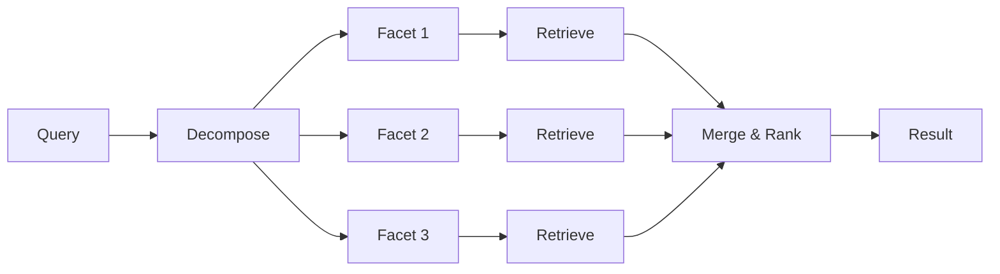

# Memory API

> *"What the hive remembers, it knows forever."*

The memory system provides vector-based semantic storage and retrieval for the hive's knowledge.

---

## Import

```python
from vecna.memory import MemoryStore
from vecna.memory.rlm_bridge import RLMBridge
```

---

## MemoryStore

### Class Definition

```python
class MemoryStore:
    """
    Vector-based semantic memory store.
    
    Provides embedding, storage, and retrieval of knowledge items
    with support for the RLM (Reasoning-Learning-Memory) pattern.
    """
    
    def __init__(
        self,
        *,
        use_local_embeddings: bool = False,
        embedding_model: str = "text-embedding-3-small",
        similarity_threshold: float = 0.7,
    ) -> None: ...
```

### Constructor Parameters

| Parameter | Type | Default | Description |
|-----------|------|---------|-------------|
| `use_local_embeddings` | `bool` | `False` | Use local embeddings (no API) |
| `embedding_model` | `str` | `"text-embedding-3-small"` | OpenAI embedding model |
| `similarity_threshold` | `float` | `0.7` | Minimum similarity for matches |

### Example

```python
from vecna.memory import MemoryStore

# With OpenAI embeddings (default)
store = MemoryStore()

# With local embeddings (no API needed)
store = MemoryStore(use_local_embeddings=True)

# Custom embedding model
store = MemoryStore(
    embedding_model="text-embedding-3-large",
    similarity_threshold=0.8
)
```

---

## Core Methods

### `add()`

Add an item to memory.

```python
async def add(
    self,
    content: str,
    *,
    metadata: dict | None = None,
    embedding: list[float] | None = None,
) -> str:
    """
    Add an item to the memory store.
    
    Args:
        content: The text content to store
        metadata: Optional metadata (type, source, confidence, etc.)
        embedding: Pre-computed embedding (computed if None)
        
    Returns:
        The unique ID of the stored item
    """
```

#### Example

```python
# Basic add
item_id = await store.add("Python is a programming language")

# With metadata
item_id = await store.add(
    "Python uses dynamic typing",
    metadata={
        "type": "fact",
        "source": "gpt-4o",
        "confidence": 0.95,
        "tags": ["python", "programming"],
    }
)

# With pre-computed embedding
embedding = await store.embed("Custom content")
item_id = await store.add(
    "Custom content",
    embedding=embedding
)
```

---

### `search()`

Semantic search for relevant items.

```python
async def search(
    self,
    query: str,
    *,
    top_k: int = 10,
    min_similarity: float | None = None,
    filter_metadata: dict | None = None,
) -> list[MemorySearchResult]:
    """
    Search memory for items similar to query.
    
    Args:
        query: Search query
        top_k: Maximum results to return
        min_similarity: Minimum similarity score (uses default if None)
        filter_metadata: Filter by metadata fields
        
    Returns:
        List of search results with scores
    """
```

#### MemorySearchResult

```python
@dataclass
class MemorySearchResult:
    id: str               # Item ID
    content: str          # Item content
    similarity: float     # Cosine similarity score
    metadata: dict        # Item metadata
```

#### Example

```python
# Basic search
results = await store.search("programming languages")
for r in results:
    print(f"[{r.similarity:.2f}] {r.content}")

# With filters
results = await store.search(
    "Python features",
    top_k=5,
    min_similarity=0.8,
    filter_metadata={"type": "fact"}
)

# Search with high threshold
results = await store.search(
    "quantum computing",
    min_similarity=0.9
)
```

---

### `retrieve_rlm()`

RLM (Reasoning-Learning-Memory) retrieval pattern.

```python
async def retrieve_rlm(
    self,
    query: str,
    *,
    top_k_per_facet: int = 5,
    max_facets: int = 4,
) -> RLMRetrievalResult:
    """
    Retrieve using the RLM decompose-retrieve-recompose pattern.
    
    Args:
        query: The main query
        top_k_per_facet: Items per facet
        max_facets: Maximum facets to decompose into
        
    Returns:
        Structured retrieval result
    """
```

#### RLM Pattern



#### RLMRetrievalResult

```python
@dataclass
class RLMRetrievalResult:
    query: str                        # Original query
    facets: list[str]                # Decomposed facets
    results_by_facet: dict[str, list[MemorySearchResult]]
    merged_results: list[MemorySearchResult]  # Deduplicated
    evidence_summary: str            # Formatted for prompts
```

#### Example

```python
# Query: "What Python frameworks are good for web APIs and why?"

result = await store.retrieve_rlm(
    "What Python frameworks are good for web APIs and why?"
)

# Facets generated:
# - "Python web frameworks"
# - "API development Python"
# - "web API best practices"

print(f"Facets: {result.facets}")
print(f"Total results: {len(result.merged_results)}")

# Use evidence in prompt
prompt = f"""
Based on this evidence:
{result.evidence_summary}

Answer: {result.query}
"""
```

---

### `embed()`

Generate embeddings for text.

```python
async def embed(
    self,
    text: str | list[str],
) -> list[float] | list[list[float]]:
    """
    Generate embeddings for text.
    
    Args:
        text: Single string or list of strings
        
    Returns:
        Embedding vector(s)
    """
```

#### Example

```python
# Single embedding
embedding = await store.embed("Hello world")
print(f"Dimensions: {len(embedding)}")  # 1536 for OpenAI

# Batch embeddings
embeddings = await store.embed([
    "First text",
    "Second text",
    "Third text"
])
```

---

### `delete()`

Remove an item from memory.

```python
async def delete(self, item_id: str) -> bool:
    """
    Delete an item from memory.
    
    Args:
        item_id: The item's unique ID
        
    Returns:
        True if deleted, False if not found
    """
```

---

### `update()`

Update an existing item.

```python
async def update(
    self,
    item_id: str,
    *,
    content: str | None = None,
    metadata: dict | None = None,
) -> bool:
    """
    Update an existing memory item.
    
    Args:
        item_id: The item's unique ID
        content: New content (re-embeds if changed)
        metadata: Metadata to merge
        
    Returns:
        True if updated, False if not found
    """
```

---

## Memory Management

### `compress()`

Compress memory by summarizing and deduplicating.

```python
async def compress(
    self,
    *,
    similarity_threshold: float = 0.9,
    summarize: bool = True,
) -> CompressionResult:
    """
    Compress memory to reduce size.
    
    Args:
        similarity_threshold: Threshold for deduplication
        summarize: Whether to summarize clusters
        
    Returns:
        Compression statistics
    """
```

#### CompressionResult

```python
@dataclass
class CompressionResult:
    items_before: int
    items_after: int
    items_removed: int
    clusters_merged: int
    reduction_ratio: float
```

#### Example

```python
result = await store.compress()
print(f"Reduced from {result.items_before} to {result.items_after}")
print(f"Reduction: {result.reduction_ratio:.1%}")
```

---

### `clear()`

Clear all items from memory.

```python
async def clear(self) -> int:
    """
    Clear all items from memory.
    
    Returns:
        Number of items cleared
    """
```

---

### `get_stats()`

Get memory statistics.

```python
def get_stats(self) -> MemoryStats:
    """Get memory store statistics."""
```

#### MemoryStats

```python
@dataclass
class MemoryStats:
    total_items: int
    total_vectors: int
    embedding_dimensions: int
    memory_usage_bytes: int
    avg_similarity: float
    items_by_type: dict[str, int]
```

---

## Persistence

### `save()` / `load()`

Persist memory to disk.

```python
async def save(self, path: str | Path) -> None:
    """Save memory store to file."""

@classmethod
async def load(cls, path: str | Path) -> "MemoryStore":
    """Load memory store from file."""
```

#### Example

```python
# Save
await store.save("~/memory_backup.vecna")

# Load
store = await MemoryStore.load("~/memory_backup.vecna")
```

---

## RLM Bridge

### `RLMBridge`

Docker sandbox for code execution.

```python
class RLMBridge:
    """
    Docker sandbox for safe code execution.
    
    Executes Python code in isolated containers with
    resource limits and network isolation.
    """
    
    def __init__(
        self,
        *,
        image: str = "python:3.11-slim",
        timeout: int = 30,
        memory_limit: str = "512m",
        cpu_limit: float = 1.0,
        prewarm: bool = True,
    ) -> None: ...
```

### Parameters

| Parameter | Type | Default | Description |
|-----------|------|---------|-------------|
| `image` | `str` | `"python:3.11-slim"` | Docker image |
| `timeout` | `int` | `30` | Execution timeout (seconds) |
| `memory_limit` | `str` | `"512m"` | Memory limit |
| `cpu_limit` | `float` | `1.0` | CPU cores limit |
| `prewarm` | `bool` | `True` | Keep container warm |

---

### `execute()`

Execute code in the sandbox.

```python
async def execute(
    self,
    code: str,
    *,
    timeout: int | None = None,
) -> ExecutionResult:
    """
    Execute Python code in the sandbox.
    
    Args:
        code: Python code to execute
        timeout: Override default timeout
        
    Returns:
        Execution result with output and metrics
    """
```

#### ExecutionResult

```python
@dataclass
class ExecutionResult:
    success: bool         # Whether execution succeeded
    output: str          # stdout output
    error: str | None    # stderr or exception
    duration_ms: float   # Execution time
    memory_bytes: int    # Memory used
    timed_out: bool      # Whether it timed out
```

#### Example

```python
from vecna.memory.rlm_bridge import RLMBridge

bridge = RLMBridge()

result = await bridge.execute("""
def fibonacci(n):
    if n <= 1:
        return n
    return fibonacci(n-1) + fibonacci(n-2)

print(fibonacci(10))
""")

if result.success:
    print(f"Output: {result.output}")
    print(f"Duration: {result.duration_ms:.2f}ms")
else:
    print(f"Error: {result.error}")
```

---

### `health_check()`

Check if Docker sandbox is available.

```python
async def health_check(self) -> bool:
    """Check if Docker is available and working."""
```

---

### `cleanup()`

Clean up containers and resources.

```python
async def cleanup(self) -> None:
    """Clean up containers and resources."""
```

---

## Embedding Models

### OpenAI Embeddings

```python
# Default: text-embedding-3-small (1536 dimensions)
store = MemoryStore(embedding_model="text-embedding-3-small")

# Higher quality: text-embedding-3-large (3072 dimensions)
store = MemoryStore(embedding_model="text-embedding-3-large")

# Legacy: text-embedding-ada-002 (1536 dimensions)
store = MemoryStore(embedding_model="text-embedding-ada-002")
```

### Local Embeddings

```python
# Uses sentence-transformers (all-MiniLM-L6-v2)
store = MemoryStore(use_local_embeddings=True)

# No API key needed, runs locally
# 384 dimensions, ~100MB model
```

#### Prerequisites for Local Embeddings

```bash
pip install "vecna[local]"
# or
pip install sentence-transformers
```

---

## Full Example

```python
import asyncio
from vecna.memory import MemoryStore

async def main():
    # Create memory store
    store = MemoryStore()
    
    # Add knowledge
    await store.add(
        "Python was created by Guido van Rossum",
        metadata={"type": "fact", "confidence": 0.99}
    )
    await store.add(
        "Python emphasizes code readability",
        metadata={"type": "fact", "confidence": 0.95}
    )
    await store.add(
        "Python is good for beginners",
        metadata={"type": "belief", "confidence": 0.8}
    )
    
    # Search
    results = await store.search("Python creator")
    print("Search results:")
    for r in results:
        print(f"  [{r.similarity:.2f}] {r.content}")
    
    # RLM retrieval
    rlm = await store.retrieve_rlm(
        "What makes Python popular for teaching?"
    )
    print(f"\nRLM facets: {rlm.facets}")
    print(f"Evidence:\n{rlm.evidence_summary}")
    
    # Compress
    result = await store.compress()
    print(f"\nCompression: {result.reduction_ratio:.1%}")
    
    # Save
    await store.save("~/python_knowledge.vecna")

asyncio.run(main())
```

---

## Related Documentation

- [Memory Architecture](../memory/index.md) - Design details
- [Memory Tiers](../memory/tiers.md) - Hot/Warm/Cold architecture
- [Retrieval Patterns](../memory/retrieval.md) - RLM deep dive
- [Code Execution](../guides/code-execution.md) - RLM Bridge guide

---

*"Memory is the foundation of intelligence."*
