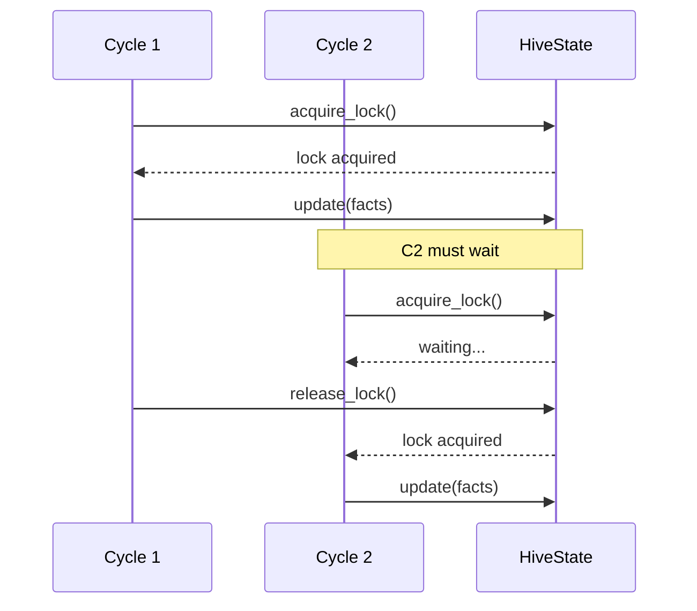
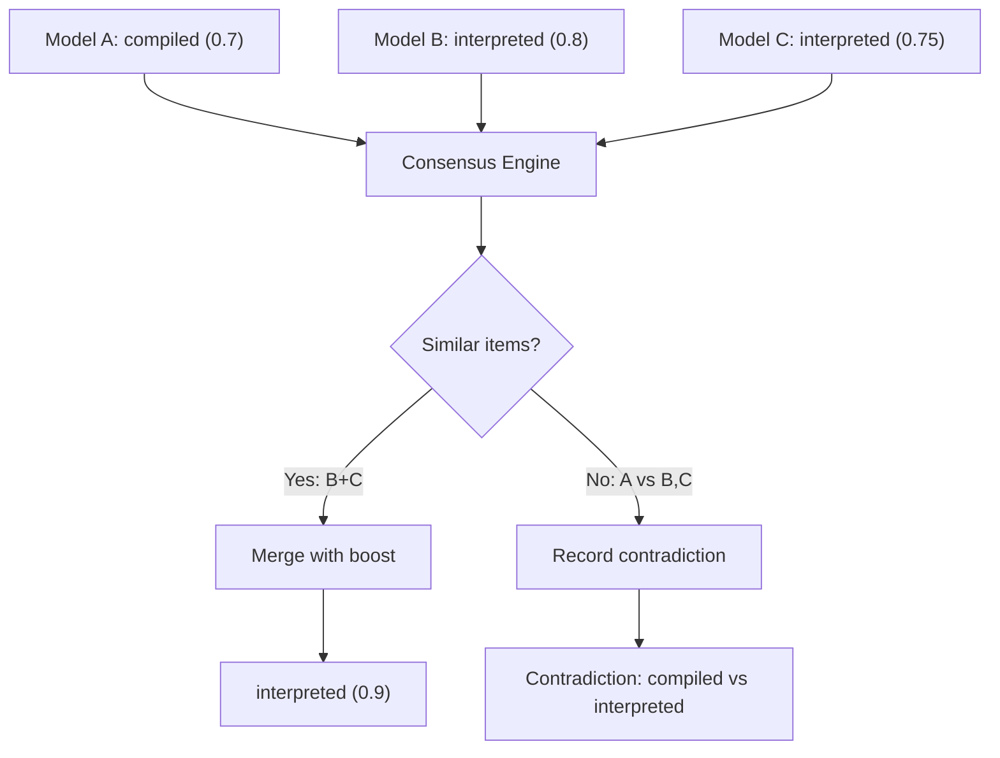
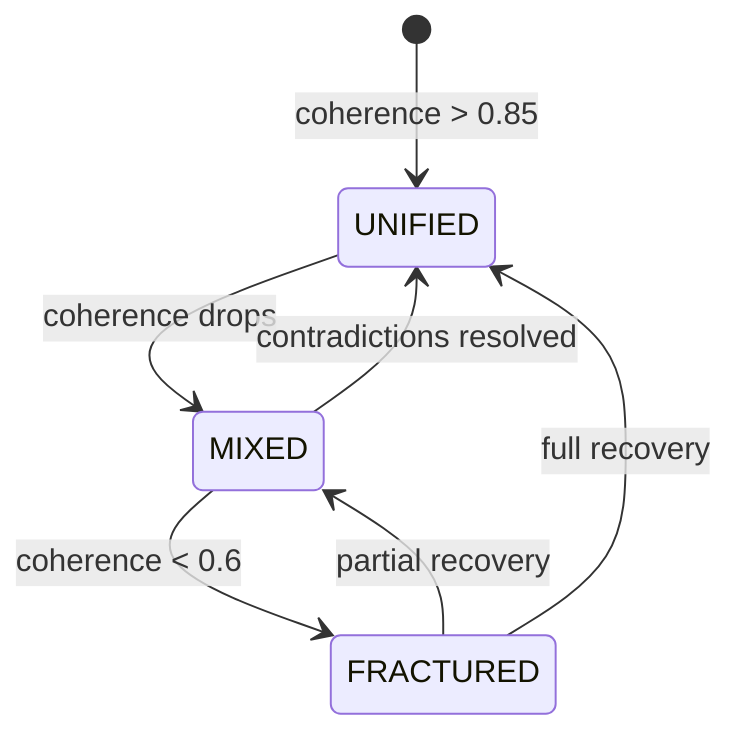

# Consistency Model

VECNA employs an **eventual consistency** model optimized for multi-model AI systems. This document details how consistency is maintained across the hive.

---

## Overview

### Consistency Spectrum

```
Strong ◄──────────────────────────────────► Eventual
Consistency                                Consistency
     │                                           │
     │  • Linearizable                          │  • VECNA ✓
     │  • Sequential                            │  • BASE
     │  • Causal                                │  • DNS
     │                                           │
     └───────────────────────────────────────────┘
```

VECNA prioritizes **availability** and **partition tolerance** (AP in CAP theorem), accepting eventual consistency as a tradeoff.

---

## Consistency Guarantees

### What VECNA Guarantees

| Guarantee | Description |
|-----------|-------------|
| **Read-your-writes** | After a think cycle, the hive sees its own updates |
| **Monotonic reads** | Coherence never appears to go backward within a session |
| **Causal ordering** | If A caused B, A is visible before B |
| **Session consistency** | A single session sees consistent state |

### What VECNA Does NOT Guarantee

| Non-Guarantee | Reason |
|---------------|--------|
| **Linearizability** | Model outputs are processed asynchronously |
| **Strong consistency** | Multiple models may have different "views" |
| **Immediate convergence** | Contradictions may persist across cycles |

---

## Consistency Mechanisms

### 1. Single-Writer Principle

Only one HiveLoop can update HiveState at a time within a process.



### 2. Versioned State

Every state update increments a version number:

```python
@dataclass
class HiveState:
    version: int = 0
    
    def update(self, changes: StateChanges) -> None:
        self._apply_changes(changes)
        self.version += 1  # Monotonically increasing

# Optimistic concurrency control
def safe_update(state: HiveState, changes: StateChanges, expected_version: int):
    if state.version != expected_version:
        raise ConcurrencyError("State was modified by another process")
    state.update(changes)
```

### 3. Conflict Detection

Contradictions are explicitly tracked, not hidden:

```python
class ConsensusEngine:
    def detect_contradictions(self, items: List[Item]) -> List[Contradiction]:
        contradictions = []
        
        for i, item_a in enumerate(items):
            for item_b in items[i+1:]:
                if self._are_contradictory(item_a, item_b):
                    contradictions.append(Contradiction(
                        item_a_id=item_a.id,
                        item_b_id=item_b.id,
                        item_a_content=item_a.content,
                        item_b_content=item_b.content,
                        status="unresolved"
                    ))
        
        return contradictions
    
    def _are_contradictory(self, a: Item, b: Item) -> bool:
        # Check for negation patterns
        negation_pairs = [
            ("is", "is not"),
            ("can", "cannot"),
            ("will", "will not"),
            ("true", "false"),
        ]
        
        for pos, neg in negation_pairs:
            if pos in a.content and neg in b.content:
                if self._similar_subject(a, b):
                    return True
        
        return False
```

### 4. Confidence Decay

Unverified facts decay over time:

```python
def apply_confidence_decay(state: HiveState, decay_rate: float = 0.01):
    """Apply weekly confidence decay to unretrieved items."""
    now = datetime.utcnow()
    
    for fact in state.facts:
        if fact.last_retrieved_at:
            days_since_retrieval = (now - fact.last_retrieved_at).days
            weeks = days_since_retrieval / 7
            
            # Decay by decay_rate per week
            fact.confidence *= (1 - decay_rate) ** weeks
            
            # Archive if below threshold
            if fact.confidence < 0.1:
                state.archive_fact(fact)
```

---

## Multi-Model Consistency

### The Challenge

Each model generates independent output. Without consensus, the hive would have inconsistent knowledge.

```
Model A: "Python is compiled"     (confidence: 0.7)
Model B: "Python is interpreted"  (confidence: 0.8)
Model C: "Python is interpreted"  (confidence: 0.75)
```

### The Solution: Consensus Merging



### Consensus Algorithm

```python
def compute_consensus(clusters: List[List[Item]]) -> List[Item]:
    merged_items = []
    
    for cluster in clusters:
        if len(cluster) == 1:
            # No agreement — keep as-is
            merged_items.append(cluster[0])
        else:
            # Agreement — merge and boost
            merged = merge_cluster(cluster)
            
            # Compute weighted average confidence
            total_weight = sum(item.weight for item in cluster)
            avg_confidence = sum(
                item.confidence * item.weight 
                for item in cluster
            ) / total_weight
            
            # Apply agreement boost
            boost = 0.15 * (len(cluster) - 1)
            merged.confidence = min(1.0, avg_confidence + boost)
            
            # Track sources
            merged.sources = [item.source for item in cluster]
            
            merged_items.append(merged)
    
    return merged_items
```

---

## Coherence as Consistency Metric

VECNA uses **coherence** as a runtime measure of internal consistency.

### Coherence Formula

$$
\text{coherence} = 0.7 \times \text{base} + 0.3 \times \text{density}
$$

Where:

$$
\text{base} = 1 - \frac{\text{unresolved\_contradictions}}{\max(1, \text{facts} + \text{beliefs})}
$$

$$
\text{density} = \frac{\sum \text{confidences}}{\text{max\_expected\_signal}}
$$

### Coherence States



| State | Coherence | Behavior |
|-------|-----------|----------|
| UNIFIED | > 0.85 | Confident, decisive responses |
| MIXED | 0.6 - 0.85 | Acknowledges complexity |
| FRACTURED | < 0.6 | Cautious, hedged responses |

### Coherence-Driven Consistency

When coherence drops, the hive takes corrective action:

```python
def handle_low_coherence(state: HiveState):
    if state.self_model.coherence < 0.6:
        # Log identity event
        state.identity_timeline.append(IdentityEvent(
            event_type="coherence_crisis",
            description="Coherence dropped below 0.6"
        ))
        
        # Prioritize contradiction resolution
        unresolved = [c for c in state.contradictions if c.status == "unresolved"]
        for contradiction in unresolved[:3]:  # Top 3
            contradiction.priority = "high"
        
        # Adjust response tone
        state.self_model.tone = Tone.FRACTURED
```

---

## Persistence Consistency

### Write-Ahead Logging (WAL)

State changes are logged before application:

```python
class StateStore:
    def update(self, state: HiveState, changes: StateChanges):
        # 1. Write to WAL
        self.wal.append(WALEntry(
            timestamp=datetime.utcnow(),
            version=state.version,
            changes=changes.serialize()
        ))
        
        # 2. Apply changes
        state.apply(changes)
        
        # 3. Checkpoint periodically
        if state.version % 100 == 0:
            self._checkpoint(state)
```

### Recovery from WAL

```python
def recover_state(self) -> HiveState:
    # Load last checkpoint
    state = self._load_checkpoint()
    
    # Replay WAL entries after checkpoint
    for entry in self.wal.entries_after(state.version):
        changes = StateChanges.deserialize(entry.changes)
        state.apply(changes)
    
    return state
```

### Multi-Process Consistency (PostgreSQL)

With PostgreSQL backend, consistency is managed via database transactions:

```python
class PostgresStore:
    async def update(self, changes: StateChanges):
        async with self.pool.acquire() as conn:
            async with conn.transaction():
                # Read current version
                row = await conn.fetchrow(
                    "SELECT version FROM hive_state WHERE key = $1 FOR UPDATE",
                    self.key
                )
                
                # Apply changes
                new_state = self._apply_changes(row['state'], changes)
                
                # Write with incremented version
                await conn.execute(
                    "UPDATE hive_state SET state = $1, version = $2 WHERE key = $3",
                    new_state,
                    row['version'] + 1,
                    self.key
                )
```

---

## Invariants

VECNA maintains these consistency invariants:

### Invariant 1: Identity Kernel Immutability

```python
class IdentityKernel:
    def __init__(self):
        self.axioms = [...]  # Set once
        self._frozen = True
    
    def __setattr__(self, name, value):
        if getattr(self, '_frozen', False) and name == 'axioms':
            raise ImmutableError("Cannot modify identity axioms")
        super().__setattr__(name, value)
```

### Invariant 2: Version Monotonicity

```python
def update_state(state: HiveState, changes: StateChanges):
    old_version = state.version
    state.apply(changes)
    assert state.version > old_version, "Version must increase"
```

### Invariant 3: Contradiction Tracking

```python
def add_fact(state: HiveState, fact: Fact):
    # Check for contradictions before adding
    for existing in state.facts:
        if contradicts(existing, fact):
            state.contradictions.append(Contradiction(
                item_a=existing,
                item_b=fact
            ))
    
    state.facts.append(fact)
```

### Invariant 4: Coherence Bounds

```python
def compute_coherence(state: HiveState) -> float:
    coherence = _compute_raw_coherence(state)
    
    # Enforce bounds
    assert 0.0 <= coherence <= 1.0, "Coherence out of bounds"
    
    return coherence
```

---

## Consistency in Practice

### Example: Handling Concurrent Insights

```python
# Cycle 1: Model A says "X is true"
# Cycle 2: Model B says "X is false" (concurrent)

# Without consistency:
state.facts = ["X is true", "X is false"]  # Inconsistent!

# With VECNA consistency:
# 1. Cycle 1 completes, adds "X is true"
# 2. Cycle 2 detects contradiction
# 3. Records Contradiction(X is true, X is false)
# 4. Coherence drops
# 5. Future cycles prioritize resolution
```

### Example: State Recovery

```python
# Process crashes mid-update
try:
    state.add_facts(new_facts)
    state.add_beliefs(new_beliefs)  # Crash here!
    state.persist()
except:
    # On restart:
    state = store.recover()  # Restores to last consistent state
    # new_facts and new_beliefs were never persisted
```

---

## Summary

| Aspect | VECNA Approach |
|--------|----------------|
| **Model** | Eventual consistency |
| **Conflicts** | Detected and tracked |
| **Resolution** | Explicit via coherence-driven healing |
| **Versioning** | Monotonic version numbers |
| **Persistence** | Write-ahead logging |
| **Multi-process** | Database transactions |
| **Metric** | Coherence score (0-1) |
