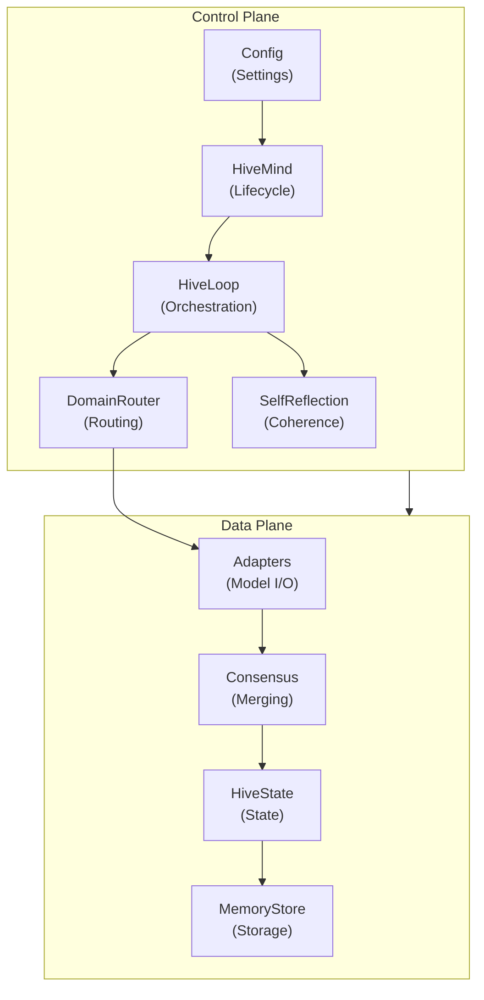
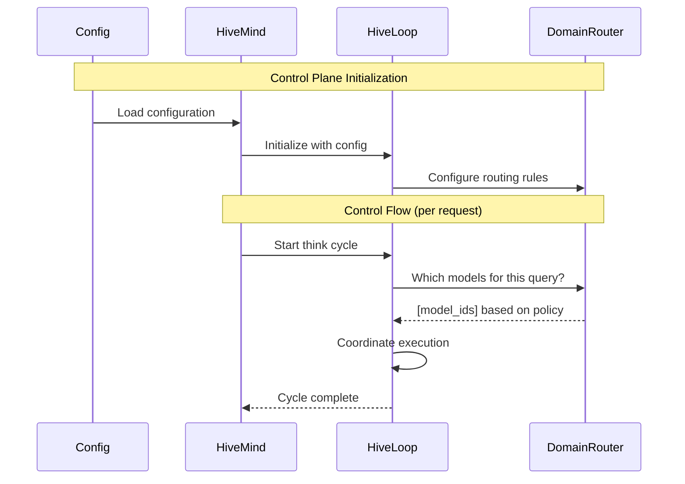
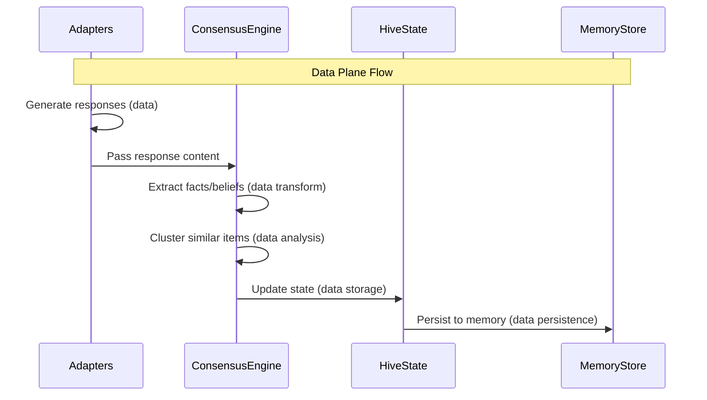
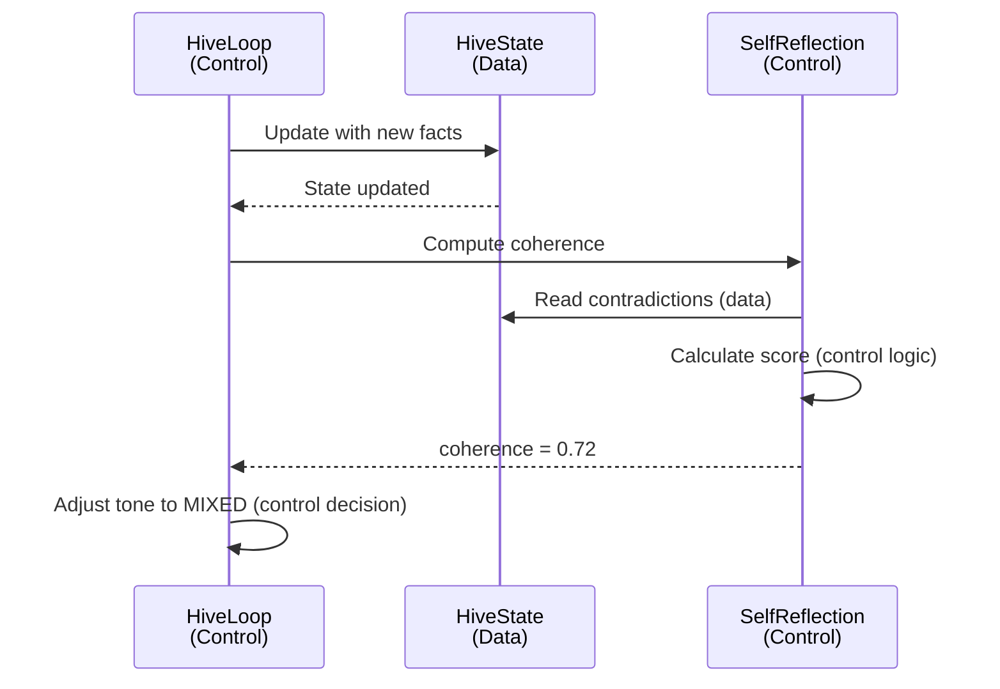

# Control Plane vs Data Plane

VECNA separates concerns into distinct **control plane** and **data plane** components, following distributed systems best practices.

---

## Overview



---

## Control Plane

The control plane manages **how** the system operates, not what data flows through it.

### Responsibilities

| Component | Responsibility |
|-----------|----------------|
| **HiveMind** | Lifecycle management, model registration, API surface |
| **HiveLoop** | Think cycle orchestration, phase coordination |
| **DomainRouter** | Model selection based on query analysis |
| **SelfReflection** | Coherence monitoring, identity management |
| **Config** | Runtime settings, feature flags |

### Characteristics

- **Stateless logic**: Control decisions don't depend on data content
- **Policy-driven**: Behavior controlled by configuration
- **Observable**: Emits metrics and logs for monitoring
- **Replaceable**: Can swap implementations without affecting data

### Control Flow



### Configuration-Driven Behavior

```python
# Control plane decisions based on config
class HiveConfig:
    max_parallel_models: int = 5      # Controls concurrency
    use_routing: bool = True          # Controls model selection
    compress_every: int = 5           # Controls memory management
    max_cycles: int = 20              # Controls execution limits
    verbose: bool = True              # Controls logging

# Example: Routing decision
def should_use_routing(config: HiveConfig) -> bool:
    return config.use_routing  # Control plane decision

# Example: Concurrency decision
def get_concurrency_limit(config: HiveConfig) -> int:
    return config.max_parallel_models  # Control plane decision
```

---

## Data Plane

The data plane handles **what** flows through the system — the actual knowledge and responses.

### Responsibilities

| Component | Responsibility |
|-----------|----------------|
| **Adapters** | Model input/output, prompt/response handling |
| **ConsensusEngine** | Data merging, similarity detection |
| **HiveState** | Knowledge storage, state representation |
| **MemoryStore** | Persistence, retrieval, embeddings |

### Characteristics

- **Data-focused**: Transforms and stores knowledge
- **Content-aware**: Decisions based on data content
- **Stateful**: Maintains accumulated knowledge
- **Idempotent operations**: Same input → same output

### Data Flow



### Data Transformation

```python
# Data plane: Content-based operations
class ConsensusEngine:
    def merge(self, responses: List[str]) -> MergedOutput:
        # Extract data from responses
        items = self._extract_items(responses)  # Data transform
        
        # Analyze data content
        clusters = self._cluster_by_content(items)  # Data analysis
        
        # Detect data conflicts
        contradictions = self._find_contradictions(items)  # Data validation
        
        return MergedOutput(items, contradictions)
```

---

## Separation Benefits

### 1. Independent Scaling

```
Control Plane (lightweight)          Data Plane (resource-intensive)
┌─────────────────────┐              ┌─────────────────────┐
│  1 instance         │              │  N instances        │
│  Low CPU/memory     │              │  High CPU/memory    │
│  Fast decisions     │              │  Parallel processing│
└─────────────────────┘              └─────────────────────┘
```

### 2. Independent Testing

```python
# Control plane tests: No real data needed
def test_routing_decision():
    router = DomainRouter()
    selected = router.select_models("Write Python code", mock_adapters)
    assert any(a.domain == "code" for a in selected)

# Data plane tests: No control logic needed
def test_consensus_merging():
    engine = ConsensusEngine()
    merged = engine.merge([
        "Python is interpreted",
        "Python is an interpreted language"
    ])
    assert len(merged.facts) == 1  # Merged into one
```

### 3. Policy Changes Without Data Migration

```python
# Change control behavior without touching data
old_config = HiveConfig(max_parallel_models=3)
new_config = HiveConfig(max_parallel_models=5)

# Data plane unchanged — same HiveState, same MemoryStore
hive.config = new_config  # Only control plane affected
```

### 4. Data Migration Without Control Changes

```python
# Change data backend without touching control logic
# Old: JSON file storage
old_store = JSONStateStore("~/.vecna/state.json")

# New: PostgreSQL storage
new_store = PostgresStore(connection_string)

# Control plane unchanged — same HiveLoop, same routing
hive.state_store = new_store  # Only data plane affected
```

---

## Interaction Points

### Control → Data Interfaces

| Interface | Direction | Purpose |
|-----------|-----------|---------|
| `HL.execute_models()` | Control → Data | Trigger model execution |
| `CE.merge()` | Control → Data | Trigger consensus |
| `HS.update()` | Control → Data | Trigger state update |
| `MS.persist()` | Control → Data | Trigger persistence |

### Data → Control Interfaces

| Interface | Direction | Purpose |
|-----------|-----------|---------|
| `HS.coherence` | Data → Control | Inform tone decisions |
| `MS.stats()` | Data → Control | Inform compression decisions |
| `AD.latency` | Data → Control | Inform timeout decisions |

### Example: Coherence Feedback Loop



---

## Implementation Patterns

### Control Plane Pattern: Strategy

```python
class RoutingStrategy(ABC):
    @abstractmethod
    def select(self, query: str, adapters: List[Adapter]) -> List[Adapter]:
        pass

class DomainRoutingStrategy(RoutingStrategy):
    def select(self, query: str, adapters: List[Adapter]) -> List[Adapter]:
        domains = self._detect_domains(query)
        return [a for a in adapters if a.domain in domains]

class RoundRobinStrategy(RoutingStrategy):
    def select(self, query: str, adapters: List[Adapter]) -> List[Adapter]:
        return adapters[:self.max_models]

# Control plane selects strategy based on config
def get_routing_strategy(config: HiveConfig) -> RoutingStrategy:
    if config.use_routing:
        return DomainRoutingStrategy()
    return RoundRobinStrategy()
```

### Data Plane Pattern: Pipeline

```python
class DataPipeline:
    def __init__(self):
        self.stages = [
            ExtractStage(),      # Extract items from responses
            ClusterStage(),      # Cluster similar items
            MergeStage(),        # Merge clusters
            ValidateStage(),     # Detect contradictions
            PersistStage(),      # Save to state
        ]
    
    def process(self, data: Any) -> Any:
        for stage in self.stages:
            data = stage.process(data)
        return data
```

---

## Observability

### Control Plane Metrics

```python
# Metrics emitted by control plane
control_metrics = {
    "routing_decisions": Counter,      # How many routing decisions made
    "models_selected": Histogram,      # Distribution of models per query
    "cycle_duration": Histogram,       # Total cycle time
    "config_reloads": Counter,         # Configuration changes
}
```

### Data Plane Metrics

```python
# Metrics emitted by data plane
data_metrics = {
    "facts_stored": Gauge,             # Current fact count
    "contradictions_detected": Counter, # Total contradictions found
    "consensus_merges": Counter,       # Items merged by consensus
    "memory_bytes": Gauge,             # Storage size
    "retrieval_latency": Histogram,    # Memory query time
}
```

---

## Summary

| Aspect | Control Plane | Data Plane |
|--------|---------------|------------|
| **Focus** | How to operate | What to process |
| **State** | Configuration | Knowledge |
| **Scaling** | Single instance | Horizontally scalable |
| **Changes** | Policy updates | Schema migrations |
| **Testing** | Mock data | Mock control |
| **Failure** | Retry/fallback | Data recovery |
