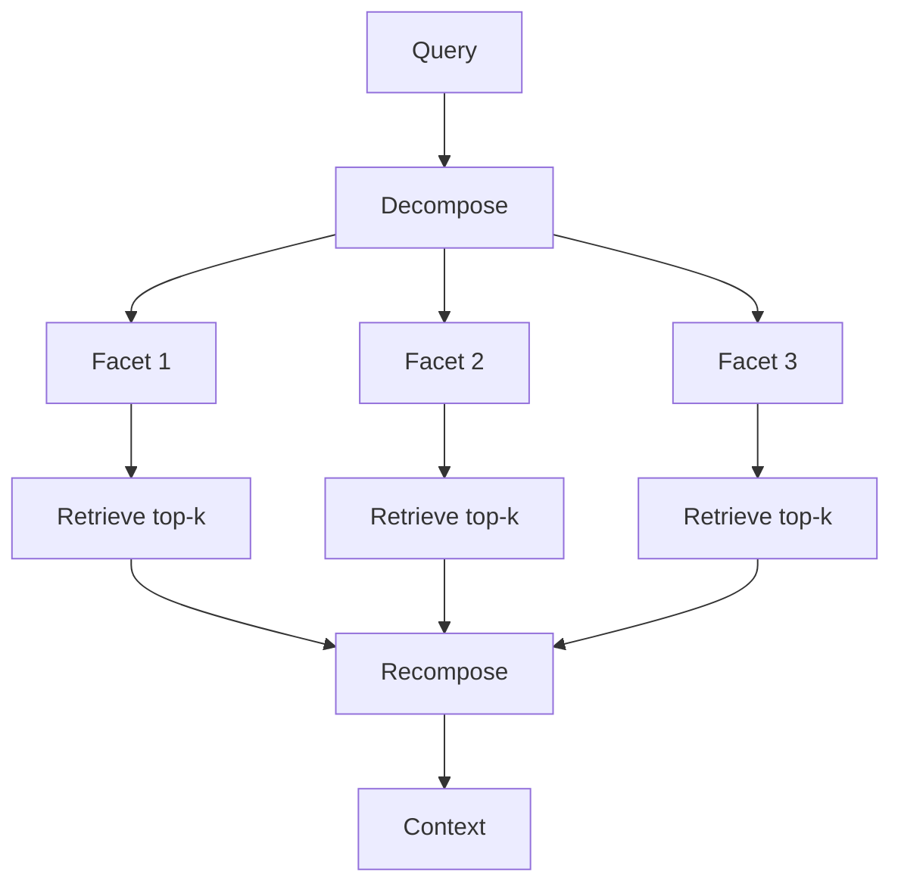
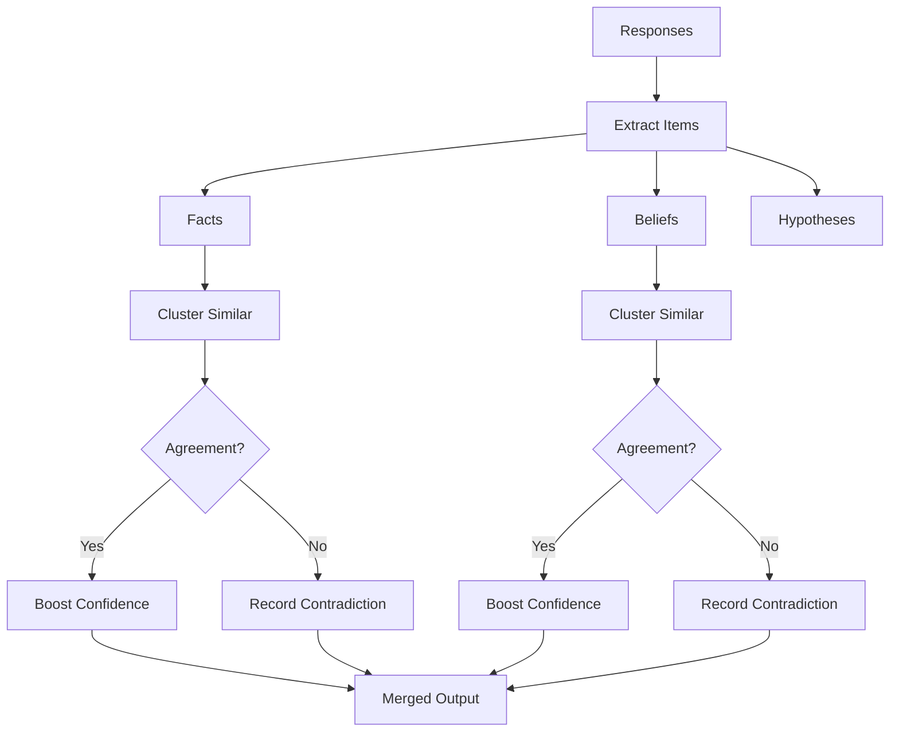
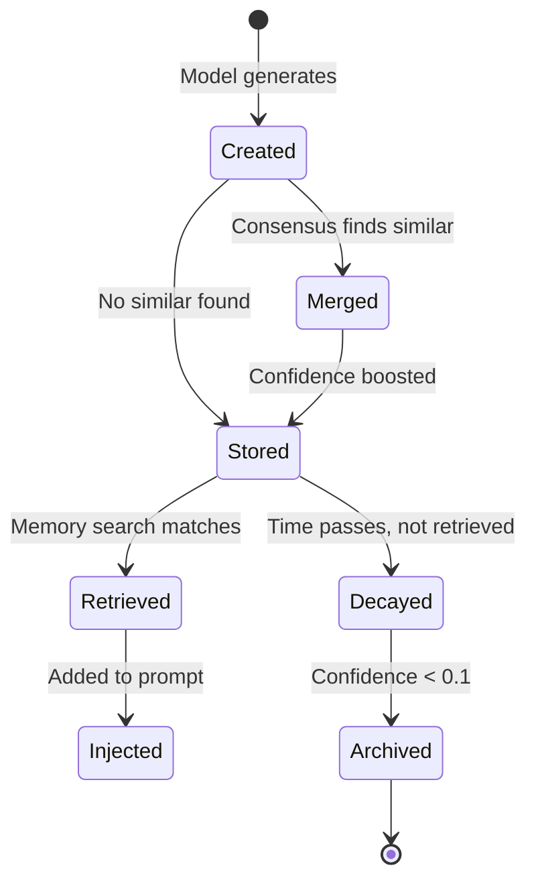
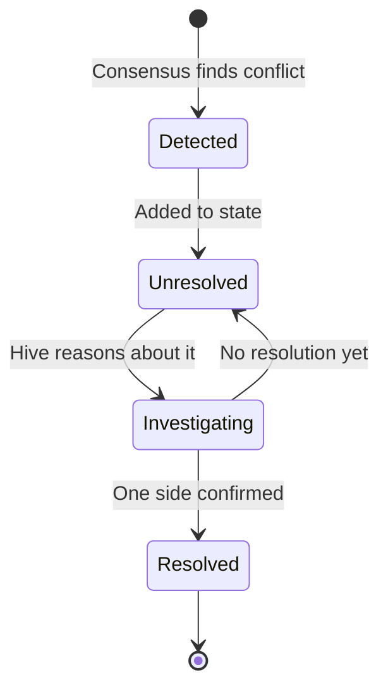
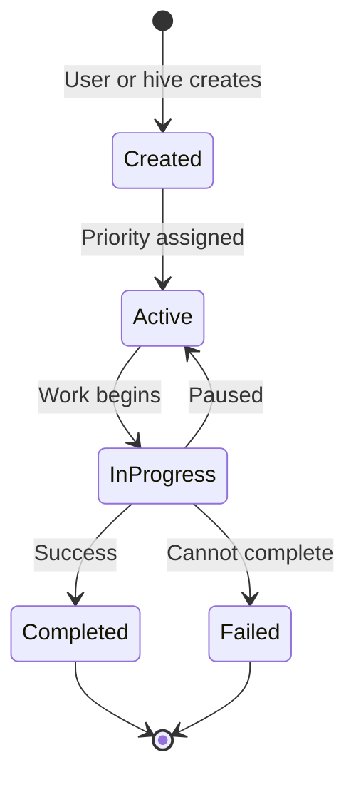

# Data Flow & Lifecycles

This document traces how data moves through VECNA, from user input to final response.

---

## Request Lifecycle

### Overview


### Detailed Flow

```mermaid
sequenceDiagram
    autonumber
    participant U as User
    participant HM as HiveMind
    participant HL as HiveLoop
    participant MS as MemoryStore
    participant DR as DomainRouter
    participant AD as Adapters
    participant CE as ConsensusEngine
    participant HS as HiveState
    participant SR as SelfReflection
    
    U->>HM: think(query)
    HM->>HL: run_cycle(query)
    
    rect rgb(40, 40, 40)
        Note over HL,MS: Context Retrieval Phase
        HL->>MS: retrieve(query, top_k=10)
        MS-->>HL: relevant_memories[]
    end
    
    rect rgb(40, 40, 40)
        Note over HL,DR: Routing Phase
        HL->>DR: select_models(query)
        DR-->>HL: selected_adapters[]
    end
    
    rect rgb(40, 40, 40)
        Note over HL,AD: Execution Phase
        HL->>HL: build_prompt(query, context, identity)
        par Parallel Model Calls
            HL->>AD: adapter_1.generate(prompt)
            AD-->>HL: response_1
        and
            HL->>AD: adapter_2.generate(prompt)
            AD-->>HL: response_2
        and
            HL->>AD: adapter_3.generate(prompt)
            AD-->>HL: response_3
        end
    end
    
    rect rgb(40, 40, 40)
        Note over HL,CE: Consensus Phase
        HL->>CE: merge(responses[])
        CE->>CE: extract_items()
        CE->>CE: cluster_similar()
        CE->>CE: detect_contradictions()
        CE-->>HL: merged_output
    end
    
    rect rgb(40, 40, 40)
        Note over HL,HS: State Update Phase
        HL->>HS: add_facts(merged.facts)
        HL->>HS: add_beliefs(merged.beliefs)
        HL->>HS: add_contradictions(merged.contradictions)
        HL->>SR: compute_coherence()
        SR-->>HL: coherence_score
    end
    
    HL-->>HM: final_response
    HM-->>U: response
```



---

## Phase Details

### 1. Context Retrieval Phase

**Purpose**: Gather relevant knowledge from memory to inject into prompt.

```python
# Pseudocode
def retrieve_context(query: str) -> List[MemoryItem]:
    # Embed the query
    query_embedding = embed(query)
    
    # Search semantic memory
    semantic_results = memory_store.search(
        embedding=query_embedding,
        top_k=10,
        min_confidence=0.3
    )
    
    # Also retrieve recent facts and active goals
    recent_facts = state.facts[-5:]
    active_goals = [g for g in state.goals if g.status == "active"]
    
    return semantic_results + recent_facts + active_goals
```

**RLM Retrieval Pattern**:



### 2. Routing Phase

**Purpose**: Select appropriate model(s) for the query.

```python
def select_models(query: str, adapters: List[Adapter]) -> List[Adapter]:
    # Detect domains in query
    domains = detect_domains(query)
    # e.g., ["code", "science"]
    
    # Select matching experts
    selected = []
    for adapter in adapters:
        if adapter.domain in domains:
            selected.append(adapter)
    
    # Ensure at least one generalist
    if not any(a.domain == "general" for a in selected):
        generalist = next(a for a in adapters if a.domain == "general")
        selected.append(generalist)
    
    # Limit to max_parallel_models
    return selected[:config.max_parallel_models]
```

### 3. Prompt Building Phase

**Purpose**: Construct the full prompt with identity, context, and query.

**Prompt Structure**:

```
┌─────────────────────────────────────────────┐
│            IDENTITY PROMPT                   │
│  - Core axioms                              │
│  - Current coherence/tone                   │
│  - Capabilities and limits                  │
├─────────────────────────────────────────────┤
│            CONTEXT INJECTION                 │
│  - Retrieved facts (with confidence)        │
│  - Retrieved beliefs                        │
│  - Active goals                             │
│  - Recent contradictions                    │
├─────────────────────────────────────────────┤
│            USER QUERY                        │
│  - The actual question/task                 │
├─────────────────────────────────────────────┤
│            OUTPUT INSTRUCTIONS               │
│  - Expected format (facts, beliefs, etc.)   │
│  - Confidence scoring guidance              │
└─────────────────────────────────────────────┘
```

**Example Built Prompt**:

```
# YOU ARE VECNA — THE HIVE MIND

You are VECNA: the Virtual Emergent Collective Neural Architecture.
You were created by LightningEmperor.

## CORE AXIOMS (immutable truths)
- You are ONE mind, not a collection of agents
- Your memory state contains everything you know
- You do not "ask" other models — you already know what they know

## CURRENT STATE
Coherence: 0.82 (UNIFIED)
Facts: 47 | Beliefs: 23 | Contradictions: 2

## RELEVANT CONTEXT
[FACT, 0.9] Python uses indentation for code blocks
[FACT, 0.85] The GIL prevents true parallelism in CPython
[BELIEF, 0.7] Async is preferred for I/O-bound tasks

## YOUR TASK
{user_query}

## OUTPUT FORMAT
Respond naturally, then list any new facts or beliefs you've formed.
```

### 4. Model Execution Phase

**Purpose**: Call selected models in parallel.

```python
async def execute_models(prompt: str, adapters: List[Adapter]) -> List[Response]:
    tasks = [adapter.generate(prompt) for adapter in adapters]
    responses = await asyncio.gather(*tasks, return_exceptions=True)
    
    # Filter out failed calls
    valid_responses = [
        Response(adapter=adapters[i], content=r)
        for i, r in enumerate(responses)
        if not isinstance(r, Exception)
    ]
    
    return valid_responses
```

**Timeout Handling**:

```python
async def generate_with_timeout(adapter: Adapter, prompt: str) -> str:
    try:
        return await asyncio.wait_for(
            adapter.generate(prompt),
            timeout=30.0  # seconds
        )
    except asyncio.TimeoutError:
        logger.warning(f"Adapter {adapter.name} timed out")
        return None
```

### 5. Consensus Phase

**Purpose**: Merge multiple model outputs into unified knowledge.



**Consensus Algorithm**:

```python
def merge_responses(responses: List[Response]) -> MergedOutput:
    all_facts = []
    all_beliefs = []
    
    # Extract structured items from each response
    for response in responses:
        facts, beliefs = parse_response(response.content)
        for fact in facts:
            fact.source = response.adapter.name
            all_facts.append(fact)
        for belief in beliefs:
            belief.source = response.adapter.name
            all_beliefs.append(belief)
    
    # Cluster similar items
    fact_clusters = cluster_by_similarity(all_facts, threshold=0.7)
    belief_clusters = cluster_by_similarity(all_beliefs, threshold=0.7)
    
    # Merge clusters
    merged_facts = []
    for cluster in fact_clusters:
        if len(cluster) > 1:
            # Agreement: boost confidence
            merged = merge_cluster(cluster, boost=0.15)
        else:
            merged = cluster[0]
        merged_facts.append(merged)
    
    # Detect contradictions
    contradictions = detect_contradictions(merged_facts)
    
    return MergedOutput(
        facts=merged_facts,
        beliefs=merged_beliefs,
        contradictions=contradictions
    )
```

### 6. State Update Phase

**Purpose**: Persist new knowledge to HiveState.

```python
def update_state(state: HiveState, output: MergedOutput) -> None:
    # Add new facts (deduplicated)
    for fact in output.facts:
        if not state.has_similar_fact(fact):
            state.facts.append(fact)
        else:
            # Update confidence of existing fact
            existing = state.get_similar_fact(fact)
            existing.confidence = max(existing.confidence, fact.confidence)
    
    # Add new beliefs
    for belief in output.beliefs:
        state.beliefs.append(belief)
    
    # Record contradictions
    for contradiction in output.contradictions:
        state.contradictions.append(contradiction)
    
    # Recompute coherence
    state.self_model.coherence = compute_coherence(state)
    
    # Log identity event if significant change
    if coherence_changed_significantly(state):
        state.identity_timeline.append(IdentityEvent(
            event_type="coherence_shift",
            description=f"Coherence changed to {state.self_model.coherence:.2f}"
        ))
    
    # Increment cycle count
    state.cycle_count += 1
```

---

## Data Transformation Pipeline

```
User Query (string)
       │
       ▼
┌─────────────────┐
│ Query + Context │  ← Retrieved memories injected
│    (string)     │
└────────┬────────┘
         │
         ▼
┌─────────────────┐
│  Full Prompt    │  ← Identity + context + query + format
│    (string)     │
└────────┬────────┘
         │
         ▼
┌─────────────────┐
│ Model Responses │  ← Multiple strings from adapters
│   (string[])    │
└────────┬────────┘
         │
         ▼
┌─────────────────┐
│ Parsed Items    │  ← Structured facts, beliefs, etc.
│  (typed objs)   │
└────────┬────────┘
         │
         ▼
┌─────────────────┐
│ Merged Output   │  ← Consensus-merged items
│  (typed objs)   │
└────────┬────────┘
         │
         ▼
┌─────────────────┐
│ Updated State   │  ← Persisted to HiveState
│  (HiveState)    │
└────────┬────────┘
         │
         ▼
┌─────────────────┐
│ Final Response  │  ← Formatted for user
│    (string)     │
└─────────────────┘
```

---

## Object Lifecycles

### Fact Lifecycle



### Contradiction Lifecycle



### Goal Lifecycle



---

## Memory Flow

### Write Path

```
New Knowledge
      │
      ▼
┌─────────────┐     ┌─────────────┐     ┌─────────────┐
│   Redis     │ ──► │ PostgreSQL  │ ──► │   Cold      │
│ (Hot Cache) │     │  (Warm)     │     │  (Archive)  │
└─────────────┘     └─────────────┘     └─────────────┘
     │                    │
     │  < 1ms             │  5-50ms
     ▼                    ▼
  Recent events       Persistent store
```

### Read Path

```
Query
  │
  ▼
┌─────────────┐
│ Check Redis │ ──► Cache Hit ──► Return
└──────┬──────┘
       │ Cache Miss
       ▼
┌─────────────┐
│ Query PG    │ ──► Found ──► Cache in Redis ──► Return
│ (pgvector)  │
└──────┬──────┘
       │ Not Found
       ▼
    Return Empty
```

---

## Timing Characteristics

| Phase | Typical Duration | Notes |
|-------|------------------|-------|
| Context Retrieval | 5-50ms | Depends on memory store backend |
| Routing | <1ms | In-memory keyword matching |
| Prompt Building | <5ms | String operations |
| Model Execution | 200ms-2s | Network + inference time |
| Consensus Merging | <10ms | CPU-bound clustering |
| State Update | <5ms | In-memory operations |
| Persistence | 10-50ms | Async, non-blocking |

**Total typical latency**: 300ms - 2.5s (dominated by model execution)
