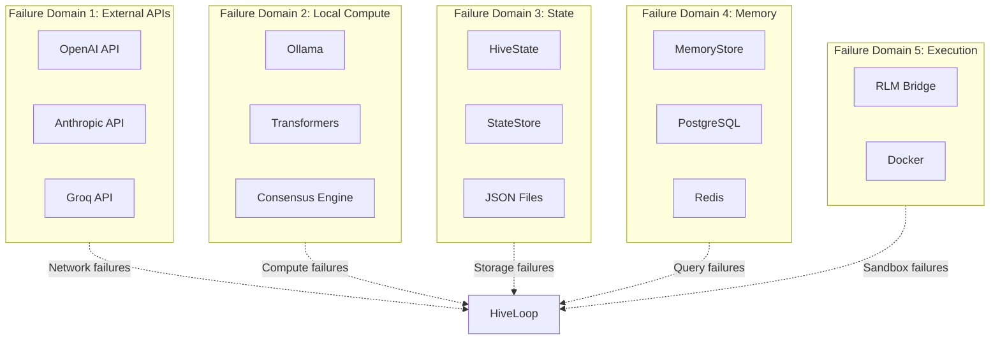
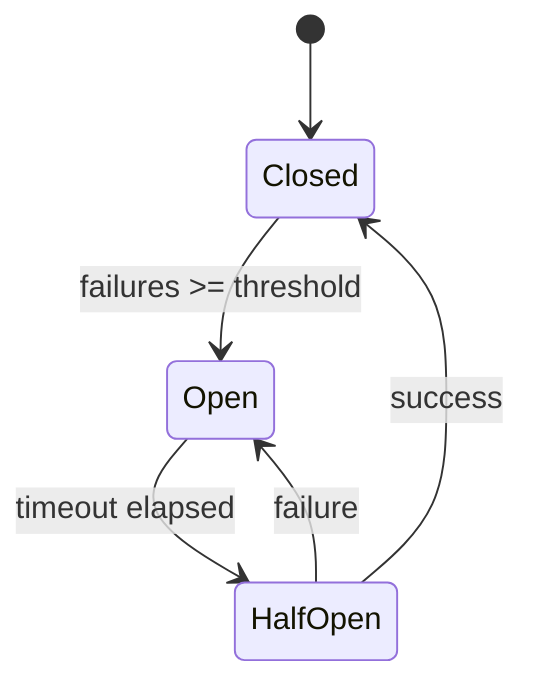
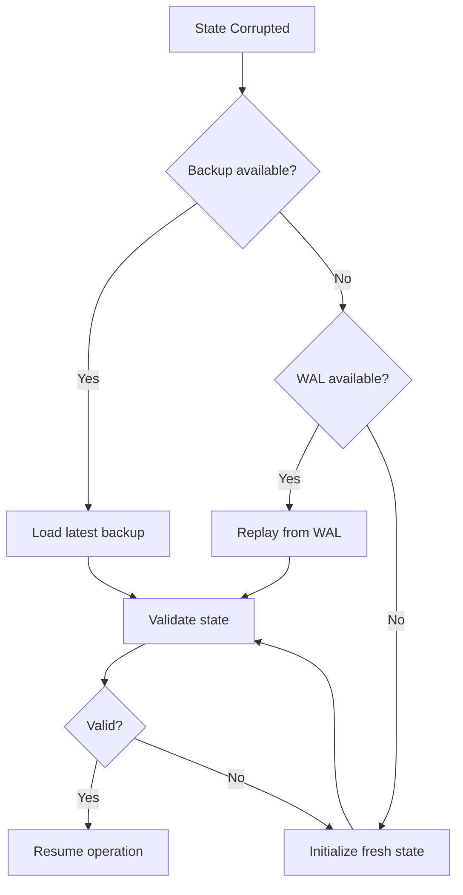
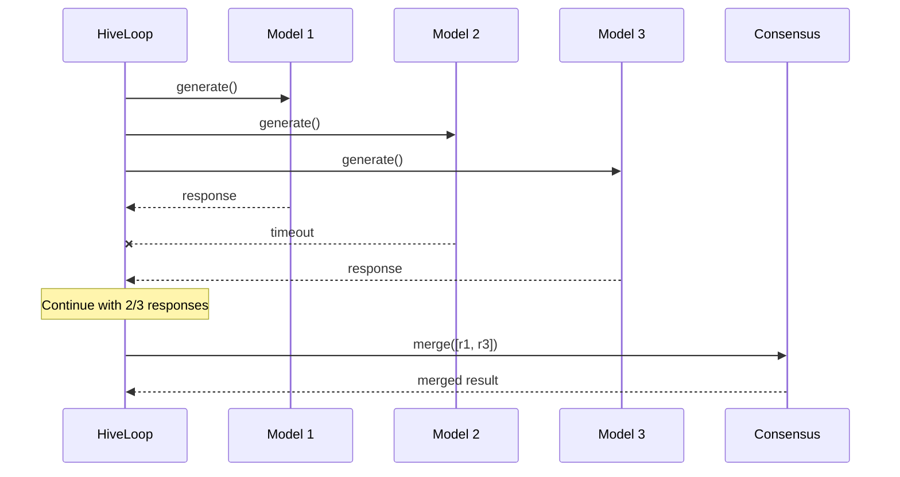
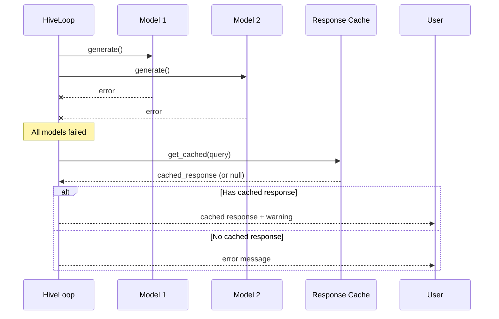
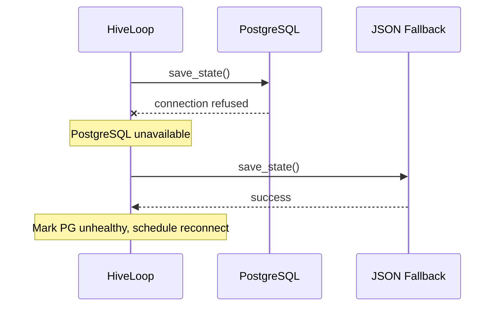

# Failure Domains & Resilience

VECNA is designed with explicit failure boundaries and recovery mechanisms. This document details how failures are isolated, detected, and handled.

---

## Failure Domain Map



---

## Failure Categories

### Category 1: Transient Failures

Temporary issues that resolve on retry.

| Failure | Detection | Recovery |
|---------|-----------|----------|
| API rate limit | HTTP 429 | Exponential backoff |
| Network timeout | Timeout exception | Retry with longer timeout |
| Temporary unavailable | HTTP 503 | Retry after delay |
| Connection reset | Connection error | Reconnect and retry |

### Category 2: Persistent Failures

Issues requiring intervention or fallback.

| Failure | Detection | Recovery |
|---------|-----------|----------|
| Invalid API key | HTTP 401/403 | Skip adapter, warn user |
| Model deprecated | HTTP 404 | Use fallback model |
| Quota exhausted | HTTP 402 | Switch provider or wait |
| Database down | Connection refused | Fallback to JSON store |

### Category 3: Data Failures

Corruption or inconsistency in data.

| Failure | Detection | Recovery |
|---------|-----------|----------|
| State corruption | Checksum mismatch | Restore from backup |
| Schema mismatch | Validation error | Run migration |
| Embedding dimension change | Size mismatch | Re-embed affected items |
| Index corruption | Query errors | Rebuild index |

### Category 4: Logic Failures

Bugs or unexpected behavior in code.

| Failure | Detection | Recovery |
|---------|-----------|----------|
| Consensus deadlock | Timeout | Force merge with single best |
| Infinite loop | Cycle count exceeded | Break with partial result |
| Memory exhaustion | OOM signal | Compress and retry |
| Assertion failure | AssertionError | Log and graceful degrade |

---

## Resilience Patterns

### 1. Circuit Breaker

Prevents cascading failures by stopping calls to failing services.

```python
class CircuitBreaker:
    def __init__(self, failure_threshold: int = 5, reset_timeout: int = 60):
        self.failure_count = 0
        self.failure_threshold = failure_threshold
        self.reset_timeout = reset_timeout
        self.state = "closed"  # closed, open, half-open
        self.last_failure_time = None
    
    async def call(self, func, *args, **kwargs):
        if self.state == "open":
            if self._should_attempt_reset():
                self.state = "half-open"
            else:
                raise CircuitOpenError("Circuit is open")
        
        try:
            result = await func(*args, **kwargs)
            self._on_success()
            return result
        except Exception as e:
            self._on_failure()
            raise
    
    def _on_success(self):
        self.failure_count = 0
        self.state = "closed"
    
    def _on_failure(self):
        self.failure_count += 1
        self.last_failure_time = time.time()
        if self.failure_count >= self.failure_threshold:
            self.state = "open"

# Usage
openai_breaker = CircuitBreaker()
anthropic_breaker = CircuitBreaker()

async def safe_generate(adapter, prompt):
    breaker = get_breaker_for(adapter)
    return await breaker.call(adapter.generate, prompt)
```



### 2. Bulkhead Isolation

Isolates failures to prevent cross-contamination.

```python
class BulkheadExecutor:
    def __init__(self, max_concurrent: int = 5):
        self.semaphore = asyncio.Semaphore(max_concurrent)
        self.active_calls = 0
    
    async def execute(self, func, *args, **kwargs):
        async with self.semaphore:
            self.active_calls += 1
            try:
                return await func(*args, **kwargs)
            finally:
                self.active_calls -= 1

# Separate bulkheads for different providers
openai_bulkhead = BulkheadExecutor(max_concurrent=5)
anthropic_bulkhead = BulkheadExecutor(max_concurrent=3)
groq_bulkhead = BulkheadExecutor(max_concurrent=10)
```

### 3. Retry with Backoff

Handles transient failures with intelligent retry.

```python
async def retry_with_backoff(
    func,
    max_retries: int = 3,
    base_delay: float = 1.0,
    max_delay: float = 60.0,
    exponential_base: float = 2.0,
    retryable_exceptions: tuple = (TimeoutError, ConnectionError)
):
    last_exception = None
    
    for attempt in range(max_retries + 1):
        try:
            return await func()
        except retryable_exceptions as e:
            last_exception = e
            
            if attempt == max_retries:
                break
            
            # Calculate delay with exponential backoff + jitter
            delay = min(
                base_delay * (exponential_base ** attempt),
                max_delay
            )
            jitter = random.uniform(0, delay * 0.1)
            
            logger.warning(f"Retry {attempt + 1}/{max_retries} after {delay:.1f}s: {e}")
            await asyncio.sleep(delay + jitter)
    
    raise last_exception
```

### 4. Fallback Chain

Provides alternative paths when primary fails.

```python
class FallbackChain:
    def __init__(self, *handlers):
        self.handlers = handlers
    
    async def execute(self, *args, **kwargs):
        last_error = None
        
        for handler in self.handlers:
            try:
                return await handler(*args, **kwargs)
            except Exception as e:
                logger.warning(f"Handler {handler.__name__} failed: {e}")
                last_error = e
                continue
        
        raise FallbackExhaustedError(f"All handlers failed. Last: {last_error}")

# Example: Embedding fallback chain
embedding_chain = FallbackChain(
    get_openai_embeddings,      # Primary: OpenAI API
    get_local_embeddings,        # Fallback 1: Local model
    get_keyword_embeddings,      # Fallback 2: TF-IDF
)

embeddings = await embedding_chain.execute(texts)
```

### 5. Graceful Degradation

Reduces functionality rather than failing completely.

```python
class GracefulDegradation:
    def __init__(self):
        self.degradation_level = 0  # 0 = full, 1 = partial, 2 = minimal
    
    async def think(self, query: str) -> str:
        if self.degradation_level == 0:
            # Full capability
            return await self._full_think(query)
        elif self.degradation_level == 1:
            # Partial: single model, no semantic memory
            return await self._partial_think(query)
        else:
            # Minimal: cached responses only
            return await self._minimal_think(query)
    
    async def _full_think(self, query: str) -> str:
        try:
            context = await self.memory.retrieve(query)
            models = self.router.select_models(query)
            responses = await self._execute_all(models, query, context)
            return self.consensus.merge(responses)
        except Exception as e:
            logger.error(f"Full think failed: {e}")
            self.degradation_level = 1
            return await self.think(query)
    
    async def _partial_think(self, query: str) -> str:
        try:
            response = await self.primary_adapter.generate(query)
            return response
        except Exception as e:
            logger.error(f"Partial think failed: {e}")
            self.degradation_level = 2
            return await self.think(query)
    
    async def _minimal_think(self, query: str) -> str:
        cached = self.cache.get(query)
        if cached:
            return cached
        return "I'm experiencing issues and operating in limited mode. Please try again later."
```

---

## Failure Detection

### Health Checks

```python
class HealthChecker:
    def __init__(self, hive: HiveMind):
        self.hive = hive
        self.checks = [
            self._check_adapters,
            self._check_memory,
            self._check_state,
            self._check_execution,
        ]
    
    async def run_all(self) -> HealthReport:
        results = {}
        for check in self.checks:
            try:
                status = await check()
                results[check.__name__] = status
            except Exception as e:
                results[check.__name__] = HealthStatus.UNHEALTHY(str(e))
        
        return HealthReport(results)
    
    async def _check_adapters(self) -> HealthStatus:
        healthy_count = 0
        for adapter in self.hive.adapters:
            try:
                await asyncio.wait_for(
                    adapter.generate("test"),
                    timeout=5.0
                )
                healthy_count += 1
            except:
                pass
        
        if healthy_count == len(self.hive.adapters):
            return HealthStatus.HEALTHY
        elif healthy_count > 0:
            return HealthStatus.DEGRADED(f"{healthy_count}/{len(self.hive.adapters)} adapters healthy")
        else:
            return HealthStatus.UNHEALTHY("No adapters available")
    
    async def _check_memory(self) -> HealthStatus:
        try:
            await self.hive.memory.search("test", top_k=1)
            return HealthStatus.HEALTHY
        except Exception as e:
            return HealthStatus.UNHEALTHY(str(e))
    
    async def _check_state(self) -> HealthStatus:
        try:
            _ = self.hive.state.to_dict()
            return HealthStatus.HEALTHY
        except Exception as e:
            return HealthStatus.UNHEALTHY(str(e))
    
    async def _check_execution(self) -> HealthStatus:
        try:
            result = await self.hive.execute_code("print('ok')")
            if "ok" in result:
                return HealthStatus.HEALTHY
            return HealthStatus.DEGRADED("Unexpected output")
        except Exception as e:
            return HealthStatus.UNHEALTHY(str(e))
```

### Anomaly Detection

```python
class AnomalyDetector:
    def __init__(self, window_size: int = 100):
        self.latencies = deque(maxlen=window_size)
        self.error_rates = deque(maxlen=window_size)
    
    def record_latency(self, latency_ms: float):
        self.latencies.append(latency_ms)
    
    def record_error(self, is_error: bool):
        self.error_rates.append(1 if is_error else 0)
    
    def detect_anomalies(self) -> List[Anomaly]:
        anomalies = []
        
        # Latency anomaly (> 3 std dev)
        if len(self.latencies) >= 10:
            mean = statistics.mean(self.latencies)
            std = statistics.stdev(self.latencies)
            latest = self.latencies[-1]
            
            if latest > mean + 3 * std:
                anomalies.append(Anomaly(
                    type="latency_spike",
                    value=latest,
                    threshold=mean + 3 * std
                ))
        
        # Error rate anomaly (> 20%)
        if len(self.error_rates) >= 10:
            error_rate = sum(self.error_rates) / len(self.error_rates)
            
            if error_rate > 0.2:
                anomalies.append(Anomaly(
                    type="high_error_rate",
                    value=error_rate,
                    threshold=0.2
                ))
        
        return anomalies
```

---

## Recovery Procedures

### State Recovery



```python
async def recover_state(store: StateStore) -> HiveState:
    # Try 1: Load current state
    try:
        state = await store.load()
        if validate_state(state):
            return state
    except Exception as e:
        logger.error(f"Current state invalid: {e}")
    
    # Try 2: Load from backup
    backups = await store.list_backups()
    for backup in sorted(backups, reverse=True):  # Most recent first
        try:
            state = await store.load_backup(backup)
            if validate_state(state):
                logger.info(f"Recovered from backup: {backup}")
                return state
        except:
            continue
    
    # Try 3: Replay from WAL
    try:
        state = await store.replay_wal()
        if validate_state(state):
            logger.info("Recovered from WAL replay")
            return state
    except:
        pass
    
    # Last resort: Fresh state
    logger.warning("Initializing fresh state - all history lost")
    return HiveState()
```

### Adapter Recovery

```python
async def recover_adapters(hive: HiveMind):
    for adapter in hive.adapters:
        if not await adapter.is_healthy():
            logger.warning(f"Adapter {adapter.name} unhealthy, attempting recovery")
            
            # Try reconnect
            try:
                await adapter.reconnect()
                if await adapter.is_healthy():
                    logger.info(f"Adapter {adapter.name} recovered")
                    continue
            except:
                pass
            
            # Try with fresh credentials
            try:
                await adapter.refresh_credentials()
                await adapter.reconnect()
                if await adapter.is_healthy():
                    logger.info(f"Adapter {adapter.name} recovered with new credentials")
                    continue
            except:
                pass
            
            # Mark as unavailable
            adapter.available = False
            logger.error(f"Adapter {adapter.name} could not be recovered")
```

---

## Failure Scenarios & Responses

### Scenario 1: Single Model Failure



**Response**: Continue with available responses. Log warning. Update adapter health.

### Scenario 2: All Models Fail



**Response**: Try cache. If miss, return informative error to user.

### Scenario 3: Database Failure



**Response**: Fall back to JSON storage. Queue writes for later sync.

---

## Summary

| Aspect | Strategy |
|--------|----------|
| **Isolation** | Bulkhead pattern, separate failure domains |
| **Detection** | Health checks, anomaly detection |
| **Prevention** | Circuit breakers, rate limiting |
| **Recovery** | Retry with backoff, fallback chains |
| **Degradation** | Graceful feature reduction |
| **Data Safety** | WAL, backups, validation |
