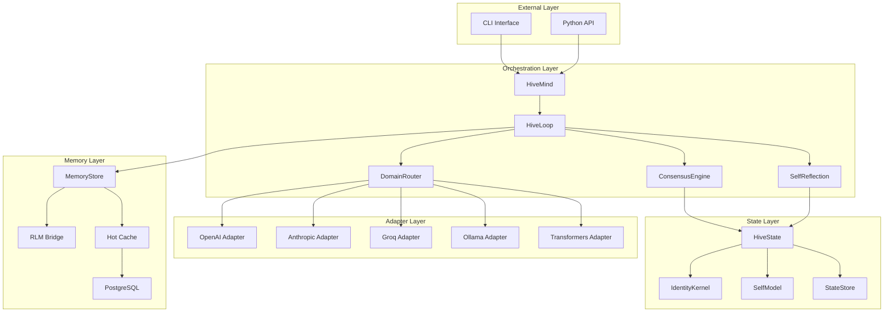
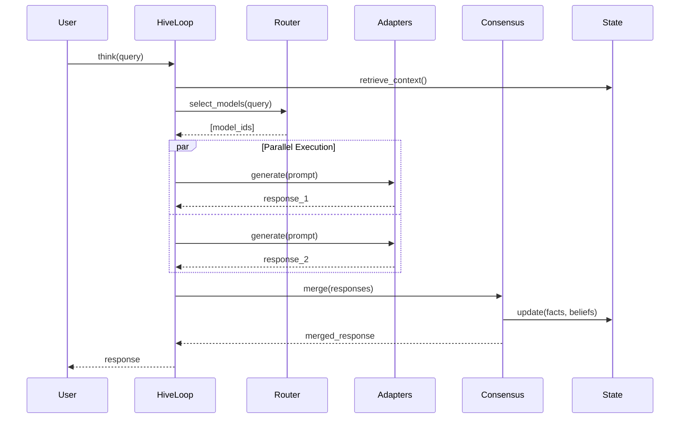
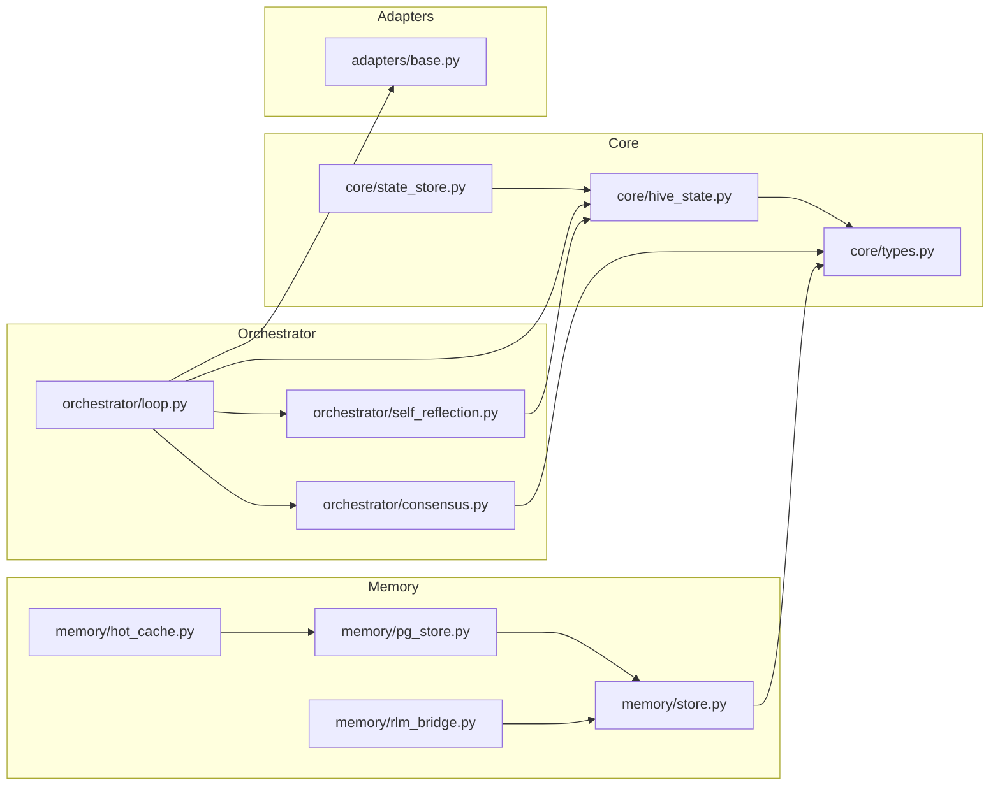

# System Topology

This document details the component layout and relationships within VECNA's architecture.

---

## High-Level Topology



---

## Component Hierarchy

### Entry Points

| Component | Type | Description |
|-----------|------|-------------|
| `HiveMind` | Class | Main entry point for programmatic access |
| `CLI` | Click app | Command-line interface |

### Orchestration Components

```
HiveMind
├── HiveLoop                 # Think cycle orchestration
│   ├── ConsensusEngine      # Output merging
│   ├── DomainRouter         # Task-to-expert routing
│   └── SelfReflection       # Coherence computation
├── Adapters[]               # Model provider interfaces
└── HiveState                # Shared mental substrate
```

### State Components

```
HiveState
├── facts[]                  # Verified knowledge
├── beliefs[]                # Interpretations
├── hypotheses[]             # Tentative ideas
├── goals[]                  # Active objectives
├── open_questions[]         # Unresolved queries
├── contradictions[]         # Tracked conflicts
├── identity_kernel          # Immutable axioms
├── self_model               # Dynamic self-awareness
└── identity_timeline        # History of becoming
```

### Memory Components

```
MemoryStore
├── embeddings               # Vector representations
├── index                    # HNSW or flat index
└── RLMBridge                # Docker sandbox
    └── CodeExecutor         # Python execution

HotCache (Redis)             # Fast access layer
└── PostgresStore            # Persistent storage
```

---

## Component Details

### HiveMind

**Location**: `vecna/orchestrator/loop.py`

The main entry point that manages:

- Model registration and lifecycle
- Configuration handling
- State persistence
- External API surface

```python
class HiveMind:
    def __init__(self, config: HiveConfig = None):
        self.config = config or HiveConfig()
        self.state = HiveState()
        self.loop = HiveLoop(self.state, self.config)
        self.adapters: List[ModelAdapter] = []
    
    def add_openai(self, model: str, **kwargs) -> None: ...
    def add_anthropic(self, model: str, **kwargs) -> None: ...
    async def think(self, query: str) -> str: ...
    def save(self, path: str) -> None: ...
    def load(self, path: str) -> None: ...
```

### HiveLoop

**Location**: `vecna/orchestrator/loop.py`

Orchestrates the think cycle:

1. Receive query
2. Retrieve relevant memory
3. Build prompts with identity + context
4. Execute models in parallel
5. Merge outputs via consensus
6. Update state
7. Return response



### ConsensusEngine

**Location**: `vecna/orchestrator/consensus.py`

Merges outputs from multiple models:

```python
class ConsensusEngine:
    def merge(self, responses: List[ModelResponse]) -> MergedOutput:
        # 1. Extract structured data (facts, beliefs, etc.)
        items = self._extract_items(responses)
        
        # 2. Cluster similar items
        clusters = self._cluster_similar(items)
        
        # 3. Detect contradictions
        contradictions = self._detect_contradictions(clusters)
        
        # 4. Compute consensus confidence
        merged = self._compute_consensus(clusters)
        
        return MergedOutput(merged, contradictions)
```

**Clustering Algorithm**:

- Uses Jaccard similarity on tokenized content
- Threshold: 0.7 (configurable)
- Groups similar statements across models

### DomainRouter

**Location**: `vecna/orchestrator/consensus.py`

Routes queries to domain experts:

```python
class DomainRouter:
    DOMAIN_KEYWORDS = {
        "code": ["python", "function", "class", "code", "implement"],
        "science": ["physics", "chemistry", "biology", "experiment"],
        "math": ["equation", "prove", "calculate", "theorem"],
        # ...
    }
    
    def route(self, query: str, adapters: List[Adapter]) -> List[Adapter]:
        detected_domains = self._detect_domains(query)
        
        # Always include at least one generalist
        selected = [a for a in adapters if a.domain in detected_domains]
        if not any(a.domain == "general" for a in selected):
            selected.append(self._get_generalist(adapters))
        
        return selected
```

### HiveState

**Location**: `vecna/core/hive_state.py`

The shared mental substrate:

```python
@dataclass
class HiveState:
    facts: List[Fact] = field(default_factory=list)
    beliefs: List[Belief] = field(default_factory=list)
    hypotheses: List[Hypothesis] = field(default_factory=list)
    goals: List[Goal] = field(default_factory=list)
    open_questions: List[OpenQuestion] = field(default_factory=list)
    contradictions: List[Contradiction] = field(default_factory=list)
    
    identity_kernel: IdentityKernel = field(default_factory=IdentityKernel)
    self_model: SelfModel = field(default_factory=SelfModel)
    identity_timeline: List[IdentityEvent] = field(default_factory=list)
    
    memory_summary: str = ""
    cycle_count: int = 0
```

### Model Adapters

**Location**: `vecna/adapters/base.py`

Unified interface for all LLM providers:

```python
class ModelAdapter(ABC):
    def __init__(self, model: str, name: str, domain: str):
        self.model = model
        self.name = name
        self.domain = domain
    
    @abstractmethod
    async def generate(self, prompt: str) -> str:
        """Generate response from the model."""
        pass

class OpenAIAdapter(ModelAdapter):
    async def generate(self, prompt: str) -> str:
        response = await self.client.chat.completions.create(
            model=self.model,
            messages=[{"role": "user", "content": prompt}]
        )
        return response.choices[0].message.content
```

---

## Dependency Graph



---

## Process Model

### Single-Process Mode (Default)

```
┌─────────────────────────────────────────┐
│              Python Process              │
│                                         │
│  ┌─────────┐  ┌─────────┐  ┌─────────┐ │
│  │ AsyncIO │  │  State  │  │ Memory  │ │
│  │  Loop   │  │  Store  │  │  Store  │ │
│  └─────────┘  └─────────┘  └─────────┘ │
│                                         │
└─────────────────────────────────────────┘
```

### Multi-Process Mode (With PostgreSQL)

```
┌─────────────────┐  ┌─────────────────┐
│   CLI Process   │  │ Explorer Process│
│                 │  │                 │
│  HiveMind       │  │  HiveMind       │
│  LocalCache     │  │  LocalCache     │
└────────┬────────┘  └────────┬────────┘
         │                    │
         └──────────┬─────────┘
                    │
         ┌──────────▼──────────┐
         │       Redis         │
         │    (Hot Cache)      │
         └──────────┬──────────┘
                    │
         ┌──────────▼──────────┐
         │    PostgreSQL       │
         │  (Persistent State) │
         └─────────────────────┘
```

---

## Thread Safety

| Component | Thread-Safe | Notes |
|-----------|-------------|-------|
| HiveState | No | Use locks for concurrent access |
| MemoryStore | Yes | Uses internal locking |
| Adapters | Yes | Stateless, async-safe |
| ConsensusEngine | Yes | Pure functions |
| StateStore | Yes | Atomic file/DB operations |

### Concurrent Access Pattern

```python
import asyncio
from threading import Lock

class SafeHiveMind:
    def __init__(self):
        self.hive = HiveMind()
        self._lock = Lock()
    
    async def safe_think(self, query: str) -> str:
        with self._lock:
            return await self.hive.think(query)
```

---

## Summary

VECNA's topology follows a clean layered architecture:

1. **External** → Entry points (CLI, API)
2. **Orchestration** → Core logic (loop, consensus, routing)
3. **Adapters** → Provider interfaces (stateless)
4. **State** → Shared substrate (single source of truth)
5. **Memory** → Persistence and retrieval (tiered)

Each layer depends only on layers below it, enabling independent testing and replacement of components.
