# ConsensusConfig

> *"Many voices, one truth."*

`ConsensusConfig` controls how VECNA merges responses from multiple models into unified knowledge. It determines confidence thresholds, agreement boosting, and contradiction handling.

---

## Overview

```python
from vecna import ConsensusConfig

config = ConsensusConfig(
    min_fact_confidence=0.3,
    agreement_boost=0.15,
    similarity_threshold=0.7,
)
```

---

## Complete Reference

### Confidence Thresholds

#### `min_fact_confidence`

Minimum confidence to classify as a fact.

| Property | Value |
|----------|-------|
| Type | `float` |
| Default | `0.3` |
| Range | `0.0` - `1.0` |

```python
config = ConsensusConfig(min_fact_confidence=0.5)
```

Items below this threshold become beliefs instead of facts.

#### `min_belief_confidence`

Minimum confidence to classify as a belief.

| Property | Value |
|----------|-------|
| Type | `float` |
| Default | `0.2` |
| Range | `0.0` - `1.0` |

```python
config = ConsensusConfig(min_belief_confidence=0.3)
```

Items below this threshold become hypotheses.

#### `min_hypothesis_confidence`

Minimum confidence to record a hypothesis.

| Property | Value |
|----------|-------|
| Type | `float` |
| Default | `0.1` |
| Range | `0.0` - `1.0` |

```python
config = ConsensusConfig(min_hypothesis_confidence=0.15)
```

Items below this threshold are discarded.

---

### Agreement & Boosting

#### `agreement_boost`

Confidence boost per agreeing model.

| Property | Value |
|----------|-------|
| Type | `float` |
| Default | `0.15` |
| Range | `0.0` - `0.5` |

```python
config = ConsensusConfig(agreement_boost=0.2)
```

**Example:**
- Base confidence: 0.6
- 2 models agree: 0.6 + 0.15 = 0.75
- 3 models agree: 0.6 + 0.30 = 0.90

#### `max_boosted_confidence`

Maximum confidence after boosting.

| Property | Value |
|----------|-------|
| Type | `float` |
| Default | `0.95` |
| Range | `0.5` - `1.0` |

```python
config = ConsensusConfig(max_boosted_confidence=0.99)
```

Prevents confidence from reaching 1.0 (reserved for axioms).

#### `contradiction_penalty`

Confidence penalty for contradicted items.

| Property | Value |
|----------|-------|
| Type | `float` |
| Default | `0.2` |
| Range | `0.0` - `0.5` |

```python
config = ConsensusConfig(contradiction_penalty=0.25)
```

Applied to items that are contradicted by other models.

---

### Similarity & Clustering

#### `similarity_threshold`

Minimum similarity to cluster items together.

| Property | Value |
|----------|-------|
| Type | `float` |
| Default | `0.7` |
| Range | `0.5` - `0.95` |

```python
config = ConsensusConfig(similarity_threshold=0.8)
```

**Effects:**
- Higher: Stricter clustering, more unique items
- Lower: More aggressive merging, fewer items

#### `use_semantic_similarity`

Use embedding-based similarity (vs. keyword).

| Property | Value |
|----------|-------|
| Type | `bool` |
| Default | `True` |

```python
config = ConsensusConfig(use_semantic_similarity=True)
```

- `True`: Cosine similarity of embeddings
- `False`: Jaccard similarity of keywords

#### `clustering_algorithm`

Algorithm for clustering similar items.

| Property | Value |
|----------|-------|
| Type | `str` |
| Default | `"greedy"` |
| Values | `greedy`, `hierarchical`, `dbscan` |

```python
config = ConsensusConfig(clustering_algorithm="hierarchical")
```

---

### Domain Weights

#### `use_domain_weights`

Weight model confidence by domain expertise.

| Property | Value |
|----------|-------|
| Type | `bool` |
| Default | `True` |

```python
config = ConsensusConfig(use_domain_weights=True)
```

When enabled, model confidence is scaled by domain match:

| Model | Code | Science | Creative |
|-------|------|---------|----------|
| GPT-4 | 1.0 | 0.9 | 0.8 |
| Claude | 0.9 | 0.8 | 1.0 |
| Groq | 0.7 | 0.8 | 0.6 |

#### `domain_weights`

Custom domain weight overrides.

| Property | Value |
|----------|-------|
| Type | `dict[str, dict[str, float]]` |
| Default | `{}` |

```python
config = ConsensusConfig(
    domain_weights={
        "gpt-4o": {"code": 1.0, "math": 0.95},
        "claude": {"creative": 1.0, "code": 0.85},
    }
)
```

---

### Contradiction Handling

#### `contradiction_strategy`

How to handle detected contradictions.

| Property | Value |
|----------|-------|
| Type | `str` |
| Default | `"record"` |
| Values | `record`, `resolve`, `ignore` |

```python
config = ConsensusConfig(contradiction_strategy="resolve")
```

- `record`: Store both items with contradiction link
- `resolve`: Keep higher-confidence item only
- `ignore`: Don't detect contradictions

#### `negation_patterns`

Patterns for detecting contradictions.

| Property | Value |
|----------|-------|
| Type | `list[str]` |
| Default | Built-in patterns |

```python
config = ConsensusConfig(
    negation_patterns=[
        r"(?:not|isn't|aren't|doesn't|don't|won't|can't)",
        r"(?:false|incorrect|wrong|invalid)",
        r"(?:never|impossible|unable)",
    ]
)
```

#### `min_contradiction_confidence`

Minimum confidence to flag a contradiction.

| Property | Value |
|----------|-------|
| Type | `float` |
| Default | `0.4` |
| Range | `0.0` - `1.0` |

```python
config = ConsensusConfig(min_contradiction_confidence=0.5)
```

Low-confidence contradictions are ignored.

---

### Response Merging

#### `merge_strategy`

Strategy for merging similar items.

| Property | Value |
|----------|-------|
| Type | `str` |
| Default | `"highest_confidence"` |
| Values | `highest_confidence`, `longest`, `first`, `average` |

```python
config = ConsensusConfig(merge_strategy="longest")
```

- `highest_confidence`: Keep item with highest confidence
- `longest`: Keep longest/most detailed item
- `first`: Keep first item encountered
- `average`: Average the content (experimental)

#### `preserve_sources`

Track which models contributed to each item.

| Property | Value |
|----------|-------|
| Type | `bool` |
| Default | `True` |

```python
config = ConsensusConfig(preserve_sources=True)
```

When enabled, merged items include metadata:
```python
item.metadata["sources"] = ["gpt-4o", "claude"]
item.metadata["consensus_count"] = 2
```

---

## Consensus Flow

```mermaid
flowchart TB
    subgraph Input["Model Responses"]
        R1[Response 1]
        R2[Response 2]
        R3[Response 3]
    end
    
    subgraph Process["Consensus Process"]
        Extract[Extract Items]
        Cluster[Cluster Similar]
        Detect[Detect Contradictions]
        Boost[Apply Agreement Boost]
        Merge[Merge Clusters]
    end
    
    subgraph Output["Unified Knowledge"]
        Facts[Facts]
        Beliefs[Beliefs]
        Contradictions[Contradictions]
    end
    
    Input --> Extract
    Extract --> Cluster
    Cluster --> Detect
    Detect --> Boost
    Boost --> Merge
    Merge --> Output
    
    style Process fill:#1a1a2e,stroke:#ff0000
```



---

## Configuration Presets

### High Consensus

Strict agreement requirements:

```python
config = ConsensusConfig(
    min_fact_confidence=0.5,
    agreement_boost=0.2,
    similarity_threshold=0.85,
    contradiction_strategy="record",
)
```

### Permissive

Accept more items with lower thresholds:

```python
config = ConsensusConfig(
    min_fact_confidence=0.2,
    min_belief_confidence=0.1,
    agreement_boost=0.1,
    similarity_threshold=0.6,
)
```

### Single Model

When using only one model:

```python
config = ConsensusConfig(
    min_fact_confidence=0.4,
    agreement_boost=0.0,  # No boost without agreement
    use_domain_weights=False,
)
```

### Contradiction Focus

Emphasize contradiction detection:

```python
config = ConsensusConfig(
    contradiction_strategy="record",
    contradiction_penalty=0.3,
    min_contradiction_confidence=0.3,
)
```

---

## Programmatic Access

### Reading Configuration

```python
from vecna import HiveMind

hive = HiveMind()
print(hive.consensus_config.agreement_boost)
print(hive.consensus_config.similarity_threshold)
```

### Runtime Modification

```python
# Adjust during operation
hive.consensus_config.agreement_boost = 0.2
hive.consensus_config.min_fact_confidence = 0.4
```

### Consensus Results

```python
# After thinking
result = await hive.think("What is Python?")

# Access consensus details
print(f"Facts extracted: {len(hive.state.facts)}")
print(f"Contradictions: {len(hive.state.contradictions)}")

# Check specific item
for fact in hive.state.facts:
    print(f"[{fact.confidence:.2f}] {fact.content}")
    print(f"  Sources: {fact.metadata.get('sources', [])}")
```

---

## Tuning Guide

### Increasing Fact Quality

```python
# Higher thresholds = fewer but more reliable facts
config = ConsensusConfig(
    min_fact_confidence=0.6,
    agreement_boost=0.2,
    similarity_threshold=0.8,
)
```

### Increasing Fact Quantity

```python
# Lower thresholds = more facts but lower reliability
config = ConsensusConfig(
    min_fact_confidence=0.2,
    agreement_boost=0.1,
    similarity_threshold=0.6,
)
```

### Better Contradiction Detection

```python
config = ConsensusConfig(
    use_semantic_similarity=True,
    contradiction_strategy="record",
    min_contradiction_confidence=0.3,
    negation_patterns=[
        r"(?:not|isn't|aren't)",
        r"(?:false|wrong|incorrect)",
        r"(?:however|but|although).*(?:not|different)",
    ],
)
```

---

## Best Practices

!!! tip "Consensus Tips"
    
    1. **Start with defaults** - They work well for most cases
    2. **Enable domain weights** - Improves quality for specialized queries
    3. **Track sources** - Helps debug unexpected results
    4. **Monitor contradictions** - High count may indicate poor question
    5. **Adjust thresholds gradually** - Small changes have big effects

!!! warning "Common Issues"
    
    - **Too few facts** - Lower `min_fact_confidence`
    - **Too many low-quality facts** - Raise thresholds
    - **Missing agreements** - Lower `similarity_threshold`
    - **False contradictions** - Adjust negation patterns

---

## Next Steps

- [HiveConfig](hive-config.md) - Core orchestrator settings
- [Environment Variables](environment.md) - API keys and secrets
- [Feature Flags](feature-flags.md) - Experimental features
