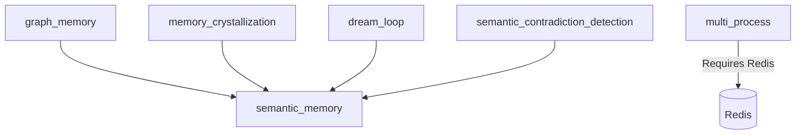

# Feature Flags

> *"Unlock the hive's potential."*

Feature flags allow you to enable or disable experimental features, optional capabilities, and behavior modifications in VECNA.

---

## Overview

Feature flags are configured via:

1. **Environment variables** - `VECNA_FEATURE_*`
2. **Configuration object** - `FeatureFlags`
3. **Runtime toggle** - `hive.features.enable(...)`

```python
from vecna import HiveMind, FeatureFlags

flags = FeatureFlags(
    streaming_responses=True,
    dream_loop=True,
    multi_process=False,
)

hive = HiveMind(features=flags)
```

---

## Available Flags

### Core Features

#### `streaming_responses`

Enable streaming token-by-token responses.

| Property | Value |
|----------|-------|
| Default | `True` |
| Stability | Stable |
| Environment | `VECNA_FEATURE_STREAMING` |

```python
flags = FeatureFlags(streaming_responses=True)

# Usage
async for token in hive.think_stream("Hello"):
    print(token, end="")
```

#### `semantic_memory`

Enable vector-based semantic memory.

| Property | Value |
|----------|-------|
| Default | `True` |
| Stability | Stable |
| Environment | `VECNA_FEATURE_SEMANTIC_MEMORY` |

```python
flags = FeatureFlags(semantic_memory=True)
```

When disabled, falls back to keyword-based retrieval.

#### `code_execution`

Enable automatic Python code execution in sandbox.

| Property | Value |
|----------|-------|
| Default | `True` |
| Stability | Stable |
| Environment | `VECNA_FEATURE_CODE_EXECUTION` |

```python
flags = FeatureFlags(code_execution=True)
```

Requires Docker for sandbox execution.

---

### Memory Features

#### `dream_loop`

Enable background memory consolidation (dream loop).

| Property | Value |
|----------|-------|
| Default | `False` |
| Stability | Experimental |
| Environment | `VECNA_FEATURE_DREAM_LOOP` |

```python
flags = FeatureFlags(dream_loop=True)
```

When enabled:
- Runs nightly compression
- Re-scores confidence based on coherence
- Merges redundant facts
- Updates identity timeline

#### `memory_decay`

Enable automatic confidence decay for unretrieved memories.

| Property | Value |
|----------|-------|
| Default | `True` |
| Stability | Stable |
| Environment | `VECNA_FEATURE_MEMORY_DECAY` |

```python
flags = FeatureFlags(memory_decay=True)
```

#### `memory_crystallization`

Enable crystallization of high-value memories (exempt from decay).

| Property | Value |
|----------|-------|
| Default | `True` |
| Stability | Beta |
| Environment | `VECNA_FEATURE_CRYSTALLIZATION` |

```python
flags = FeatureFlags(memory_crystallization=True)
```

#### `graph_memory`

Enable memory graph relationships (supports, contradicts).

| Property | Value |
|----------|-------|
| Default | `True` |
| Stability | Stable |
| Environment | `VECNA_FEATURE_GRAPH_MEMORY` |

```python
flags = FeatureFlags(graph_memory=True)
```

---

### Consensus Features

#### `domain_routing`

Enable domain-based model routing.

| Property | Value |
|----------|-------|
| Default | `True` |
| Stability | Stable |
| Environment | `VECNA_FEATURE_DOMAIN_ROUTING` |

```python
flags = FeatureFlags(domain_routing=True)
```

#### `contradiction_detection`

Enable automatic contradiction detection between items.

| Property | Value |
|----------|-------|
| Default | `True` |
| Stability | Stable |
| Environment | `VECNA_FEATURE_CONTRADICTION_DETECTION` |

```python
flags = FeatureFlags(contradiction_detection=True)
```

#### `semantic_contradiction_detection`

Use embeddings for contradiction detection (vs. keyword patterns).

| Property | Value |
|----------|-------|
| Default | `False` |
| Stability | Experimental |
| Environment | `VECNA_FEATURE_SEMANTIC_CONTRADICTIONS` |

```python
flags = FeatureFlags(semantic_contradiction_detection=True)
```

---

### Advanced Features

#### `multi_process`

Enable multi-process operation (CLI, Explorer, Dream).

| Property | Value |
|----------|-------|
| Default | `False` |
| Stability | Experimental |
| Environment | `VECNA_FEATURE_MULTI_PROCESS` |

```python
flags = FeatureFlags(multi_process=True)
```

Requires Redis for coordination.

#### `training_export`

Enable training dataset export for adapter fine-tuning.

| Property | Value |
|----------|-------|
| Default | `False` |
| Stability | Experimental |
| Environment | `VECNA_FEATURE_TRAINING_EXPORT` |

```python
flags = FeatureFlags(training_export=True)

# Usage
await hive.export_training_data("training_data.jsonl")
```

#### `autonomous_exploration`

Enable autonomous world exploration (24/7 operation).

| Property | Value |
|----------|-------|
| Default | `False` |
| Stability | Experimental |
| Environment | `VECNA_FEATURE_AUTONOMOUS` |

```python
flags = FeatureFlags(autonomous_exploration=True)
```

!!! warning "Resource Intensive"
    Autonomous exploration runs continuously and consumes API credits.

---

### UI Features

#### `boot_animation`

Show ASCII boot animation on startup.

| Property | Value |
|----------|-------|
| Default | `True` |
| Stability | Stable |
| Environment | `VECNA_FEATURE_BOOT_ANIMATION` |

```python
flags = FeatureFlags(boot_animation=True)
```

#### `live_visualization`

Enable live substrate visualization.

| Property | Value |
|----------|-------|
| Default | `True` |
| Stability | Stable |
| Environment | `VECNA_FEATURE_VISUALIZATION` |

```python
flags = FeatureFlags(live_visualization=True)
```

#### `activity_feed`

Show real-time activity feed in CLI.

| Property | Value |
|----------|-------|
| Default | `True` |
| Stability | Beta |
| Environment | `VECNA_FEATURE_ACTIVITY_FEED` |

```python
flags = FeatureFlags(activity_feed=True)
```

---

## Configuration Methods

### Via FeatureFlags Object

```python
from vecna import HiveMind, FeatureFlags

flags = FeatureFlags(
    streaming_responses=True,
    dream_loop=True,
    multi_process=False,
    training_export=True,
)

hive = HiveMind(features=flags)
```

### Via Environment Variables

```bash
export VECNA_FEATURE_STREAMING=true
export VECNA_FEATURE_DREAM_LOOP=true
export VECNA_FEATURE_MULTI_PROCESS=false
```

### Via Config File

```toml
# ~/.vecna/config.toml
[features]
streaming_responses = true
dream_loop = true
multi_process = false
training_export = true
```

### Runtime Toggle

```python
# Enable at runtime
hive.features.enable("dream_loop")
hive.features.disable("boot_animation")

# Check status
if hive.features.is_enabled("streaming_responses"):
    async for token in hive.think_stream(query):
        print(token)
else:
    response = await hive.think(query)
    print(response)
```

---

## Feature Groups

### Minimal

Bare minimum features:

```python
flags = FeatureFlags.minimal()
# Equivalent to:
# flags = FeatureFlags(
#     streaming_responses=False,
#     semantic_memory=False,
#     code_execution=False,
#     boot_animation=False,
# )
```

### Standard

Default recommended features:

```python
flags = FeatureFlags.standard()
# All stable features enabled
```

### Full

All features including experimental:

```python
flags = FeatureFlags.full()
# Everything enabled
```

### Custom Preset

```python
flags = FeatureFlags.from_preset("production")

# Available presets:
# - minimal: Bare minimum
# - standard: Recommended defaults
# - full: Everything enabled
# - production: Stable features only
# - development: All features for testing
```

---

## Stability Levels

| Level | Description | Recommendation |
|-------|-------------|----------------|
| **Stable** | Production ready | Safe to use |
| **Beta** | Mostly stable, minor issues possible | Use with caution |
| **Experimental** | Under development, may change | Testing only |
| **Deprecated** | Being removed | Migrate away |

### Checking Stability

```python
from vecna import FeatureFlags

# List all features with stability
for name, info in FeatureFlags.all_features().items():
    print(f"{name}: {info.stability} - {info.description}")

# Filter by stability
stable_features = FeatureFlags.by_stability("stable")
experimental_features = FeatureFlags.by_stability("experimental")
```

---

## Feature Dependencies

Some features require others:



### Dependency Validation

```python
flags = FeatureFlags(
    graph_memory=True,
    semantic_memory=False,  # Required by graph_memory!
)

# Raises FeatureDependencyError:
# "graph_memory requires semantic_memory to be enabled"
```

---

## Monitoring Features

### Feature Usage Metrics

```python
# Get feature usage stats
stats = hive.features.usage_stats()

print(stats)
# {
#     "streaming_responses": {"enabled": True, "invocations": 42},
#     "code_execution": {"enabled": True, "invocations": 15},
#     "dream_loop": {"enabled": False, "invocations": 0},
# }
```

### Feature Events

```python
# Listen for feature toggles
@hive.on_feature_change
def on_feature_change(feature: str, enabled: bool):
    print(f"Feature {feature} {'enabled' if enabled else 'disabled'}")
```

---

## Best Practices

!!! tip "Feature Flag Tips"
    
    1. **Start with defaults** - Standard preset works for most cases
    2. **Enable gradually** - Test experimental features in development first
    3. **Monitor stability** - Check stability levels before production
    4. **Document your flags** - Note which flags your deployment uses
    5. **Use presets** - Easier to manage than individual flags

!!! warning "Common Issues"
    
    - **Missing dependencies** - Check feature requirements
    - **Resource usage** - Some features consume more resources
    - **Experimental breakage** - Experimental features may change behavior

---

## Complete Reference

```python
@dataclass
class FeatureFlags:
    # Core
    streaming_responses: bool = True
    semantic_memory: bool = True
    code_execution: bool = True
    
    # Memory
    dream_loop: bool = False
    memory_decay: bool = True
    memory_crystallization: bool = True
    graph_memory: bool = True
    
    # Consensus
    domain_routing: bool = True
    contradiction_detection: bool = True
    semantic_contradiction_detection: bool = False
    
    # Advanced
    multi_process: bool = False
    training_export: bool = False
    autonomous_exploration: bool = False
    
    # UI
    boot_animation: bool = True
    live_visualization: bool = True
    activity_feed: bool = True
```

---

## Next Steps

- [HiveConfig](hive-config.md) - Core configuration
- [Environment Variables](environment.md) - API keys and settings
- [Operations](../operations/index.md) - Deployment guide
