# Configuration

> *"Shape the hive to your will."*

This section covers all configuration options for VECNA, from basic setup to advanced tuning.

---

## Overview

VECNA is configured through a combination of:

1. **Python Configuration Objects** - `HiveConfig`, `ConsensusConfig`, etc.
2. **Environment Variables** - API keys and deployment settings
3. **Feature Flags** - Enable/disable experimental features
4. **Runtime Settings** - Dynamic adjustments during operation

```mermaid
flowchart TB
    subgraph Sources["Configuration Sources"]
        Env[Environment Variables]
        Code[Python Config Objects]
        File[Config Files]
        Runtime[Runtime Settings]
    end
    
    subgraph Merged["Merged Configuration"]
        Final[Final Config]
    end
    
    Env --> Final
    Code --> Final
    File --> Final
    Runtime --> Final
    
    Final --> Hive[HiveMind]
    
    style Final fill:#1a1a2e,stroke:#ff0000
```



---

## Quick Start

### Minimal Configuration

```python
from vecna import HiveMind

# Uses all defaults - just add API keys via environment
hive = HiveMind()
hive.add_openai()  # Uses OPENAI_API_KEY from env
```

### Basic Configuration

```python
from vecna import HiveMind, HiveConfig

config = HiveConfig(
    max_parallel_models=3,
    use_semantic_memory=True,
    auto_execute_code=True,
    verbose=True,
)

hive = HiveMind(config=config)
```

### Full Configuration

```python
from vecna import HiveMind, HiveConfig, ConsensusConfig

hive_config = HiveConfig(
    max_parallel_models=5,
    use_routing=True,
    use_semantic_memory=True,
    use_local_embeddings=False,
    auto_execute_code=True,
    compress_every=5,
    max_cycles=20,
    verbose=True,
)

consensus_config = ConsensusConfig(
    min_fact_confidence=0.3,
    min_belief_confidence=0.2,
    agreement_boost=0.15,
    contradiction_penalty=0.2,
    similarity_threshold=0.7,
    use_domain_weights=True,
)

hive = HiveMind(
    config=hive_config,
    consensus_config=consensus_config,
)
```

---

## Section Contents

<div class="grid cards" markdown>

-   :material-cog:{ .lg .middle } **[HiveConfig](hive-config.md)**

    ---

    Core configuration for the HiveMind orchestrator, including model limits, memory settings, and execution options.

-   :material-merge:{ .lg .middle } **[ConsensusConfig](consensus-config.md)**

    ---

    Configure how model responses are merged, including confidence thresholds, agreement boosting, and contradiction handling.

-   :material-key:{ .lg .middle } **[Environment Variables](environment.md)**

    ---

    API keys, connection strings, and deployment settings via environment variables.

-   :material-flag:{ .lg .middle } **[Feature Flags](feature-flags.md)**

    ---

    Enable or disable experimental features and optional capabilities.

</div>

---

## Configuration Precedence

When the same setting is specified in multiple places, the following precedence applies (highest to lowest):

1. **Runtime settings** - `hive.config.verbose = False`
2. **Constructor arguments** - `HiveMind(config=...)`
3. **Environment variables** - `VECNA_VERBOSE=false`
4. **Config files** - `~/.vecna/config.toml`
5. **Defaults** - Built-in default values

---

## Environment Setup

### Required Environment Variables

```bash
# At least one model provider API key
export OPENAI_API_KEY="sk-..."
# OR
export ANTHROPIC_API_KEY="sk-ant-..."
# OR
export GROQ_API_KEY="gsk_..."
```

### Optional Environment Variables

```bash
# Memory backend
export VECNA_DATABASE_URL="postgresql://localhost/vecna"
export VECNA_REDIS_URL="redis://localhost:6379"

# Behavior
export VECNA_VERBOSE="true"
export VECNA_AUTO_EXECUTE_CODE="true"

# Paths
export VECNA_STATE_PATH="~/.vecna/hive_state.json"
export VECNA_LOG_PATH="~/.vecna/logs"
```

---

## Configuration Validation

VECNA validates configuration at startup:

```python
from vecna import HiveConfig, validate_config

config = HiveConfig(
    max_parallel_models=10,  # Will warn: high value
    compress_every=0,        # Will error: must be > 0
)

# Explicit validation
errors, warnings = validate_config(config)
for error in errors:
    print(f"ERROR: {error}")
for warning in warnings:
    print(f"WARNING: {warning}")
```

---

## Best Practices

!!! tip "Configuration Tips"
    
    1. **Start with defaults** - Override only what you need
    2. **Use environment variables for secrets** - Never hardcode API keys
    3. **Match models to use case** - More models isn't always better
    4. **Enable verbose mode initially** - Helps debug configuration issues
    5. **Version your config** - Track configuration changes

!!! warning "Common Mistakes"
    
    - **Too many parallel models** - Increases latency and cost
    - **Missing API keys** - Check environment variables
    - **Wrong embedding dimensions** - Must match your embedding model
    - **Disabled memory** - Loses context between queries

---

## Next Steps

Start with [HiveConfig](hive-config.md) for core settings, then explore [Environment Variables](environment.md) for deployment configuration.
