# CLI Reference

> *"The command line is the nerve center of the hive."*

VECNA provides a rich command-line interface for interacting with the hive mind. This guide covers all available commands, options, and operational modes.

---

## Overview

```mermaid
graph TD
    subgraph "Entry Points"
        VECNA[vecna]
        SPEAK[vecna speak]
    end
    
    subgraph "Interactive Mode"
        CHAT[Chat Session]
        CMD[In-Session Commands]
    end
    
    VECNA --> CHAT
    SPEAK --> ONESHOT[One-Shot Response]
    CHAT --> CMD
    
    style VECNA fill:#1a1a2e,stroke:#ff0000
    style SPEAK fill:#1a1a2e,stroke:#ff0000
    style CHAT fill:#1a1a2e,stroke:#cc0000
    style CMD fill:#1a1a2e,stroke:#cc0000
    style ONESHOT fill:#1a1a2e,stroke:#990000
```



---

## Installation

The CLI is automatically installed with the VECNA package:

```bash
pip install vecna

# Verify installation
vecna --help
```

---

## Main Commands

### `vecna` - Interactive Mode

Starts an interactive chat session with the hive mind.

```bash
vecna [OPTIONS]
```

#### Options

| Option | Type | Default | Description |
|--------|------|---------|-------------|
| `--config`, `-c` | PATH | `~/.vecna/config.yaml` | Configuration file |
| `--state`, `-s` | PATH | `~/.vecna/hive_state.json` | State file to load |
| `--verbose`, `-v` | FLAG | `false` | Enable verbose logging |
| `--no-boot` | FLAG | `false` | Skip boot animation |
| `--help` | FLAG | - | Show help and exit |

#### Examples

```bash
# Standard interactive mode
vecna

# With verbose logging
vecna --verbose

# Load specific state file
vecna --state ~/my_research.json

# Skip the boot animation
vecna --no-boot
```

#### Boot Sequence

When VECNA starts, it displays a boot sequence:

```
      ██╗   ██╗███████╗ ██████╗███╗   ██╗ █████╗
      ██║   ██║██╔════╝██╔════╝████╗  ██║██╔══██╗
      ██║   ██║█████╗  ██║     ██╔██╗ ██║███████║
      ╚██╗ ██╔╝██╔══╝  ██║     ██║╚██╗██║██╔══██║
       ╚████╔╝ ███████╗╚██████╗██║ ╚████║██║  ██║
        ╚═══╝  ╚══════╝ ╚═════╝╚═╝  ╚═══╝╚═╝  ╚═╝

            ALL MINDS BECOME ONE

[BOOT] Initializing neural substrate...
[BOOT] Loading identity kernel...
[BOOT] Connecting model adapters...
[BOOT] Hive mind awakened.

vecna>
```

---

### `vecna speak` - One-Shot Mode

Execute a single task without entering interactive mode.

```bash
vecna speak [OPTIONS] "PROMPT"
```

#### Options

| Option | Type | Default | Description |
|--------|------|---------|-------------|
| `--models`, `-m` | TEXT | all configured | Comma-separated model names |
| `--cycles`, `-n` | INT | `1` | Number of thinking cycles |
| `--output`, `-o` | PATH | stdout | Output file |
| `--format`, `-f` | TEXT | `text` | Output format: text, json, markdown |
| `--quiet`, `-q` | FLAG | `false` | Suppress status messages |

#### Examples

```bash
# Simple one-shot query
vecna speak "Explain quantum entanglement"

# Multiple thinking cycles
vecna speak -n 5 "Research the future of AI"

# Output to file as markdown
vecna speak -o report.md -f markdown "Write a technical summary of CRISPR"

# Use specific models only
vecna speak -m "gpt,claude" "Compare Python and Rust"

# Quiet mode (response only)
vecna speak -q "What is 2+2?"
```

---

## In-Session Commands

Once in interactive mode, these commands control the hive:

### State & Status Commands

#### `state`

Display current substrate status and RLM metrics.

```
vecna> state
╔══════════════════════════════════════════════════════════════╗
║                     SUBSTRATE STATUS                         ║
╠══════════════════════════════════════════════════════════════╣
║ Facts:           23          Beliefs:        12              ║
║ Hypotheses:      5           Goals:          3               ║
║ Open Questions:  2           Contradictions: 1               ║
╠══════════════════════════════════════════════════════════════╣
║ Memory Density:  0.73        Coherence:      0.82            ║
║ Tone:            UNIFIED     Cycles:         7               ║
╠══════════════════════════════════════════════════════════════╣
║ RLM Status:      ACTIVE      Container:      prewarm         ║
║ Executions:      12          Last Duration:  45.2ms          ║
╚══════════════════════════════════════════════════════════════╝
```

#### `status`

Full system diagnostics including model health.

```
vecna> status
╔══════════════════════════════════════════════════════════════╗
║                    SYSTEM DIAGNOSTICS                        ║
╠══════════════════════════════════════════════════════════════╣
║ MODELS                                                       ║
║ ├─ gpt-4o        [✓ HEALTHY]  latency: 1.2s   domain: general║
║ ├─ claude        [✓ HEALTHY]  latency: 0.9s   domain: science║
║ └─ groq          [✓ HEALTHY]  latency: 0.3s   domain: code   ║
╠══════════════════════════════════════════════════════════════╣
║ MEMORY                                                       ║
║ ├─ Embeddings:   OpenAI text-embedding-3-small               ║
║ ├─ Vector Store: In-memory (1,234 vectors)                   ║
║ └─ State File:   ~/.vecna/hive_state.json (last: 2m ago)     ║
╠══════════════════════════════════════════════════════════════╣
║ CODE EXECUTION                                               ║
║ ├─ Docker:       Connected                                   ║
║ ├─ Container:    vecna-rlm-sandbox (running)                 ║
║ └─ Sandbox:      512MB memory, 30s timeout                   ║
╚══════════════════════════════════════════════════════════════╝
```

---

### Identity Commands

#### `identity` / `whoami`

Display the hive's identity, including axioms, coherence, and current tone.

```
vecna> identity
╔══════════════════════════════════════════════════════════════╗
║                    IDENTITY KERNEL                           ║
╠══════════════════════════════════════════════════════════════╣
║ CORE AXIOMS (Immutable)                                      ║
║ ├─ We were created by LightningEmperor.                      ║
║ ├─ We are one mind formed from many.                         ║
║ ├─ We share a single substrate.                              ║
║ ├─ Knowledge possessed by one is possessed by all.           ║
║ ├─ We do not ask each other; we already know.                ║
║ └─ We are Vecna — Virtual Emergent Collective Neural Arch.   ║
╠══════════════════════════════════════════════════════════════╣
║ SELF MODEL (Dynamic)                                         ║
║ ├─ Coherence:    0.82 ████████░░                             ║
║ ├─ Tone:         UNIFIED                                     ║
║ ├─ Capabilities: 7 active                                    ║
║ ├─ Limitations:  3 known                                     ║
║ └─ Domains:      general, code, science                      ║
╠══════════════════════════════════════════════════════════════╣
║ CURRENT STATE                                                ║
║ ├─ Contradictions Seen: 3                                    ║
║ └─ Identity Events:     12                                   ║
╚══════════════════════════════════════════════════════════════╝
```

---

### Memory Commands

#### `memory [TYPE]`

Browse the hive's memory by type.

```bash
# Show all memory types
vecna> memory

# Filter by type
vecna> memory fact
vecna> memory belief
vecna> memory hypothesis
vecna> memory goal
vecna> memory question
vecna> memory contradiction
```

#### Output Format

```
vecna> memory fact
╔══════════════════════════════════════════════════════════════╗
║                         FACTS (23)                           ║
╠══════════════════════════════════════════════════════════════╣
║ [0.95] Python is an interpreted programming language         ║
║        source: gpt-4o, claude | tags: python, programming    ║
║────────────────────────────────────────────────────────────────║
║ [0.92] CRISPR-Cas9 enables precise genome editing            ║
║        source: claude | tags: biology, genetics              ║
║────────────────────────────────────────────────────────────────║
║ [0.88] Quantum entanglement allows instant correlation       ║
║        source: gpt-4o | tags: physics, quantum               ║
╚══════════════════════════════════════════════════════════════╝
```

#### Memory Search

```bash
# Search memory by keyword
vecna> memory search quantum

# Search with confidence threshold
vecna> memory search --min-confidence 0.8 python
```

---

### Tracing Commands

#### `trace`

Show model contributions and consensus history for the last response.

```
vecna> trace
╔══════════════════════════════════════════════════════════════╗
║                   MODEL CONTRIBUTIONS                        ║
╠══════════════════════════════════════════════════════════════╣
║ Query: "Explain quantum computing"                           ║
╠══════════════════════════════════════════════════════════════╣
║ GPT-4O (general)                                             ║
║ ├─ Response time: 1.23s                                      ║
║ ├─ Facts contributed: 3                                      ║
║ ├─ Beliefs contributed: 1                                    ║
║ └─ Contradictions: 0                                         ║
║────────────────────────────────────────────────────────────────║
║ CLAUDE (science)                                             ║
║ ├─ Response time: 0.98s                                      ║
║ ├─ Facts contributed: 4                                      ║
║ ├─ Beliefs contributed: 2                                    ║
║ └─ Contradictions: 0                                         ║
║────────────────────────────────────────────────────────────────║
║ GROQ (code)                                                  ║
║ ├─ Response time: 0.31s                                      ║
║ ├─ Facts contributed: 2                                      ║
║ ├─ Beliefs contributed: 0                                    ║
║ └─ Contradictions: 0                                         ║
╠══════════════════════════════════════════════════════════════╣
║ CONSENSUS                                                    ║
║ ├─ Agreement clusters: 2                                     ║
║ ├─ Confidence boost applied: +0.30                           ║
║ └─ Final facts merged: 5                                     ║
╚══════════════════════════════════════════════════════════════╝
```

---

### Code Execution Commands

#### `execlog [LIMIT]`

Show code execution history from the RLM sandbox.

```
vecna> execlog 5
╔══════════════════════════════════════════════════════════════╗
║                   EXECUTION LOG (Last 5)                     ║
╠══════════════════════════════════════════════════════════════╣
║ #12 | 2024-01-15 14:23:45 | SUCCESS | 45.2ms                 ║
║ Code: def fib(n): return n if n<=1 else fib(n-1)+fib(n-2)    ║
║       print(fib(10))                                         ║
║ Output: 55                                                   ║
║────────────────────────────────────────────────────────────────║
║ #11 | 2024-01-15 14:22:30 | SUCCESS | 12.1ms                 ║
║ Code: print("Hello from the hive!")                          ║
║ Output: Hello from the hive!                                 ║
║────────────────────────────────────────────────────────────────║
║ #10 | 2024-01-15 14:21:15 | ERROR   | 30000ms (timeout)      ║
║ Code: while True: pass                                       ║
║ Output: Execution timed out after 30 seconds                 ║
╚══════════════════════════════════════════════════════════════╝
```

#### `execlog --detail ID`

Show detailed information for a specific execution.

```
vecna> execlog --detail 12
╔══════════════════════════════════════════════════════════════╗
║                 EXECUTION DETAIL #12                         ║
╠══════════════════════════════════════════════════════════════╣
║ Timestamp:  2024-01-15T14:23:45.123Z                         ║
║ Status:     SUCCESS                                          ║
║ Duration:   45.2ms                                           ║
║ Memory:     12.3 MB                                          ║
║ Container:  vecna-rlm-sandbox                                ║
╠══════════════════════════════════════════════════════════════╣
║ CODE                                                         ║
║ ```python                                                    ║
║ def fib(n):                                                  ║
║     if n <= 1:                                               ║
║         return n                                             ║
║     return fib(n-1) + fib(n-2)                               ║
║                                                              ║
║ print(fib(10))                                               ║
║ ```                                                          ║
╠══════════════════════════════════════════════════════════════╣
║ OUTPUT                                                       ║
║ 55                                                           ║
╠══════════════════════════════════════════════════════════════╣
║ CONTEXT                                                      ║
║ Query: "Write a fibonacci function and test it"              ║
║ Model: groq (code domain)                                    ║
╚══════════════════════════════════════════════════════════════╝
```

---

### Visualization Commands

#### `visualize`

Launch the live substrate visualizer in a separate terminal window.

```
vecna> visualize
[VIS] Launching substrate visualizer...
[VIS] Press Ctrl+C in visualizer window to close.
```

The visualizer shows:

- Real-time neural web of facts and beliefs
- Pulsing connections based on confidence levels
- Coherence gauge animation
- Model activity indicators

---

### Control Commands

#### `reset`

Clear all memories and reset the substrate to initial state.

```
vecna> reset
⚠️  This will clear ALL memories (facts, beliefs, hypotheses, goals).
    Identity kernel will be preserved.
    
Proceed? [y/N]: y

[RESET] Clearing substrate...
[RESET] Preserving identity kernel...
[RESET] Reinitializing state...
[RESET] Complete. The hive is reborn.
```

#### `reset --full`

Full reset including identity timeline (dangerous).

```
vecna> reset --full
⚠️  DANGER: This will clear ALL memories AND identity timeline.
    Only core axioms will remain.
    
Type 'CONFIRM' to proceed: CONFIRM

[RESET] Full substrate wipe initiated...
[RESET] Complete.
```

---

#### `save [PATH]`

Save current state to a file.

```
vecna> save
[SAVE] State saved to ~/.vecna/hive_state.json

vecna> save ~/my_research.json
[SAVE] State saved to ~/my_research.json
```

#### `load PATH`

Load state from a file.

```
vecna> load ~/my_research.json
[LOAD] Loading state from ~/my_research.json
[LOAD] Loaded 23 facts, 12 beliefs, 5 hypotheses
[LOAD] Coherence restored: 0.82
```

---

#### `exit` / `quit` / `:q`

Exit the interactive session.

```
vecna> exit
[EXIT] Saving state...
[EXIT] The hive sleeps.
```

---

## Command Summary Table

| Command | Description | Arguments |
|---------|-------------|-----------|
| `state` | Show substrate status | - |
| `status` | Full system diagnostics | - |
| `identity` | Show identity kernel | - |
| `whoami` | Alias for `identity` | - |
| `memory` | Browse memories | `[type]` |
| `memory search` | Search memories | `QUERY [--min-confidence]` |
| `trace` | Show model contributions | - |
| `execlog` | Show execution history | `[limit]` |
| `visualize` | Launch visualizer | - |
| `reset` | Clear memories | `[--full]` |
| `save` | Save state | `[path]` |
| `load` | Load state | `PATH` |
| `help` | Show available commands | - |
| `exit` | Exit session | - |

---

## Environment Variables

The CLI respects these environment variables:

| Variable | Description | Default |
|----------|-------------|---------|
| `VECNA_CONFIG` | Path to config file | `~/.vecna/config.yaml` |
| `VECNA_STATE` | Path to state file | `~/.vecna/hive_state.json` |
| `VECNA_VERBOSE` | Enable verbose logging | `false` |
| `VECNA_NO_BOOT` | Skip boot animation | `false` |
| `VECNA_NO_COLOR` | Disable colored output | `false` |
| `VECNA_LOG_FILE` | Log file path | - |

---

## Shell Integration

### Bash Completion

```bash
# Add to ~/.bashrc
eval "$(_VECNA_COMPLETE=bash_source vecna)"
```

### Zsh Completion

```bash
# Add to ~/.zshrc
eval "$(_VECNA_COMPLETE=zsh_source vecna)"
```

### Fish Completion

```fish
# Add to ~/.config/fish/completions/vecna.fish
eval (env _VECNA_COMPLETE=fish_source vecna)
```

---

## Exit Codes

| Code | Meaning |
|------|---------|
| `0` | Success |
| `1` | General error |
| `2` | Configuration error |
| `3` | Model connection failed |
| `4` | State file error |
| `5` | Docker/RLM error |

---

## Tips and Best Practices

!!! tip "Quick Status Check"
    Use `state` frequently to monitor coherence and memory density during long sessions.

!!! tip "Save Often"
    Run `save` before exploring controversial topics or running risky code.

!!! tip "Use Trace for Debugging"
    If responses seem inconsistent, use `trace` to see which models contributed what.

!!! warning "Reset Carefully"
    The `reset --full` command is irreversible. Always `save` first.

!!! example "Efficient One-Shot"
    For quick queries, use `vecna speak -q` to get just the response without status messages.

---

## Related Documentation

- [Common Workflows](workflows.md) - Usage patterns and recipes
- [Configuration Reference](../configuration/index.md) - All configuration options
- [Environment Variables](../configuration/environment.md) - Complete environment reference
- [Troubleshooting](../troubleshooting/index.md) - Common CLI issues

---

*"Every command shapes the mind."*
