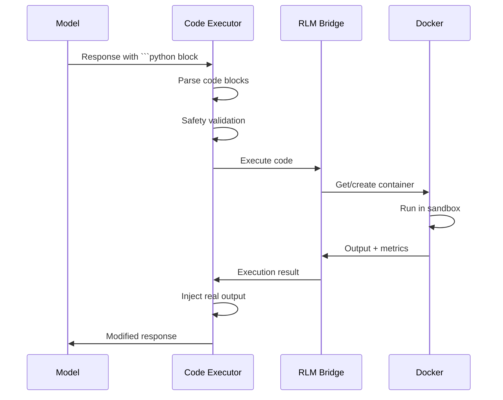

# Code Execution

> *"The hive does not merely think — it acts."*

VECNA can execute Python code in a secure sandbox, replacing hallucinated outputs with real results. This guide covers the RLM (Reasoning-Learning-Memory) code execution system.

---

## Overview

```mermaid
graph LR
    subgraph "HiveMind"
        GEN[Code Generation]
        DETECT[Block Detection]
    end
    
    subgraph "RLM Bridge"
        SANDBOX[Docker Sandbox]
        EXEC[Execution]
    end
    
    subgraph "Output"
        INJECT[Output Injection]
        LOG[Execution Log]
    end
    
    GEN --> DETECT
    DETECT --> SANDBOX
    SANDBOX --> EXEC
    EXEC --> INJECT
    EXEC --> LOG
    INJECT --> RESPONSE[Final Response]
    
    style GEN fill:#1a1a2e,stroke:#ff0000
    style DETECT fill:#1a1a2e,stroke:#ff0000
    style SANDBOX fill:#1a1a2e,stroke:#cc0000
    style EXEC fill:#1a1a2e,stroke:#cc0000
    style INJECT fill:#1a1a2e,stroke:#990000
    style LOG fill:#1a1a2e,stroke:#990000
```



---

## How It Works

### The Problem: Hallucinated Output

When LLMs generate code, they often "hallucinate" the output:

```python
# Model generates:
def fibonacci(n):
    if n <= 1:
        return n
    return fibonacci(n-1) + fibonacci(n-2)

print(fibonacci(10))
# Output: 55  ← This is a guess, not actual execution
```

The model predicts what the output *should* be, but doesn't actually run the code.

### The Solution: RLM Execution

VECNA intercepts code blocks, executes them in a Docker sandbox, and injects the real output:

```python
# Model generates code...

# VECNA executes it:
**Executed in RLM sandbox** (took 45.2ms):
```
55
```
```

Now the output is **verified** — it came from actual execution.

---

## Prerequisites

### Docker Installation

The RLM sandbox requires Docker:

```bash
# macOS
brew install docker
open -a Docker  # Start Docker Desktop

# Linux (Ubuntu/Debian)
sudo apt-get update
sudo apt-get install docker.io
sudo systemctl start docker

# Verify
docker --version
docker run hello-world
```

### Configuration

Enable code execution in your configuration:

```python
from vecna import HiveMind
from vecna.orchestrator import HiveConfig

config = HiveConfig(
    auto_execute_code=True  # Enable RLM
)

hive = HiveMind(config)
```

Or via environment:

```bash
export VECNA_AUTO_EXECUTE_CODE=true
```

---

## RLM Architecture

### Components

```mermaid
graph TB
    subgraph "Code Executor"
        PARSE[Block Parser]
        VALIDATE[Safety Check]
    end
    
    subgraph "RLM Bridge"
        DOCKER[Docker Client]
        CONTAINER[Container Manager]
        PREWARM[Prewarm Pool]
    end
    
    subgraph "Sandbox"
        PYTHON[Python 3.11]
        LIMITS[Resource Limits]
        ISOLATION[Network Isolation]
    end
    
    PARSE --> VALIDATE
    VALIDATE --> DOCKER
    DOCKER --> CONTAINER
    CONTAINER --> PREWARM
    PREWARM --> PYTHON
    PYTHON --> LIMITS
    LIMITS --> ISOLATION
    
    style PARSE fill:#1a1a2e,stroke:#ff0000
    style VALIDATE fill:#1a1a2e,stroke:#ff0000
    style DOCKER fill:#1a1a2e,stroke:#cc0000
    style CONTAINER fill:#1a1a2e,stroke:#cc0000
    style PREWARM fill:#1a1a2e,stroke:#cc0000
    style PYTHON fill:#1a1a2e,stroke:#990000
    style LIMITS fill:#1a1a2e,stroke:#990000
    style ISOLATION fill:#1a1a2e,stroke:#990000
```



### Execution Flow



---

## Sandbox Security

### Isolation Features

| Feature | Implementation | Purpose |
|---------|---------------|---------|
| **Container isolation** | Docker | Process/filesystem isolation |
| **Memory limit** | 512 MB | Prevent memory exhaustion |
| **CPU limit** | 1 core | Prevent CPU exhaustion |
| **Timeout** | 30 seconds | Prevent infinite loops |
| **Network disabled** | `--network=none` | No external access |
| **Read-only root** | `--read-only` | No filesystem modification |
| **No privileges** | `--security-opt=no-new-privileges` | No privilege escalation |

### What Code CAN Do

- Standard Python operations
- Math, string manipulation, data processing
- Use standard library (most modules)
- Print output to stdout/stderr
- Create temporary files (in /tmp)

### What Code CANNOT Do

- Access the internet
- Access the host filesystem
- Run system commands (limited)
- Spawn processes (limited)
- Use excessive memory or CPU
- Run indefinitely

---

## Configuration Options

### HiveConfig Options

```python
from vecna.orchestrator import HiveConfig

config = HiveConfig(
    # Enable/disable code execution
    auto_execute_code=True,
    
    # RLM-specific settings (via rlm_config)
    rlm_config={
        "timeout": 30,           # Seconds
        "memory_limit": "512m",  # Memory limit
        "cpu_limit": 1.0,        # CPU cores
        "prewarm": True,         # Keep container warm
        "image": "python:3.11-slim"  # Docker image
    }
)
```

### Environment Variables

| Variable | Default | Description |
|----------|---------|-------------|
| `VECNA_AUTO_EXECUTE_CODE` | `false` | Enable code execution |
| `VECNA_RLM_TIMEOUT` | `30` | Execution timeout (seconds) |
| `VECNA_RLM_MEMORY` | `512m` | Memory limit |
| `VECNA_RLM_IMAGE` | `python:3.11-slim` | Docker image |
| `VECNA_RLM_PREWARM` | `true` | Keep container prewarmed |

---

## Code Block Detection

### Supported Formats

VECNA detects Python code blocks in these formats:

````markdown
```python
print("Hello")
```
````

````markdown
```py
print("Hello")
```
````

````markdown
```
# Python code without language tag
print("Hello")
```
````

### Detection Logic

```python
# Code executor detects:
# 1. Fenced code blocks with python/py tag
# 2. Blocks containing Python keywords (def, import, print, etc.)
# 3. Blocks with Python-like syntax

# Example patterns matched:
patterns = [
    r'```python\n(.*?)```',
    r'```py\n(.*?)```',
    r'```\n(def |import |print\(|class )(.*?)```'
]
```

---

## Output Injection

### Before Execution

Model generates:

````markdown
Here's a Fibonacci function:

```python
def fib(n):
    if n <= 1:
        return n
    return fib(n-1) + fib(n-2)

print(fib(10))
```

The output will be 55.
````

### After Execution

VECNA injects real output:

````markdown
Here's a Fibonacci function:

```python
def fib(n):
    if n <= 1:
        return n
    return fib(n-1) + fib(n-2)

print(fib(10))
```

**Executed in RLM sandbox** (took 45.2ms):
```
55
```
````

### Error Handling

If code fails:

````markdown
```python
print(undefined_variable)
```

**Execution failed** (took 12.1ms):
```
NameError: name 'undefined_variable' is not defined
```
````

---

## Execution Logging

All executions are logged for auditing.

### Log Location

```
~/.vecna/execution_log.jsonl
```

### Log Format

```json
{
  "id": 12,
  "timestamp": "2024-01-15T14:23:45.123Z",
  "code": "def fib(n):\n    ...",
  "status": "success",
  "output": "55\n",
  "duration_ms": 45.2,
  "memory_bytes": 12943360,
  "query_context": "Write a fibonacci function",
  "model": "groq"
}
```

### Viewing Logs

```bash
# CLI command
vecna> execlog 10

# Detailed view
vecna> execlog --detail 12

# Programmatic
from vecna.tools import get_execution_log
logs = get_execution_log(limit=10)
```

---

## Advanced Usage

### Multiple Code Blocks

VECNA executes all Python blocks in order:

````markdown
First, let's define a helper:

```python
def square(x):
    return x * x
```

Now let's use it:

```python
print(square(5))
print(square(10))
```
````

Result:

````markdown
**Executed in RLM sandbox** (took 8.2ms):
```
(no output)
```

**Executed in RLM sandbox** (took 5.1ms):
```
25
100
```
````

### State Persistence (Within Session)

Code blocks in the same response share state:

````markdown
```python
x = 42
```

```python
print(x * 2)  # Can access x from previous block
```
````

### Installing Packages

The sandbox supports pip installation (with timeout constraints):

````markdown
```python
import subprocess
subprocess.run(["pip", "install", "numpy"], check=True)

import numpy as np
print(np.array([1, 2, 3]) * 2)
```
````

!!! warning "Package Installation Time"
    Package installation consumes timeout. For complex dependencies, 
    consider using a custom Docker image.

---

## Custom Docker Images

### Creating a Custom Image

```dockerfile
# Dockerfile.vecna
FROM python:3.11-slim

# Install common packages
RUN pip install --no-cache-dir \
    numpy \
    pandas \
    matplotlib \
    scipy \
    requests

# Security hardening
RUN useradd -m -s /bin/bash sandbox
USER sandbox
WORKDIR /home/sandbox
```

### Building and Using

```bash
docker build -t vecna-sandbox:custom -f Dockerfile.vecna .
```

```python
config = HiveConfig(
    auto_execute_code=True,
    rlm_config={
        "image": "vecna-sandbox:custom"
    }
)
```

---

## Disabling Execution

### Globally

```python
config = HiveConfig(
    auto_execute_code=False
)
```

### Per-Query

```python
# Disable for specific query
response = await hive.think(
    "Explain this code (don't execute)",
    execute_code=False
)
```

### Via Environment

```bash
export VECNA_AUTO_EXECUTE_CODE=false
```

---

## Troubleshooting

### Docker Not Available

```
Error: Docker is not running or not installed
```

**Solutions:**
1. Start Docker: `open -a Docker` (macOS) or `sudo systemctl start docker` (Linux)
2. Verify: `docker ps`
3. Check permissions: `sudo usermod -aG docker $USER`

### Execution Timeout

```
Error: Execution timed out after 30 seconds
```

**Solutions:**
1. Optimize code (avoid infinite loops)
2. Increase timeout: `rlm_config={"timeout": 60}`
3. Break into smaller chunks

### Memory Limit Exceeded

```
Error: Container exceeded memory limit
```

**Solutions:**
1. Reduce data size
2. Use generators instead of lists
3. Increase limit: `rlm_config={"memory_limit": "1g"}`

### Container Creation Failed

```
Error: Failed to create sandbox container
```

**Solutions:**
1. Check Docker disk space: `docker system df`
2. Clean up: `docker system prune`
3. Verify image exists: `docker images | grep python`

---

## Best Practices

### Code Quality

!!! tip "Use Type Hints"
    Models generate better code when asked for type hints:
    ```
    Write a function with proper type hints to calculate...
    ```

!!! tip "Request Tests"
    Ask for test code to verify behavior:
    ```
    Write the function and include test cases.
    ```

### Security

!!! warning "Review Before Trusting"
    Always review executed code output. The sandbox is secure, 
    but code logic errors can still produce incorrect results.

!!! danger "Don't Execute Untrusted Code"
    While the sandbox is isolated, avoid executing code from 
    untrusted sources without review.

### Performance

!!! tip "Prewarm Containers"
    Keep `prewarm=True` for faster execution during interactive sessions.

!!! tip "Batch Operations"
    For multiple calculations, combine into one code block 
    to avoid container overhead.

---

## Related Documentation

- [CLI Reference](cli.md) - `execlog` command details
- [Common Workflows](workflows.md) - Code development workflow
- [Architecture: Execution](../substrate/execution.md) - System design
- [Security](../security/index.md) - Security model

---

*"Verified truth, not hallucinated dreams."*
