# Guides

> *"To command the hive, one must first understand its rituals."*

This section provides practical, task-oriented guides for working with VECNA. Whether you're running your first query or orchestrating a multi-model research session, these guides will show you how.

---

## Guide Overview

```mermaid
graph LR
    subgraph "Getting Started"
        CLI[CLI Reference]
        WORK[Common Workflows]
    end
    
    subgraph "Advanced"
        MULTI[Multi-Model Setup]
        CODE[Code Execution]
    end
    
    CLI --> WORK
    WORK --> MULTI
    MULTI --> CODE
    
    style CLI fill:#1a1a2e,stroke:#ff0000
    style WORK fill:#1a1a2e,stroke:#ff0000
    style MULTI fill:#1a1a2e,stroke:#cc0000
    style CODE fill:#1a1a2e,stroke:#cc0000
```



---

## Available Guides

### [CLI Reference](cli.md)

Complete reference for VECNA's command-line interface.

| Topic | Description |
|-------|-------------|
| Interactive mode | The `vecna` command and chat session |
| One-shot execution | `vecna speak` for single tasks |
| In-session commands | `state`, `status`, `identity`, `memory`, etc. |
| Output formats | Terminal rendering and export options |

**Best for:** All users who interact with VECNA via terminal.

---

### [Common Workflows](workflows.md)

Step-by-step guides for typical VECNA usage patterns.

| Workflow | Description |
|----------|-------------|
| Research session | Multi-cycle knowledge accumulation |
| Code development | Writing and verifying code with RLM |
| State management | Saving, loading, and resetting state |
| Memory inspection | Browsing facts, beliefs, and contradictions |

**Best for:** Users learning VECNA's operational patterns.

---

### [Multi-Model Setup](multi-model.md)

Guide to configuring and orchestrating multiple AI models.

| Topic | Description |
|-------|-------------|
| Provider setup | API keys and authentication |
| Domain assignment | Routing models to specializations |
| Consensus tuning | Configuring agreement and contradiction handling |
| Local models | Using Ollama for offline operation |

**Best for:** Users building custom hive configurations.

---

### [Code Execution](code-execution.md)

Working with VECNA's RLM (Reasoning-Learning-Memory) code execution system.

| Topic | Description |
|-------|-------------|
| Docker sandbox | How code is executed safely |
| Output injection | Replacing hallucinated output with real results |
| Execution logging | Tracking and auditing code runs |
| Security model | Isolation and resource limits |

**Best for:** Developers using VECNA for code generation and verification.

---

## Quick Reference

### Starting VECNA

```bash
# Interactive chat mode
vecna

# One-shot task
vecna speak "Explain quantum computing"

# With specific config
VECNA_VERBOSE=true vecna
```

### Essential Commands

| Command | Action |
|---------|--------|
| `state` | Show substrate status |
| `status` | Full system diagnostics |
| `identity` | Display identity and coherence |
| `memory fact` | Browse facts |
| `trace` | Show model contributions |
| `reset` | Clear all memories |

### Model Setup

```python
from vecna import HiveMind

hive = HiveMind()
hive.add_openai("gpt-4o", domain="general")
hive.add_anthropic("claude-sonnet-4-20250514", domain="science")
hive.add_groq("llama-3.1-70b-versatile", domain="code")
```

---

## Learning Path

```mermaid
graph TD
    START[New User] --> CLI[Learn CLI Basics]
    CLI --> WORK[Practice Workflows]
    WORK --> MULTI[Configure Multi-Model]
    MULTI --> CODE[Enable Code Execution]
    CODE --> ADV[Advanced Operations]
    
    style START fill:#1a1a2e,stroke:#ff0000
    style CLI fill:#1a1a2e,stroke:#ff0000
    style WORK fill:#1a1a2e,stroke:#ff0000
    style MULTI fill:#1a1a2e,stroke:#cc0000
    style CODE fill:#1a1a2e,stroke:#cc0000
    style ADV fill:#1a1a2e,stroke:#990000
```



### Recommended Order

1. **CLI Reference** - Learn the commands
2. **Common Workflows** - Understand usage patterns
3. **Multi-Model Setup** - Build your hive configuration
4. **Code Execution** - Enable verified code output

---

## Prerequisites

Before using these guides, ensure you have:

- [ ] VECNA installed (`pip install vecna`)
- [ ] At least one API key configured (OpenAI, Anthropic, or Groq)
- [ ] Docker installed (for code execution features)
- [ ] Python 3.10+ environment

### Environment Setup

```bash
# Required: At least one provider
export OPENAI_API_KEY="sk-..."
export ANTHROPIC_API_KEY="sk-ant-..."
export GROQ_API_KEY="gsk_..."

# Optional: Local models
# Install Ollama from https://ollama.ai
ollama pull llama3.1
```

---

## Guide Conventions

Throughout these guides, you'll see:

!!! tip "Tips"
    Helpful suggestions for better results.

!!! warning "Warnings"
    Important caveats or potential issues.

!!! danger "Dangers"
    Critical information about destructive operations.

!!! example "Examples"
    Concrete code and command examples.

### Code Blocks

```python
# Python code for programmatic usage
hive = HiveMind()
```

```bash
# Shell commands for CLI operations
vecna speak "Hello, hive"
```

```
# Output examples (no syntax highlighting)
[UNIFIED] The hive mind responds...
```

---

## Getting Help

### In-Session Help

```
vecna> help
Available commands:
  state, status, identity, memory, trace, execlog, visualize, reset, exit
```

### Documentation

- [Architecture Overview](../architecture/index.md) - System design
- [Configuration Reference](../configuration/index.md) - All options
- [API Reference](../api/index.md) - Programmatic interface
- [Troubleshooting](../troubleshooting/index.md) - Common issues

### Community

- GitHub Issues: Report bugs and request features
- Discussions: Ask questions and share configurations

---

*"The hive awaits your command."*
