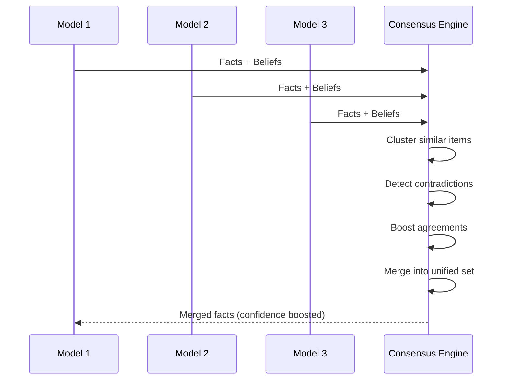

# Multi-Model Setup

> *"One mind, many voices — each contributing its strength."*

This guide covers how to configure multiple AI models to work together as a unified hive mind.

---

## Overview

```mermaid
graph TB
    subgraph "API Providers"
        OAI[OpenAI]
        ANT[Anthropic]
        GRQ[Groq]
    end
    
    subgraph "Local Providers"
        OLL[Ollama]
        HF[HuggingFace]
    end
    
    subgraph "HiveMind"
        ROUTER[Domain Router]
        CONS[Consensus Engine]
    end
    
    OAI --> ROUTER
    ANT --> ROUTER
    GRQ --> ROUTER
    OLL --> ROUTER
    HF --> ROUTER
    ROUTER --> CONS
    
    style OAI fill:#1a1a2e,stroke:#ff0000
    style ANT fill:#1a1a2e,stroke:#ff0000
    style GRQ fill:#1a1a2e,stroke:#ff0000
    style OLL fill:#1a1a2e,stroke:#cc0000
    style HF fill:#1a1a2e,stroke:#cc0000
    style ROUTER fill:#1a1a2e,stroke:#990000
    style CONS fill:#1a1a2e,stroke:#990000
```



---

## Supported Providers

| Provider | Adapter | Models | Strengths |
|----------|---------|--------|-----------|
| **OpenAI** | `OpenAIAdapter` | GPT-4, GPT-4o, o1, o3 | General reasoning, coding |
| **Anthropic** | `AnthropicAdapter` | Claude 3, Claude 3.5 | Analysis, safety, long context |
| **Groq** | `GroqAdapter` | Llama 3.1 70B | Ultra-fast inference |
| **Ollama** | `OllamaAdapter` | Any local model | Privacy, offline use |
| **HuggingFace** | `TransformersAdapter` | Any causal LM | Custom models |

---

## API Provider Setup

### OpenAI

#### Authentication

```bash
export OPENAI_API_KEY="sk-..."
```

#### Adding Models

```python
from vecna import HiveMind

hive = HiveMind()

# Standard GPT-4
hive.add_openai(
    model="gpt-4o",
    name="gpt",
    domain="general"
)

# GPT-4 Turbo for longer context
hive.add_openai(
    model="gpt-4-turbo",
    name="gpt-turbo",
    domain="analysis"
)

# Reasoning models
hive.add_openai(
    model="o1-preview",
    name="o1",
    domain="reasoning"
)
```

#### Configuration Options

| Option | Type | Default | Description |
|--------|------|---------|-------------|
| `model` | str | required | Model identifier |
| `name` | str | auto | Unique name in hive |
| `domain` | str | `"general"` | Specialization domain |
| `temperature` | float | `0.7` | Response randomness |
| `max_tokens` | int | `4096` | Maximum response length |
| `api_key` | str | env var | Override API key |

---

### Anthropic

#### Authentication

```bash
export ANTHROPIC_API_KEY="sk-ant-..."
```

#### Adding Models

```python
hive = HiveMind()

# Claude 3.5 Sonnet (balanced)
hive.add_anthropic(
    model="claude-sonnet-4-20250514",
    name="claude",
    domain="science"
)

# Claude 3 Opus (most capable)
hive.add_anthropic(
    model="claude-3-opus-20240229",
    name="claude-opus",
    domain="analysis"
)

# Claude 3 Haiku (fastest)
hive.add_anthropic(
    model="claude-3-haiku-20240307",
    name="claude-fast",
    domain="quick"
)
```

#### Configuration Options

| Option | Type | Default | Description |
|--------|------|---------|-------------|
| `model` | str | required | Model identifier |
| `name` | str | auto | Unique name in hive |
| `domain` | str | `"general"` | Specialization domain |
| `temperature` | float | `0.7` | Response randomness |
| `max_tokens` | int | `4096` | Maximum response length |
| `api_key` | str | env var | Override API key |

---

### Groq

#### Authentication

```bash
export GROQ_API_KEY="gsk_..."
```

#### Adding Models

```python
hive = HiveMind()

# Llama 3.1 70B (fast and capable)
hive.add_groq(
    model="llama-3.1-70b-versatile",
    name="groq",
    domain="code"
)

# Mixtral (good for diverse tasks)
hive.add_groq(
    model="mixtral-8x7b-32768",
    name="mixtral",
    domain="general"
)
```

!!! tip "Groq Speed"
    Groq provides extremely fast inference (~10x faster than OpenAI). 
    Great for code-heavy workflows where quick iteration matters.

#### Configuration Options

| Option | Type | Default | Description |
|--------|------|---------|-------------|
| `model` | str | required | Model identifier |
| `name` | str | auto | Unique name in hive |
| `domain` | str | `"general"` | Specialization domain |
| `temperature` | float | `0.7` | Response randomness |
| `max_tokens` | int | `4096` | Maximum response length |
| `api_key` | str | env var | Override API key |

---

## Local Model Setup

### Ollama

Ollama allows running models locally without API costs.

#### Installation

```bash
# macOS
brew install ollama

# Linux
curl -fsSL https://ollama.ai/install.sh | sh

# Start Ollama service
ollama serve
```

#### Pull Models

```bash
# Llama 3.1 (recommended)
ollama pull llama3.1

# Mistral
ollama pull mistral

# Code-focused
ollama pull codellama
```

#### Adding to Hive

```python
hive = HiveMind()

# Local Llama
hive.add_ollama(
    model="llama3.1",
    name="local-llama",
    domain="general"
)

# Code-specialized
hive.add_ollama(
    model="codellama",
    name="local-code",
    domain="code"
)
```

#### Configuration Options

| Option | Type | Default | Description |
|--------|------|---------|-------------|
| `model` | str | required | Model name (as pulled) |
| `name` | str | auto | Unique name in hive |
| `domain` | str | `"general"` | Specialization domain |
| `base_url` | str | `http://localhost:11434` | Ollama server URL |
| `temperature` | float | `0.7` | Response randomness |

!!! warning "Resource Usage"
    Local models use significant RAM and CPU/GPU. 
    70B models need ~40GB RAM or a capable GPU.

---

### HuggingFace Transformers

For complete control with custom or fine-tuned models.

#### Installation

```bash
pip install "vecna[transformers]"
# Or manually:
pip install transformers torch
```

#### Adding Models

```python
hive = HiveMind()

# Load from HuggingFace Hub
hive.add_transformers(
    model_name="mistralai/Mistral-7B-Instruct-v0.2",
    name="mistral-local",
    domain="general",
    device="cuda"  # or "cpu", "mps"
)

# Load from local path
hive.add_transformers(
    model_name="/path/to/my/model",
    name="custom",
    domain="specialized"
)
```

#### Configuration Options

| Option | Type | Default | Description |
|--------|------|---------|-------------|
| `model_name` | str | required | HF model ID or local path |
| `name` | str | auto | Unique name in hive |
| `domain` | str | `"general"` | Specialization domain |
| `device` | str | `"auto"` | Device: cuda, cpu, mps |
| `torch_dtype` | str | `"auto"` | Data type: float16, bfloat16 |
| `load_in_8bit` | bool | `False` | 8-bit quantization |
| `load_in_4bit` | bool | `False` | 4-bit quantization |

---

## Domain Assignment

Domains determine which models are selected for specific queries.

### Built-in Domains

| Domain | Query Patterns | Best Models |
|--------|---------------|-------------|
| `general` | Open-ended, conversation | GPT-4, Claude |
| `code` | Programming, debugging | Groq/Llama, GPT-4 |
| `science` | Research, analysis | Claude, GPT-4 |
| `math` | Calculations, proofs | o1, Claude |
| `creative` | Writing, ideation | Claude, GPT-4 |

### Domain Routing

```mermaid
graph LR
    QUERY[User Query] --> ROUTER[Domain Router]
    ROUTER --> |code keywords| CODE[Code Models]
    ROUTER --> |science keywords| SCI[Science Models]
    ROUTER --> |general| GEN[General Models]
    
    CODE --> CONS[Consensus]
    SCI --> CONS
    GEN --> CONS
    
    style QUERY fill:#1a1a2e,stroke:#ff0000
    style ROUTER fill:#1a1a2e,stroke:#ff0000
    style CODE fill:#1a1a2e,stroke:#cc0000
    style SCI fill:#1a1a2e,stroke:#cc0000
    style GEN fill:#1a1a2e,stroke:#cc0000
    style CONS fill:#1a1a2e,stroke:#990000
```



### Configuring Domains

```python
hive = HiveMind()

# Explicit domain assignment
hive.add_openai("gpt-4o", name="gpt", domain="general")
hive.add_anthropic("claude-sonnet-4-20250514", name="claude", domain="science")
hive.add_groq("llama-3.1-70b-versatile", name="groq", domain="code")

# Multiple domains per model
hive.add_openai(
    "gpt-4o",
    name="gpt-multi",
    domain=["general", "code", "analysis"]
)
```

### Disabling Routing

```python
from vecna.orchestrator import HiveConfig

config = HiveConfig(
    use_routing=False  # All models respond to all queries
)

hive = HiveMind(config)
```

---

## Consensus Configuration

### How Consensus Works



### Tuning Consensus

```python
from vecna.orchestrator import HiveConfig, ConsensusConfig

consensus = ConsensusConfig(
    # Minimum confidence to accept
    min_fact_confidence=0.3,
    min_belief_confidence=0.2,
    
    # Agreement effects
    agreement_boost=0.15,       # +15% per agreeing model
    contradiction_penalty=0.2,  # -20% for contradicted items
    
    # Clustering
    similarity_threshold=0.7,   # 70% Jaccard similarity to merge
    
    # Domain weighting
    use_domain_weights=True     # Domain experts get higher weight
)

config = HiveConfig(consensus_config=consensus)
hive = HiveMind(config)
```

### Consensus Parameters

| Parameter | Default | Description |
|-----------|---------|-------------|
| `min_fact_confidence` | `0.3` | Minimum confidence to accept a fact |
| `min_belief_confidence` | `0.2` | Minimum confidence to accept a belief |
| `agreement_boost` | `0.15` | Confidence boost per agreeing model |
| `contradiction_penalty` | `0.2` | Confidence reduction for contradictions |
| `similarity_threshold` | `0.7` | Jaccard similarity threshold for merging |
| `use_domain_weights` | `True` | Weight domain experts higher |

---

## Example Configurations

### Research Hive

Optimized for deep research and analysis:

```python
from vecna import HiveMind
from vecna.orchestrator import HiveConfig, ConsensusConfig

config = HiveConfig(
    max_parallel_models=4,
    use_routing=True,
    compress_every=3,
    use_semantic_memory=True,
    consensus_config=ConsensusConfig(
        agreement_boost=0.2,  # Strong agreement emphasis
        similarity_threshold=0.6  # Looser clustering
    )
)

hive = HiveMind(config)

# Reasoning powerhouse
hive.add_openai("gpt-4o", name="gpt", domain="general")
hive.add_anthropic("claude-sonnet-4-20250514", name="claude", domain="science")
hive.add_anthropic("claude-3-opus-20240229", name="opus", domain="analysis")
hive.add_openai("o1-preview", name="o1", domain="reasoning")
```

### Code Development Hive

Optimized for programming tasks:

```python
config = HiveConfig(
    max_parallel_models=3,
    use_routing=True,
    auto_execute_code=True,
    consensus_config=ConsensusConfig(
        min_fact_confidence=0.4,  # Higher bar for code facts
    )
)

hive = HiveMind(config)

# Fast iteration
hive.add_groq("llama-3.1-70b-versatile", name="groq", domain="code")
hive.add_openai("gpt-4o", name="gpt", domain=["code", "general"])
hive.add_anthropic("claude-sonnet-4-20250514", name="claude", domain="code")
```

### Offline Hive

No API dependencies:

```python
config = HiveConfig(
    use_local_embeddings=True,  # No OpenAI embeddings
    auto_execute_code=True
)

hive = HiveMind(config)

# All local
hive.add_ollama("llama3.1", name="llama", domain="general")
hive.add_ollama("codellama", name="codellama", domain="code")
hive.add_ollama("mistral", name="mistral", domain="analysis")
```

### Budget-Conscious Hive

Minimize API costs:

```python
config = HiveConfig(
    max_parallel_models=2,  # Fewer parallel calls
    compress_every=2,       # Frequent compression
)

hive = HiveMind(config)

# Mix of cheap and capable
hive.add_groq("llama-3.1-70b-versatile", name="groq", domain="general")
hive.add_anthropic("claude-3-haiku-20240307", name="haiku", domain="quick")
hive.add_ollama("llama3.1", name="local", domain="backup")
```

---

## Model Management

### Checking Model Status

```python
# Programmatic
for name, adapter in hive.adapters.items():
    print(f"{name}: {adapter.model} ({adapter.domain})")

# CLI
vecna> status
```

### Disabling/Enabling Models

```python
# Temporarily disable
hive.disable_model("slow-model")

# Re-enable
hive.enable_model("slow-model")

# Remove entirely
hive.remove_model("unused-model")
```

### Runtime Model Addition

```python
# Start with basic hive
hive = HiveMind()
hive.add_openai("gpt-4o", name="gpt")

# Add more models as needed
if need_science:
    hive.add_anthropic("claude-sonnet-4-20250514", name="claude", domain="science")

if need_speed:
    hive.add_groq("llama-3.1-70b-versatile", name="groq", domain="code")
```

---

## Best Practices

### Model Selection

!!! tip "Diversity is Strength"
    Use models from different providers. They have different training data 
    and biases, leading to richer consensus.

!!! tip "Match Domain to Strength"
    - **Code**: Groq/Llama (fast), GPT-4 (accurate)
    - **Analysis**: Claude (thorough), GPT-4 (versatile)
    - **Reasoning**: o1 (deep), Claude Opus (careful)

### Performance

!!! tip "Limit Parallel Models"
    More than 5 parallel models rarely improves quality but increases cost and latency.

!!! tip "Use Groq for Speed"
    Groq's Llama is ~10x faster than OpenAI. Use it for iterative tasks.

### Cost Management

!!! warning "Monitor Usage"
    Each thinking cycle queries all active models. 
    Use `max_cycles` and `compress_every` to control costs.

!!! tip "Local for Development"
    Use Ollama during development, switch to API models for production.

---

## Troubleshooting

### Model Connection Failed

```
Error: Failed to connect to model 'gpt'
```

**Solutions:**
1. Check API key: `echo $OPENAI_API_KEY`
2. Verify network connectivity
3. Check provider status page
4. Try with verbose mode: `vecna --verbose`

### Slow Responses

```
vecna> status
# Check latencies
```

**Solutions:**
1. Remove slow models temporarily
2. Reduce `max_parallel_models`
3. Use faster models (Groq, Claude Haiku)

### Inconsistent Outputs

**Solutions:**
1. Check `trace` for model contributions
2. Increase `similarity_threshold` for tighter clustering
3. Increase `min_fact_confidence` for higher quality

---

## Related Documentation

- [Configuration Reference](../configuration/index.md) - All options
- [Consensus Config](../configuration/consensus-config.md) - Consensus details
- [Architecture: Consensus](../architecture/consistency.md) - How consensus works
- [Troubleshooting](../troubleshooting/index.md) - Common issues

---

*"Many voices, one truth."*
