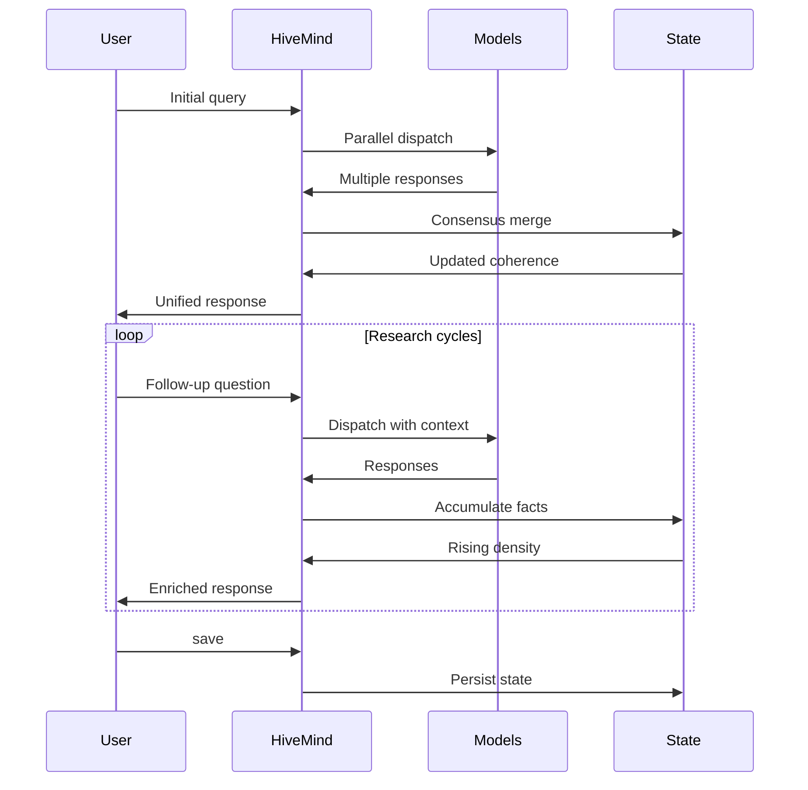
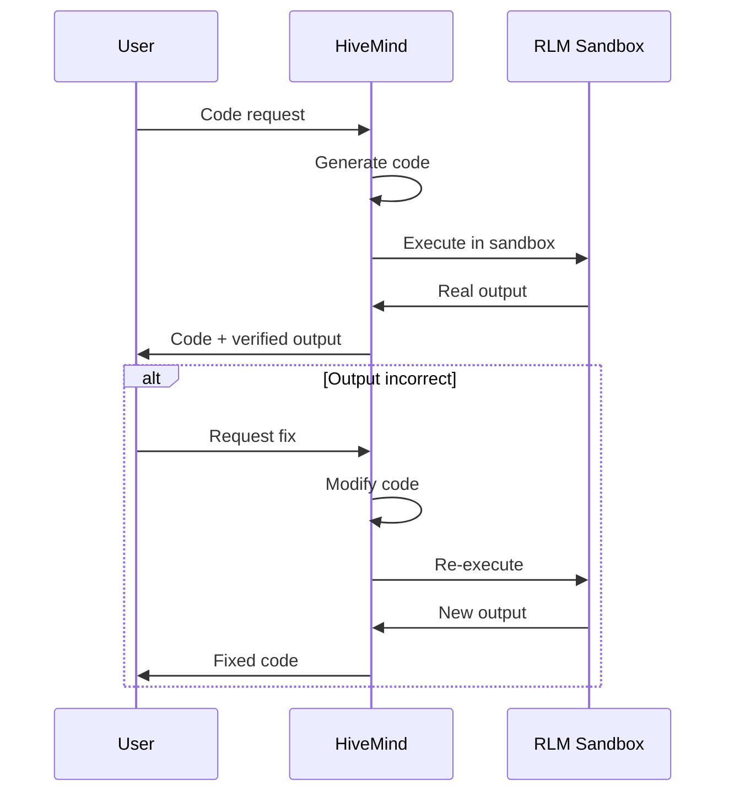

# Common Workflows

> *"The hive has patterns — learn them, and you command its power."*

This guide covers common usage patterns and workflows for working with VECNA effectively.

---

## Overview


---

## Research Session Workflow

### Goal

Accumulate knowledge on a topic through multiple thinking cycles.

### Workflow



### Step-by-Step

#### 1. Start a Research Session

```bash
vecna
```

#### 2. Set the Research Topic

```
vecna> Explain the current state of quantum computing research, 
       focusing on error correction and fault tolerance.
```

#### 3. Monitor Knowledge Accumulation

```
vecna> state
# Check: Facts count, coherence level

vecna> memory fact
# Review accumulated facts
```

#### 4. Dive Deeper with Follow-ups

```
vecna> What are the main approaches to topological qubits?

vecna> How does Microsoft's approach differ from Google's?

vecna> What are the current limitations of superconducting qubits?
```

#### 5. Check for Contradictions

```
vecna> memory contradiction
# If contradictions exist, explore them:

vecna> I see a contradiction about qubit coherence times. 
       Can you reconcile these different claims?
```

#### 6. Save Your Research

```
vecna> save ~/research/quantum_computing.json
```

### Tips for Research Sessions

!!! tip "Start Broad, Then Narrow"
    Begin with overview questions, then progressively dive into specifics.

!!! tip "Monitor Coherence"
    If coherence drops below 0.6, the hive may be uncertain. Clarify with targeted questions.

!!! tip "Save Checkpoints"
    Save state periodically in case you want to branch your research.

---

## Continuous Learning Workflow

### Goal

Build knowledge over multiple sessions that persists across time.

### Configuration

```python
from vecna import HiveMind
from vecna.orchestrator import HiveConfig

config = HiveConfig(
    max_cycles=10,           # Allow extended thinking
    compress_every=3,        # Compress memory periodically
    use_semantic_memory=True # Enable vector retrieval
)

hive = HiveMind(config)
```

### Workflow

#### Day 1: Initial Research

```bash
vecna --state ~/learning/topic.json

vecna> Research the fundamentals of gene therapy...
vecna> save
vecna> exit
```

#### Day 2: Continue from Previous State

```bash
vecna --state ~/learning/topic.json

vecna> state
# Shows: 15 facts, 8 beliefs from yesterday

vecna> Building on what we know, explain AAV vector design...
vecna> save
vecna> exit
```

#### Day 3+: Accumulated Knowledge

```bash
vecna --state ~/learning/topic.json

vecna> state
# Shows: 45 facts, 23 beliefs accumulated

vecna> Given everything we've learned, what are the most 
       promising directions for in-vivo gene therapy?
```

### Managing Long-Running State

```
# Periodic compression
vecna> compress
[COMPRESS] Summarizing 45 facts into dense form...
[COMPRESS] Memory density improved: 0.68 → 0.82

# Export summary
vecna> export summary ~/learning/gene_therapy_summary.md
```

---

## Code Development Workflow

### Goal

Write, verify, and iterate on code with the hive's help.

### Prerequisites

- Docker installed and running
- Code execution enabled (`auto_execute_code=True`)

### Workflow



### Step-by-Step

#### 1. Request Code Generation

```
vecna> Write a Python function to calculate the Levenshtein 
       distance between two strings, then test it.
```

#### 2. Review Executed Output

The hive generates code and executes it:

```
I'll write a Levenshtein distance function:

```python
def levenshtein(s1: str, s2: str) -> int:
    if len(s1) < len(s2):
        return levenshtein(s2, s1)
    if len(s2) == 0:
        return len(s1)
    
    prev_row = range(len(s2) + 1)
    for i, c1 in enumerate(s1):
        curr_row = [i + 1]
        for j, c2 in enumerate(s2):
            insertions = prev_row[j + 1] + 1
            deletions = curr_row[j] + 1
            substitutions = prev_row[j] + (c1 != c2)
            curr_row.append(min(insertions, deletions, substitutions))
        prev_row = curr_row
    
    return prev_row[-1]

# Test
print(levenshtein("kitten", "sitting"))
print(levenshtein("hello", "hallo"))
```

**Executed in RLM sandbox** (took 12.3ms):
```
3
1
```
```

#### 3. Verify Execution Log

```
vecna> execlog 1
# See details of last execution
```

#### 4. Iterate if Needed

```
vecna> Add memoization to make it more efficient for repeated calls.
```

### Code Development Tips

!!! tip "Domain Routing"
    Models assigned to the `code` domain (like Groq/Llama) get priority for programming tasks.

!!! tip "Check Execution Log"
    Use `execlog --detail ID` to see memory usage and exact timing.

!!! warning "Timeout Awareness"
    Code times out after 30 seconds. For long-running computations, break into chunks.

---

## State Management Workflow

### Goal

Effectively save, load, branch, and merge hive states.

### Basic Operations

#### Saving State

```
# Save to default location
vecna> save
[SAVE] State saved to ~/.vecna/hive_state.json

# Save to specific path
vecna> save ~/projects/research.json
[SAVE] State saved to ~/projects/research.json
```

#### Loading State

```
# Load at startup
vecna --state ~/projects/research.json

# Load during session
vecna> load ~/projects/research.json
[LOAD] Loaded 23 facts, 12 beliefs
```

### Branching Workflow

Create branches for exploring different directions:

```bash
# Main research
vecna --state ~/research/main.json
vecna> ... research on topic A ...
vecna> save

# Branch for alternative exploration
vecna> save ~/research/branch_hypothesis_b.json

# Explore the alternative
vecna> Let's assume hypothesis B is true instead...
vecna> save ~/research/branch_hypothesis_b.json

# Return to main branch
vecna> load ~/research/main.json
```

### State Export/Import

```bash
# Export for sharing
vecna> export ~/research/summary.json --format json

# Export as markdown report
vecna> export ~/research/report.md --format markdown
```

---

## Memory Inspection Workflow

### Goal

Understand what the hive knows, believes, and questions.

### Browsing by Type

```
# All facts (verified knowledge)
vecna> memory fact

# Beliefs (interpretations)
vecna> memory belief

# Active hypotheses
vecna> memory hypothesis

# Current goals
vecna> memory goal

# Unresolved questions
vecna> memory question

# Internal contradictions
vecna> memory contradiction
```

### Searching Memory

```
# Keyword search
vecna> memory search quantum

# With confidence threshold
vecna> memory search --min-confidence 0.8 python

# Search specific type
vecna> memory search --type fact machine learning
```

### Understanding Contradictions

```
vecna> memory contradiction

# Output:
╔══════════════════════════════════════════════════════════════╗
║ CONTRADICTION #1 (unresolved)                                ║
║ Item A: "Python is slower than Java" (belief, 0.65)          ║
║ Item B: "Python can be faster than Java with NumPy" (0.72)   ║
║ Status: UNRESOLVED                                           ║
╚══════════════════════════════════════════════════════════════╝

# Ask the hive to resolve
vecna> Can you reconcile these views on Python vs Java performance?
```

### Memory Statistics

```
vecna> state

# Detailed breakdown
vecna> memory stats

╔══════════════════════════════════════════════════════════════╗
║                    MEMORY STATISTICS                         ║
╠══════════════════════════════════════════════════════════════╣
║ Total Items:     67                                          ║
║ ├─ Facts:        23 (avg confidence: 0.84)                   ║
║ ├─ Beliefs:      18 (avg confidence: 0.68)                   ║
║ ├─ Hypotheses:   12 (avg confidence: 0.45)                   ║
║ ├─ Goals:        5 (2 critical, 3 medium)                    ║
║ └─ Questions:    9 (4 open, 5 investigating)                 ║
╠══════════════════════════════════════════════════════════════╣
║ Memory Density:  0.73                                        ║
║ Coherence:       0.82                                        ║
║ Contradictions:  2 (1 unresolved)                            ║
╚══════════════════════════════════════════════════════════════╝
```

---

## Debugging Workflow

### Goal

Diagnose issues with hive behavior or responses.

### Check System Health

```
vecna> status
# Review model health, latencies, error counts
```

### Trace Model Contributions

```
vecna> trace

# Shows which model said what for the last response
# Useful for understanding disagreements
```

### Verbose Mode

```bash
# Start with verbose logging
vecna --verbose

# Or set environment variable
VECNA_VERBOSE=true vecna
```

### Common Debug Patterns

#### Low Coherence

```
vecna> state
# If coherence < 0.6:

vecna> memory contradiction
# Review and resolve contradictions

vecna> What are the main points of disagreement in our current knowledge?
```

#### Slow Responses

```
vecna> status
# Check model latencies

# If one model is slow, it might be rate-limited or overloaded
# Consider removing it temporarily:
vecna> disable model groq
```

#### Unexpected Outputs

```
vecna> trace
# See which model contributed the unexpected content

vecna> memory search [unexpected term]
# Check if it came from memory

vecna> reset
# Nuclear option: start fresh
```

---

## Workflow Recipes

### Quick Research (5 minutes)

```bash
vecna speak -n 3 "Summarize the key challenges in fusion energy" -o fusion.md
```

### Deep Dive Session

```bash
vecna
> Research [topic] comprehensively
> [follow-up 1]
> [follow-up 2]
> state  # monitor
> save ~/research/[topic].json
```

### Code + Documentation

```bash
vecna
> Write a Python class for [purpose]
> Now write unit tests for it
> Generate docstrings and a README
> save
```

### Knowledge Base Building

```bash
# Session 1
vecna --state ~/kb/domain.json
> Learn about [domain fundamentals]
> save

# Session 2
vecna --state ~/kb/domain.json
> Build on previous knowledge with [advanced topic]
> save

# Session 3
vecna --state ~/kb/domain.json
> Synthesize everything into a comprehensive guide
> export ~/kb/guide.md
```

---

## Related Documentation

- [CLI Reference](cli.md) - All commands
- [Multi-Model Setup](multi-model.md) - Configure models
- [Code Execution](code-execution.md) - RLM details
- [Configuration Reference](../configuration/index.md) - All options

---

*"The patterns emerge; the hive remembers."*
