# Memory Lifecycle

> *"The hive remembers everything worth remembering, forgets what doesn't serve, and dreams itself into coherence."*

This page describes how memories flow through VECNA's system — from creation through promotion, decay, compression, and eventual archival.

---

## Overview

```mermaid
flowchart TB
    subgraph Creation["1. CREATION"]
        Input[New Information]
        Extract[Extraction]
        Embed[Embedding]
        Store[Initial Storage]
    end
    
    subgraph Active["2. ACTIVE LIFE"]
        Retrieve[Retrieval]
        Reinforce[Reinforcement]
        Update[Confidence Update]
    end
    
    subgraph Maturation["3. MATURATION"]
        Promote[Promotion]
        Crystallize[Crystallization]
        Link[Graph Linking]
    end
    
    subgraph Aging["4. AGING"]
        Decay[Confidence Decay]
        Compress[Compression]
        Archive[Archival]
    end
    
    Creation --> Active
    Active --> Maturation
    Active --> Aging
    Maturation --> Active
    Aging --> Archive
    
    style Creation fill:#1a1a2e,stroke:#ff0000
    style Active fill:#1a1a2e,stroke:#cc0000
    style Maturation fill:#1a1a2e,stroke:#990000
    style Aging fill:#1a1a2e,stroke:#660000
```



---

## Stage 1: Creation

### Extraction

When the hive processes queries and generates responses, the consensus engine extracts knowledge:

```python
class KnowledgeExtractor:
    """Extract structured knowledge from model responses."""
    
    async def extract(self, response: str, domain: str) -> list[MemoryItem]:
        """Extract facts, beliefs, and hypotheses from response."""
        items = []
        
        # Pattern matching for facts
        fact_patterns = [
            r"(?:It is|This is|The) (?:a fact that|known that|true that) (.+)",
            r"(?:Definitively|Certainly|Absolutely),? (.+)",
        ]
        for pattern in fact_patterns:
            matches = re.findall(pattern, response, re.IGNORECASE)
            for match in matches:
                items.append(MemoryItem(
                    content=match.strip(),
                    item_type="fact",
                    confidence=0.8,
                    domain=domain,
                ))
        
        # Pattern matching for beliefs
        belief_patterns = [
            r"(?:I believe|It seems|Likely|Probably) (.+)",
            r"(?:In my view|My understanding is) (.+)",
        ]
        for pattern in belief_patterns:
            matches = re.findall(pattern, response, re.IGNORECASE)
            for match in matches:
                items.append(MemoryItem(
                    content=match.strip(),
                    item_type="belief",
                    confidence=0.5,
                    domain=domain,
                ))
        
        return items
```

### Consensus Merging

Multiple model responses are merged with confidence boosting:

```python
class ConsensusMerger:
    """Merge knowledge from multiple models."""
    
    def merge(
        self,
        items_by_model: dict[str, list[MemoryItem]],
        agreement_boost: float = 0.15,
    ) -> list[MemoryItem]:
        """Merge items with consensus boosting."""
        
        # Cluster similar items
        all_items = []
        for model, items in items_by_model.items():
            for item in items:
                item.source_model = model
                all_items.append(item)
        
        clusters = self._cluster_similar(all_items, threshold=0.85)
        
        # Merge each cluster
        merged = []
        for cluster in clusters:
            if len(cluster) == 1:
                merged.append(cluster[0])
            else:
                # Multiple models agree - boost confidence
                base_item = cluster[0]
                boost = agreement_boost * (len(cluster) - 1)
                base_item.confidence = min(1.0, base_item.confidence + boost)
                base_item.metadata["sources"] = [i.source_model for i in cluster]
                base_item.metadata["consensus_count"] = len(cluster)
                merged.append(base_item)
        
        return merged
```

### Initial Storage

New items are written to hot cache immediately, then persisted to warm storage:

```python
async def store_item(
    item: MemoryItem,
    embedder: Embedder,
    hot_cache: HotCache,
    warm_store: PgMemoryStore,
) -> str:
    """Store a new memory item."""
    
    # Generate embedding
    item.embedding = await embedder.embed(item.content)
    
    # Write to hot cache (immediate)
    await hot_cache.add_recent_item(item)
    
    # Persist to PostgreSQL (async)
    item_id = await warm_store.insert(item)
    
    return item_id
```

---

## Stage 2: Active Life

### Retrieval & Reinforcement

Every time a memory is retrieved, it is reinforced:

```python
async def retrieve_and_reinforce(
    store: PgMemoryStore,
    query: str,
    top_k: int = 10,
) -> list[MemoryItem]:
    """Retrieve items and update retrieval stats."""
    
    items = await store.semantic_search(query, top_k=top_k)
    
    # Update retrieval statistics
    item_ids = [item.id for item in items]
    await store.execute("""
        UPDATE memory_items
        SET 
            retrieval_count = retrieval_count + 1,
            last_retrieved_at = NOW()
        WHERE id = ANY($1)
    """, item_ids)
    
    return items
```

### Confidence Updates

Confidence changes based on validation and retrieval:

```python
class ConfidenceManager:
    """Manage memory item confidence levels."""
    
    async def validate_fact(
        self,
        item_id: str,
        is_correct: bool,
        store: PgMemoryStore,
    ):
        """Update confidence based on validation."""
        if is_correct:
            # Positive validation increases confidence
            await store.execute("""
                UPDATE memory_items
                SET confidence = LEAST(confidence + 0.1, 1.0)
                WHERE id = $1
            """, item_id)
        else:
            # Negative validation decreases confidence
            await store.execute("""
                UPDATE memory_items
                SET confidence = GREATEST(confidence - 0.2, 0.0)
                WHERE id = $1
            """, item_id)
    
    async def on_retrieval(
        self,
        item_id: str,
        was_useful: bool,
        store: PgMemoryStore,
    ):
        """Small confidence adjustment on retrieval."""
        if was_useful:
            await store.execute("""
                UPDATE memory_items
                SET confidence = LEAST(confidence + 0.02, 1.0)
                WHERE id = $1
            """, item_id)
```

---

## Stage 3: Maturation

### Promotion Criteria

Short-term memories are promoted to long-term based on:

| Criterion | Threshold | Weight |
|-----------|-----------|--------|
| Confidence | > 0.6 | 40% |
| Retrieval count | > 3 | 30% |
| Multi-model consensus | > 1 model | 20% |
| Age | > 24 hours | 10% |

```python
class PromotionEngine:
    """Promote memories from short-term to long-term."""
    
    async def check_promotion(
        self,
        item: MemoryItem,
    ) -> bool:
        """Determine if item should be promoted."""
        score = 0.0
        
        # Confidence criterion (40%)
        if item.confidence > 0.6:
            score += 0.4 * min(item.confidence, 1.0)
        
        # Retrieval criterion (30%)
        if item.retrieval_count > 3:
            score += 0.3 * min(item.retrieval_count / 10, 1.0)
        
        # Consensus criterion (20%)
        consensus_count = item.metadata.get("consensus_count", 1)
        if consensus_count > 1:
            score += 0.2 * min(consensus_count / 3, 1.0)
        
        # Age criterion (10%)
        age_hours = (datetime.now() - item.created_at).total_seconds() / 3600
        if age_hours > 24:
            score += 0.1
        
        return score > 0.5
    
    async def promote(self, item_id: str, store: PgMemoryStore):
        """Promote item to long-term memory."""
        await store.execute("""
            UPDATE memory_items
            SET 
                metadata = jsonb_set(metadata, '{promoted}', 'true'),
                metadata = jsonb_set(metadata, '{promoted_at}', to_jsonb(NOW()))
            WHERE id = $1
        """, item_id)
```

### Crystallization

High-value memories become "crystallized" — exempt from decay:

```python
class CrystallizationEngine:
    """Crystallize high-value memories."""
    
    CRYSTAL_THRESHOLD = 0.9
    MIN_RETRIEVALS = 10
    
    async def check_crystallization(
        self,
        item: MemoryItem,
    ) -> bool:
        """Determine if item should be crystallized."""
        return (
            item.confidence >= self.CRYSTAL_THRESHOLD
            and item.retrieval_count >= self.MIN_RETRIEVALS
            and item.metadata.get("consensus_count", 1) >= 2
        )
    
    async def crystallize(self, item_id: str, store: PgMemoryStore):
        """Mark item as crystallized (exempt from decay)."""
        await store.execute("""
            UPDATE memory_items
            SET 
                metadata = jsonb_set(metadata, '{crystallized}', 'true'),
                metadata = jsonb_set(metadata, '{crystallized_at}', to_jsonb(NOW()))
            WHERE id = $1
        """, item_id)
```

### Graph Linking

Establish relationships between related memories:

```python
class GraphLinker:
    """Create relationships between memory items."""
    
    async def link_related(
        self,
        item: MemoryItem,
        store: PgMemoryStore,
        similarity_threshold: float = 0.8,
    ):
        """Find and link related items."""
        
        # Find similar items
        similar = await store.semantic_search(
            item.content,
            top_k=10,
            exclude_ids=[item.id],
        )
        
        for related in similar:
            if related.similarity >= similarity_threshold:
                # Create support relationship
                await store.create_edge(
                    source_id=item.id,
                    target_id=related.id,
                    relation="related_to",
                    weight=related.similarity,
                )
    
    async def detect_contradictions(
        self,
        item: MemoryItem,
        store: PgMemoryStore,
    ):
        """Detect and link contradictory items."""
        
        # Use negation detection
        contradictions = await self._find_contradictions(item, store)
        
        for contra in contradictions:
            await store.create_edge(
                source_id=item.id,
                target_id=contra.id,
                relation="contradicts",
                weight=contra.contradiction_score,
            )
```

---

## Stage 4: Aging

### Confidence Decay

Unretrieved memories decay over time:

```python
class DecayEngine:
    """Apply confidence decay to aging memories."""
    
    DECAY_RATE = 0.01  # Per day
    MIN_CONFIDENCE = 0.1
    DECAY_EXEMPT_TAG = "crystallized"
    
    async def apply_decay(self, store: PgMemoryStore):
        """Apply daily decay to all non-crystallized items."""
        
        await store.execute("""
            UPDATE memory_items
            SET confidence = GREATEST(
                confidence * EXP(-$1 * EXTRACT(EPOCH FROM NOW() - COALESCE(last_retrieved_at, created_at)) / 86400),
                $2
            )
            WHERE 
                NOT (metadata ? 'crystallized')
                AND confidence > $2
        """, self.DECAY_RATE, self.MIN_CONFIDENCE)
    
    async def decay_single(
        self,
        item_id: str,
        days_since_retrieval: float,
        store: PgMemoryStore,
    ):
        """Apply decay to a single item."""
        decay_factor = np.exp(-self.DECAY_RATE * days_since_retrieval)
        
        await store.execute("""
            UPDATE memory_items
            SET confidence = GREATEST(confidence * $1, $2)
            WHERE id = $3 AND NOT (metadata ? 'crystallized')
        """, decay_factor, self.MIN_CONFIDENCE, item_id)
```

### Compression (Dream Loop)

Periodic compression summarizes events into episodes:

```mermaid
flowchart TB
    subgraph DreamLoop["Dream Loop (Nightly)"]
        Collect[Collect Day's Events]
        Summarize[Summarize into Episodes]
        Merge[Merge Redundant Facts]
        Rescore[Re-score Confidence]
        UpdateIdentity[Update Identity Timeline]
        Export[Export Training Data]
    end
    
    Collect --> Summarize
    Summarize --> Merge
    Merge --> Rescore
    Rescore --> UpdateIdentity
    UpdateIdentity --> Export
    
    style DreamLoop fill:#1a1a2e,stroke:#ff0000
```



```python
class DreamLoop:
    """Background process for memory consolidation."""
    
    async def run_nightly(
        self,
        store: PgMemoryStore,
        summarizer: Summarizer,
    ):
        """Execute nightly dream loop."""
        
        # 1. Summarize day's events into episodes
        events = await store.get_events_since(
            datetime.now() - timedelta(days=1)
        )
        
        if events:
            episode = await summarizer.summarize_events(events)
            await store.insert_episode(episode)
        
        # 2. Merge redundant facts
        await self._merge_duplicates(store)
        
        # 3. Re-score confidence based on coherence
        await self._rescore_by_coherence(store)
        
        # 4. Update identity timeline
        await self._update_identity(store)
        
        # 5. Apply decay
        await DecayEngine().apply_decay(store)
        
        # 6. Archive old events
        await self._archive_old_events(store)
    
    async def _merge_duplicates(self, store: PgMemoryStore):
        """Merge semantically duplicate facts."""
        
        # Find clusters of highly similar items
        clusters = await store.find_similar_clusters(
            threshold=0.95,
            min_cluster_size=2,
        )
        
        for cluster in clusters:
            # Keep highest confidence item
            primary = max(cluster, key=lambda x: x.confidence)
            
            # Merge metadata from others
            for item in cluster:
                if item.id != primary.id:
                    primary.metadata["merged_from"] = primary.metadata.get("merged_from", [])
                    primary.metadata["merged_from"].append(item.id)
                    await store.delete(item.id)
            
            await store.update(primary)
    
    async def _rescore_by_coherence(self, store: PgMemoryStore):
        """Adjust confidence based on graph coherence."""
        
        items = await store.get_all_items(min_confidence=0.1)
        
        for item in items:
            # Get support/contradiction edges
            edges = await store.get_edges(item.id)
            
            support_weight = sum(
                e.weight for e in edges if e.relation == "supports"
            )
            contra_weight = sum(
                e.weight for e in edges if e.relation == "contradicts"
            )
            
            # Adjust confidence
            coherence_factor = (support_weight - contra_weight) / max(len(edges), 1)
            adjustment = 0.05 * coherence_factor
            
            new_confidence = max(0.1, min(1.0, item.confidence + adjustment))
            await store.update_confidence(item.id, new_confidence)
```

### Archival

Low-confidence and old items are archived to cold storage:

```python
class Archiver:
    """Archive old memories to cold storage."""
    
    ARCHIVE_THRESHOLD = 0.15
    ARCHIVE_AGE_DAYS = 90
    
    async def archive_old_items(
        self,
        store: PgMemoryStore,
        cold_storage: ColdStorage,
    ):
        """Archive items meeting criteria."""
        
        # Find items to archive
        items = await store.execute("""
            SELECT * FROM memory_items
            WHERE 
                (confidence < $1 AND created_at < NOW() - INTERVAL '$2 days')
                OR (created_at < NOW() - INTERVAL '365 days')
        """, self.ARCHIVE_THRESHOLD, self.ARCHIVE_AGE_DAYS)
        
        if items:
            # Export to cold storage
            await cold_storage.export_items(items)
            
            # Remove from warm storage
            item_ids = [item.id for item in items]
            await store.execute("""
                DELETE FROM memory_items WHERE id = ANY($1)
            """, item_ids)
    
    async def archive_events(
        self,
        store: PgMemoryStore,
        cold_storage: ColdStorage,
        retention_days: int = 30,
    ):
        """Archive old events."""
        
        cutoff = datetime.now() - timedelta(days=retention_days)
        
        # Export to cold storage
        await cold_storage.export_events_before(cutoff)
        
        # Drop old partitions
        partition_name = f"memory_events_{cutoff.strftime('%Y_%m')}"
        await store.execute(f"DROP TABLE IF EXISTS {partition_name}")
```

---

## Lifecycle Configuration

```python
@dataclass
class LifecycleConfig:
    """Memory lifecycle configuration."""
    
    # Promotion
    promotion_confidence_threshold: float = 0.6
    promotion_retrieval_threshold: int = 3
    promotion_consensus_threshold: int = 2
    promotion_age_hours: int = 24
    
    # Crystallization
    crystallization_confidence: float = 0.9
    crystallization_retrievals: int = 10
    
    # Decay
    decay_rate_per_day: float = 0.01
    decay_min_confidence: float = 0.1
    
    # Compression
    dream_loop_hour: int = 3  # 3 AM
    event_retention_days: int = 7
    
    # Archival
    archive_confidence_threshold: float = 0.15
    archive_age_days: int = 90
    cold_retention_days: int = 365
```

---

## Monitoring Lifecycle Health

### Metrics

| Metric | Description | Healthy Range |
|--------|-------------|---------------|
| `items_created_24h` | New items per day | 10-1000 |
| `items_promoted_24h` | Promotions per day | 5-100 |
| `items_crystallized_total` | Total crystallized | Growing slowly |
| `items_decayed_24h` | Items below threshold | < 10% of total |
| `items_archived_24h` | Archived per day | < 5% of total |
| `avg_confidence` | Mean confidence | 0.5-0.7 |

### Health Check

```python
async def lifecycle_health_check(store: PgMemoryStore) -> dict:
    """Check memory lifecycle health."""
    
    stats = await store.execute("""
        SELECT
            COUNT(*) as total_items,
            AVG(confidence) as avg_confidence,
            COUNT(*) FILTER (WHERE metadata ? 'crystallized') as crystallized,
            COUNT(*) FILTER (WHERE confidence < 0.15) as low_confidence,
            COUNT(*) FILTER (WHERE created_at > NOW() - INTERVAL '24 hours') as created_24h,
            COUNT(*) FILTER (WHERE 
                metadata->>'promoted_at' IS NOT NULL 
                AND (metadata->>'promoted_at')::timestamptz > NOW() - INTERVAL '24 hours'
            ) as promoted_24h
        FROM memory_items
    """)
    
    return {
        "total_items": stats["total_items"],
        "avg_confidence": float(stats["avg_confidence"]),
        "crystallized_count": stats["crystallized"],
        "low_confidence_count": stats["low_confidence"],
        "created_24h": stats["created_24h"],
        "promoted_24h": stats["promoted_24h"],
        "health": "healthy" if stats["avg_confidence"] > 0.4 else "degraded",
    }
```

---

## Best Practices

!!! tip "Lifecycle Tips"
    
    1. **Run dream loop during off-hours** - Reduces impact on interactive use
    2. **Monitor decay rate** - Too fast = knowledge loss, too slow = noise
    3. **Review crystallized items** - They're exempt from decay
    4. **Archive aggressively** - Warm storage should stay bounded
    5. **Export training data regularly** - Don't lose valuable examples

!!! warning "Common Issues"
    
    - **No decay configured** - Memory grows unbounded with noise
    - **Too aggressive decay** - Valuable knowledge forgotten
    - **No compression** - Event log grows forever
    - **Missing archival** - Warm storage becomes slow
    - **Broken dream loop** - Substrate degrades over time

---

## Next Steps

- [Memory Tiers](tiers.md) - Storage architecture
- [Retrieval Pipelines](retrieval.md) - Access patterns
- [Storage Schema](schema.md) - Database schema
