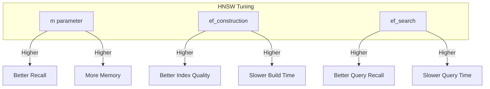

# Low-Level Details

> *"In the substrate's depths, vectors become thoughts."*

This page covers the low-level implementation details of VECNA's memory system, including embeddings, vector operations, similarity metrics, index tuning, and performance optimization.

---

## Embedding Generation

### Overview

Embeddings transform text into dense vector representations that capture semantic meaning. VECNA supports multiple embedding providers:

| Provider | Model | Dimensions | Use Case |
|----------|-------|------------|----------|
| OpenAI | `text-embedding-3-small` | 1536 | Default, high quality |
| OpenAI | `text-embedding-3-large` | 3072 | Maximum quality |
| Local | `all-MiniLM-L6-v2` | 384 | Offline, fast |
| Local | `bge-base-en-v1.5` | 768 | Offline, better quality |

### OpenAI Embeddings

```python
import openai
import numpy as np

class OpenAIEmbedder:
    """OpenAI embedding generator."""
    
    def __init__(
        self,
        model: str = "text-embedding-3-small",
        api_key: str | None = None,
    ):
        self.model = model
        self.client = openai.AsyncOpenAI(api_key=api_key)
        self.dimensions = 1536 if "small" in model else 3072
    
    async def embed(self, text: str) -> list[float]:
        """Generate embedding for single text."""
        response = await self.client.embeddings.create(
            model=self.model,
            input=text,
        )
        return response.data[0].embedding
    
    async def embed_batch(
        self,
        texts: list[str],
        batch_size: int = 100,
    ) -> list[list[float]]:
        """Generate embeddings for batch of texts."""
        all_embeddings = []
        
        for i in range(0, len(texts), batch_size):
            batch = texts[i:i + batch_size]
            response = await self.client.embeddings.create(
                model=self.model,
                input=batch,
            )
            # Preserve order
            batch_embeddings = [None] * len(batch)
            for item in response.data:
                batch_embeddings[item.index] = item.embedding
            all_embeddings.extend(batch_embeddings)
        
        return all_embeddings
```

### Local Embeddings

```python
from sentence_transformers import SentenceTransformer
import numpy as np

class LocalEmbedder:
    """Local embedding generator using sentence-transformers."""
    
    def __init__(self, model: str = "all-MiniLM-L6-v2"):
        self.model = SentenceTransformer(model)
        self.dimensions = self.model.get_sentence_embedding_dimension()
    
    def embed(self, text: str) -> list[float]:
        """Generate embedding for single text."""
        embedding = self.model.encode(text, convert_to_numpy=True)
        return embedding.tolist()
    
    def embed_batch(self, texts: list[str]) -> list[list[float]]:
        """Generate embeddings for batch of texts."""
        embeddings = self.model.encode(texts, convert_to_numpy=True)
        return embeddings.tolist()
```

### Embedding Normalization

For cosine similarity, embeddings should be L2-normalized:

```python
def normalize_embedding(embedding: list[float]) -> list[float]:
    """L2 normalize an embedding vector."""
    arr = np.array(embedding, dtype=np.float32)
    norm = np.linalg.norm(arr)
    if norm > 0:
        arr = arr / norm
    return arr.tolist()

def normalize_batch(embeddings: list[list[float]]) -> list[list[float]]:
    """L2 normalize a batch of embeddings."""
    arr = np.array(embeddings, dtype=np.float32)
    norms = np.linalg.norm(arr, axis=1, keepdims=True)
    norms = np.where(norms > 0, norms, 1)  # Avoid division by zero
    arr = arr / norms
    return arr.tolist()
```

---

## Vector Operations

### Similarity Metrics

VECNA supports multiple similarity metrics:

```mermaid
flowchart LR
    subgraph Metrics["Similarity Metrics"]
        Cosine[Cosine Similarity<br/>Default]
        Euclidean[Euclidean Distance]
        DotProduct[Dot Product]
    end
    
    style Cosine fill:#1a1a2e,stroke:#ff0000
```



#### Cosine Similarity

Measures angle between vectors (default for VECNA):

```python
def cosine_similarity(a: list[float], b: list[float]) -> float:
    """Compute cosine similarity between two vectors."""
    a_arr = np.array(a, dtype=np.float32)
    b_arr = np.array(b, dtype=np.float32)
    
    dot = np.dot(a_arr, b_arr)
    norm_a = np.linalg.norm(a_arr)
    norm_b = np.linalg.norm(b_arr)
    
    if norm_a == 0 or norm_b == 0:
        return 0.0
    
    return float(dot / (norm_a * norm_b))
```

**pgvector operator:** `<=>` (returns distance, so similarity = 1 - distance)

```sql
SELECT 1 - (embedding <=> $1) as similarity
FROM memory_items
ORDER BY embedding <=> $1
LIMIT 10;
```

#### Euclidean Distance

Measures straight-line distance:

```python
def euclidean_distance(a: list[float], b: list[float]) -> float:
    """Compute Euclidean distance between two vectors."""
    a_arr = np.array(a, dtype=np.float32)
    b_arr = np.array(b, dtype=np.float32)
    return float(np.linalg.norm(a_arr - b_arr))
```

**pgvector operator:** `<->`

#### Inner Product (Dot Product)

For pre-normalized vectors:

```python
def dot_product(a: list[float], b: list[float]) -> float:
    """Compute dot product of two vectors."""
    a_arr = np.array(a, dtype=np.float32)
    b_arr = np.array(b, dtype=np.float32)
    return float(np.dot(a_arr, b_arr))
```

**pgvector operator:** `<#>` (returns negative inner product)

### Batch Operations

```python
def batch_cosine_similarity(
    query: list[float],
    candidates: list[list[float]],
) -> list[float]:
    """Compute cosine similarity between query and all candidates."""
    query_arr = np.array(query, dtype=np.float32)
    cand_arr = np.array(candidates, dtype=np.float32)
    
    # Normalize
    query_norm = query_arr / np.linalg.norm(query_arr)
    cand_norms = cand_arr / np.linalg.norm(cand_arr, axis=1, keepdims=True)
    
    # Batch dot product
    similarities = np.dot(cand_norms, query_norm)
    return similarities.tolist()
```

---

## pgvector Deep Dive

### Extension Setup

```sql
-- Install pgvector extension
CREATE EXTENSION IF NOT EXISTS vector;

-- Verify installation
SELECT * FROM pg_extension WHERE extname = 'vector';
```

### Vector Column Types

```sql
-- Fixed dimension (recommended)
embedding vector(1536)

-- Variable dimension (less efficient)
embedding vector
```

### Index Types

#### HNSW (Hierarchical Navigable Small World)

Best for most use cases:

```sql
CREATE INDEX memory_items_embedding_hnsw_idx ON memory_items 
    USING hnsw (embedding vector_cosine_ops) 
    WITH (m = 16, ef_construction = 64);
```

**Parameters:**

| Parameter | Description | Default | Recommendation |
|-----------|-------------|---------|----------------|
| `m` | Max connections per layer | 16 | 12-48, higher = better recall, more memory |
| `ef_construction` | Build-time search width | 64 | 64-200, higher = better index, slower build |

**Query-time parameter:**

```sql
-- Set before query for better recall
SET hnsw.ef_search = 100;  -- Default 40
```

#### IVFFlat (Inverted File with Flat)

Alternative for very large datasets:

```sql
CREATE INDEX memory_items_embedding_ivf_idx ON memory_items 
    USING ivfflat (embedding vector_cosine_ops) 
    WITH (lists = 100);
```

**Parameters:**

| Parameter | Description | Recommendation |
|-----------|-------------|----------------|
| `lists` | Number of clusters | sqrt(n) to n/1000 |
| `probes` | Clusters to search | 10-50 at query time |

### Operator Classes

| Operator Class | Distance Metric | Operator |
|---------------|-----------------|----------|
| `vector_cosine_ops` | Cosine | `<=>` |
| `vector_l2_ops` | Euclidean (L2) | `<->` |
| `vector_ip_ops` | Inner Product | `<#>` |

---

## Index Tuning

### HNSW Tuning Guide



### Tuning Recommendations

| Dataset Size | `m` | `ef_construction` | `ef_search` |
|--------------|-----|-------------------|-------------|
| < 10K | 16 | 64 | 40 |
| 10K - 100K | 16 | 100 | 60 |
| 100K - 1M | 24 | 128 | 80 |
| > 1M | 32 | 200 | 100 |

### Measuring Index Quality

```sql
-- Check index size
SELECT pg_size_pretty(pg_relation_size('memory_items_embedding_idx'));

-- Explain query to verify index usage
EXPLAIN (ANALYZE, BUFFERS) 
SELECT id, 1 - (embedding <=> $1) as similarity
FROM memory_items
ORDER BY embedding <=> $1
LIMIT 10;

-- Compare recall at different ef_search values
-- Run same query with different settings and compare results
```

### Index Maintenance

```sql
-- Reindex for optimal performance (after many inserts/deletes)
REINDEX INDEX CONCURRENTLY memory_items_embedding_idx;

-- Update statistics
ANALYZE memory_items;

-- Check index health
SELECT 
    indexrelname,
    idx_scan,
    idx_tup_read,
    idx_tup_fetch
FROM pg_stat_user_indexes
WHERE indexrelname LIKE 'memory_items%';
```

---

## Embedding Serialization

### Database Storage

pgvector handles vector serialization automatically:

```python
import asyncpg
import numpy as np

# Register vector type codec
async def setup_connection(conn):
    await conn.set_type_codec(
        'vector',
        encoder=lambda v: f'[{",".join(str(x) for x in v)}]',
        decoder=lambda v: [float(x) for x in v[1:-1].split(',')],
        schema='public',
        format='text'
    )

# Insert embedding
embedding = [0.1, 0.2, 0.3, ...]  # 1536 dimensions
await conn.execute(
    "INSERT INTO memory_items (content, embedding) VALUES ($1, $2)",
    "some text",
    embedding
)
```

### Redis Caching

Embeddings are serialized as base64-encoded float32 arrays:

```python
import base64
import numpy as np

def serialize_embedding(embedding: list[float]) -> str:
    """Serialize embedding to base64 string."""
    arr = np.array(embedding, dtype=np.float32)
    return base64.b64encode(arr.tobytes()).decode('ascii')

def deserialize_embedding(data: str) -> list[float]:
    """Deserialize embedding from base64 string."""
    raw = base64.b64decode(data)
    arr = np.frombuffer(raw, dtype=np.float32)
    return arr.tolist()

# Storage: ~8KB per 1536-dim embedding (vs ~20KB as JSON)
```

### Compression

For cold storage, use quantization:

```python
def quantize_embedding(
    embedding: list[float],
    bits: int = 8,
) -> bytes:
    """Quantize embedding to reduce storage size."""
    arr = np.array(embedding, dtype=np.float32)
    
    # Scale to 0-255 range for 8-bit quantization
    min_val, max_val = arr.min(), arr.max()
    scale = (2**bits - 1) / (max_val - min_val + 1e-10)
    quantized = ((arr - min_val) * scale).astype(np.uint8)
    
    # Store scale factors for reconstruction
    header = np.array([min_val, max_val], dtype=np.float32)
    return header.tobytes() + quantized.tobytes()

def dequantize_embedding(data: bytes, bits: int = 8) -> list[float]:
    """Reconstruct embedding from quantized form."""
    header = np.frombuffer(data[:8], dtype=np.float32)
    min_val, max_val = header
    
    quantized = np.frombuffer(data[8:], dtype=np.uint8)
    scale = (max_val - min_val) / (2**bits - 1)
    arr = quantized.astype(np.float32) * scale + min_val
    
    return arr.tolist()

# Storage: ~1.5KB per 1536-dim embedding (8-bit quantization)
```

---

## Performance Optimization

### Query Optimization

```python
class OptimizedRetriever:
    """Performance-optimized retrieval."""
    
    def __init__(self, pool: asyncpg.Pool, cache: HotCache):
        self.pool = pool
        self.cache = cache
    
    async def retrieve(
        self,
        query_embedding: list[float],
        top_k: int = 10,
        min_confidence: float = 0.3,
    ) -> list[MemoryItem]:
        # Check cache first
        cache_key = self._cache_key(query_embedding, top_k, min_confidence)
        cached = await self.cache.get(cache_key)
        if cached:
            return cached
        
        async with self.pool.acquire() as conn:
            # Set HNSW search parameter for this query
            await conn.execute("SET hnsw.ef_search = 100")
            
            rows = await conn.fetch("""
                SELECT 
                    id, content, item_type, confidence,
                    1 - (embedding <=> $1) as similarity
                FROM memory_items
                WHERE confidence >= $2
                ORDER BY embedding <=> $1
                LIMIT $3
            """, query_embedding, min_confidence, top_k)
        
        results = [MemoryItem.from_row(row) for row in rows]
        
        # Cache results
        await self.cache.set(cache_key, results, ttl=1800)
        
        return results
```

### Batch Processing

```python
async def batch_insert_items(
    pool: asyncpg.Pool,
    items: list[dict],
    embedder: OpenAIEmbedder,
) -> list[str]:
    """Batch insert items with embeddings."""
    
    # Generate embeddings in batch
    contents = [item["content"] for item in items]
    embeddings = await embedder.embed_batch(contents)
    
    # Prepare records
    records = [
        (
            item["content"],
            item["item_type"],
            item.get("confidence", 0.5),
            item.get("domain", "general"),
            embeddings[i],
        )
        for i, item in enumerate(items)
    ]
    
    # Batch insert
    async with pool.acquire() as conn:
        await conn.executemany("""
            INSERT INTO memory_items (content, item_type, confidence, domain, embedding)
            VALUES ($1, $2, $3, $4, $5)
        """, records)
    
    return [str(uuid.uuid4()) for _ in items]
```

### Connection Pooling

```python
import asyncpg

async def create_pool() -> asyncpg.Pool:
    """Create optimized connection pool."""
    return await asyncpg.create_pool(
        dsn="postgresql://localhost/vecna",
        
        # Pool sizing
        min_size=5,
        max_size=20,
        
        # Connection settings
        command_timeout=30,
        
        # Statement cache
        statement_cache_size=100,
        
        # Setup hook for vector type
        init=setup_connection,
    )
```

### Memory Management

```python
class MemoryEfficientSearch:
    """Memory-efficient vector operations."""
    
    def __init__(self, max_batch_size: int = 1000):
        self.max_batch_size = max_batch_size
    
    async def search_large_dataset(
        self,
        query: list[float],
        items: AsyncIterator[MemoryItem],
        top_k: int = 10,
    ) -> list[MemoryItem]:
        """Search large dataset without loading all into memory."""
        
        # Use heap to maintain top-k
        import heapq
        
        top_items = []  # min-heap of (similarity, item)
        
        batch = []
        async for item in items:
            batch.append(item)
            
            if len(batch) >= self.max_batch_size:
                self._process_batch(query, batch, top_items, top_k)
                batch = []
        
        # Process remaining
        if batch:
            self._process_batch(query, batch, top_items, top_k)
        
        # Return sorted by similarity (descending)
        return [item for _, item in sorted(top_items, reverse=True)]
    
    def _process_batch(self, query, batch, heap, k):
        embeddings = [item.embedding for item in batch]
        similarities = batch_cosine_similarity(query, embeddings)
        
        for sim, item in zip(similarities, batch):
            if len(heap) < k:
                heapq.heappush(heap, (sim, item))
            elif sim > heap[0][0]:
                heapq.heapreplace(heap, (sim, item))
```

---

## Debugging & Monitoring

### Embedding Quality Checks

```python
def check_embedding_quality(embeddings: list[list[float]]) -> dict:
    """Analyze embedding quality metrics."""
    arr = np.array(embeddings, dtype=np.float32)
    
    # Check dimensions
    if arr.shape[1] != 1536:
        print(f"Warning: Expected 1536 dims, got {arr.shape[1]}")
    
    # Check for zero vectors
    norms = np.linalg.norm(arr, axis=1)
    zero_count = np.sum(norms == 0)
    
    # Check distribution
    mean_norm = np.mean(norms)
    std_norm = np.std(norms)
    
    # Check for duplicates
    unique_count = len(set(tuple(e) for e in embeddings))
    
    return {
        "count": len(embeddings),
        "dimensions": arr.shape[1],
        "zero_vectors": int(zero_count),
        "mean_norm": float(mean_norm),
        "std_norm": float(std_norm),
        "unique_count": unique_count,
        "duplicate_count": len(embeddings) - unique_count,
    }
```

### Query Performance Monitoring

```python
import time
import structlog

logger = structlog.get_logger()

async def monitored_search(
    pool: asyncpg.Pool,
    query_embedding: list[float],
    top_k: int = 10,
) -> list[MemoryItem]:
    """Search with performance monitoring."""
    
    start = time.perf_counter()
    
    async with pool.acquire() as conn:
        # Get query plan
        plan = await conn.fetchval(
            "EXPLAIN (FORMAT JSON) SELECT * FROM memory_items "
            "ORDER BY embedding <=> $1 LIMIT $2",
            query_embedding, top_k
        )
        
        # Execute query
        rows = await conn.fetch(
            "SELECT id, content, 1 - (embedding <=> $1) as similarity "
            "FROM memory_items ORDER BY embedding <=> $1 LIMIT $2",
            query_embedding, top_k
        )
    
    duration_ms = (time.perf_counter() - start) * 1000
    
    # Log metrics
    logger.info(
        "vector_search_completed",
        duration_ms=duration_ms,
        results=len(rows),
        top_similarity=rows[0]["similarity"] if rows else None,
        index_used="hnsw" in str(plan).lower(),
    )
    
    return [MemoryItem.from_row(row) for row in rows]
```

---

## Best Practices

!!! tip "Low-Level Tips"
    
    1. **Always normalize embeddings** - Required for accurate cosine similarity
    2. **Batch embedding calls** - Reduces API latency significantly
    3. **Cache embeddings** - Same content = same embedding
    4. **Tune HNSW for your data** - Profile with realistic queries
    5. **Monitor index health** - Reindex after large changes

!!! warning "Common Mistakes"
    
    - **Wrong dimensions** - Mixing 1536 and 384 dim embeddings
    - **Unnormalized vectors** - Gives incorrect cosine similarity
    - **Missing index** - Falls back to sequential scan
    - **Too low ef_search** - Poor recall quality
    - **No connection pooling** - Connection overhead per query

---

## Next Steps

- [Memory Lifecycle](lifecycle.md) - Data movement and cleanup
- [Storage Schema](schema.md) - Database schema reference
- [Retrieval Pipelines](retrieval.md) - High-level retrieval patterns
