# Retrieval Pipelines

> *"The hive already knows. Retrieval is telepathy."*

This page details how VECNA retrieves relevant memories from the substrate, including semantic search, the RLM pattern, graph traversal, and hybrid retrieval strategies.

---

## Overview

Memory retrieval in VECNA is **pre-emptive and automatic** — the system anticipates what knowledge is needed and injects it into the prompt before models generate responses.


---

## Retrieval Patterns

### 1. Semantic Recall

Vector similarity search using embeddings:

```mermaid
flowchart TB
    Query[Query Text] --> Embed[Generate Embedding]
    Embed --> ANN[pgvector ANN Search]
    ANN --> Filter[Apply Filters]
    Filter --> Rerank[Rerank Results]
    Rerank --> Return[Return Top-K]
    
    style ANN fill:#1a1a2e,stroke:#ff0000
```



**Process:**
1. Embed the query using the same model as stored items
2. Execute approximate nearest neighbor (ANN) search
3. Filter by type, confidence, domain
4. Optionally rerank with cross-encoder
5. Return top-K results

**SQL Implementation:**
```sql
SELECT 
    id, content, item_type, confidence,
    1 - (embedding <=> $1) as similarity
FROM memory_items
WHERE 
    confidence >= $2
    AND ($3::text[] IS NULL OR item_type = ANY($3))
ORDER BY embedding <=> $1
LIMIT $4;
```

**Python Interface:**
```python
results = await memory.semantic_search(
    query="What is quantum entanglement?",
    top_k=10,
    min_confidence=0.5,
    item_types=["fact", "belief"],
)

for item in results:
    print(f"[{item.confidence:.2f}] {item.content}")
```

### 2. Graph Recall

Traverse relationships between memory items:


**Use Cases:**
- Find supporting evidence for a fact
- Discover contradictions
- Trace derivation chains

**SQL Implementation:**
```sql
-- Expand from seed items
WITH RECURSIVE graph AS (
    -- Seed nodes
    SELECT 
        source_id, target_id, relation, weight, 1 as depth
    FROM memory_edges
    WHERE source_id = ANY($1)
    
    UNION ALL
    
    -- Expand edges
    SELECT 
        e.source_id, e.target_id, e.relation, e.weight, g.depth + 1
    FROM memory_edges e
    JOIN graph g ON e.source_id = g.target_id
    WHERE g.depth < $2  -- max depth
)
SELECT DISTINCT target_id, relation, SUM(weight) as path_weight
FROM graph
GROUP BY target_id, relation
ORDER BY path_weight DESC
LIMIT $3;
```

**Python Interface:**
```python
subgraph = await memory.graph_expand(
    seed_ids=["uuid-1", "uuid-2"],
    relations=["supports", "derived_from"],
    max_depth=2,
    limit=20,
)

for node in subgraph.nodes:
    print(f"{node.content} (via {node.relation})")
```

### 3. Temporal Recall

Query memories by time range:


**Use Cases:**
- "What did we discuss yesterday?"
- "Find my goals from last week"
- "Show recent contradictions"

**SQL Implementation:**
```sql
SELECT *
FROM episodes
WHERE 
    start_time >= $1
    AND end_time <= $2
    AND ($3::text[] IS NULL OR tags && $3)
ORDER BY start_time DESC
LIMIT $4;
```

**Python Interface:**
```python
from datetime import datetime, timedelta

episodes = await memory.temporal_search(
    start_time=datetime.now() - timedelta(days=7),
    end_time=datetime.now(),
    tags=["code", "discussion"],
    limit=10,
)
```

---

## The RLM Pattern

**RLM** (Retrieve, Learn, Merge) is VECNA's core retrieval strategy, also known as **Decompose → Retrieve → Recompose**.

### Pattern Overview

```mermaid
flowchart TB
    subgraph Decompose["1. DECOMPOSE"]
        Query[Original Query]
        Query --> F1[Facet 1]
        Query --> F2[Facet 2]
        Query --> F3[Facet 3]
    end
    
    subgraph Retrieve["2. RETRIEVE"]
        F1 --> R1[Results 1]
        F2 --> R2[Results 2]
        F3 --> R3[Results 3]
    end
    
    subgraph Recompose["3. RECOMPOSE"]
        R1 --> Merge[Merge & Dedupe]
        R2 --> Merge
        R3 --> Merge
        Merge --> Context[Structured Context]
    end
    
    style Decompose fill:#1a1a2e,stroke:#ff0000
    style Retrieve fill:#1a1a2e,stroke:#cc0000
    style Recompose fill:#1a1a2e,stroke:#990000
```



### Step 1: Decompose

Break the query into multiple search facets:

```python
def decompose_query(query: str) -> list[str]:
    """Decompose query into search facets."""
    facets = [query]  # Original query
    
    # Extract key concepts
    concepts = extract_concepts(query)
    facets.extend(concepts)
    
    # Generate related queries
    related = generate_related_queries(query)
    facets.extend(related)
    
    return facets[:5]  # Limit to 5 facets

# Example
query = "What Python frameworks are good for web APIs and why?"

facets = [
    "What Python frameworks are good for web APIs and why?",
    "Python web frameworks",
    "API development Python",
    "web API best practices",
    "Flask FastAPI Django comparison"
]
```

### Step 2: Retrieve

Execute parallel searches for each facet:

```python
async def retrieve_for_facets(
    facets: list[str],
    top_k_per_facet: int = 5,
) -> list[MemoryItem]:
    """Retrieve memories for all facets in parallel."""
    
    tasks = [
        memory.semantic_search(facet, top_k=top_k_per_facet)
        for facet in facets
    ]
    
    results = await asyncio.gather(*tasks)
    
    # Flatten results
    all_items = []
    for facet_results in results:
        all_items.extend(facet_results)
    
    return all_items
```

### Step 3: Recompose

Merge, deduplicate, and structure the results:

```python
def recompose_context(
    items: list[MemoryItem],
    max_items: int = 15,
) -> str:
    """Recompose retrieved items into structured context."""
    
    # Deduplicate by content similarity
    unique_items = deduplicate(items, threshold=0.9)
    
    # Sort by relevance (confidence * similarity)
    ranked = sorted(
        unique_items,
        key=lambda x: x.confidence * x.similarity,
        reverse=True
    )[:max_items]
    
    # Format as structured context
    context_parts = []
    
    facts = [i for i in ranked if i.item_type == "fact"]
    if facts:
        context_parts.append("## Known Facts")
        for f in facts:
            context_parts.append(f"- [{f.confidence:.2f}] {f.content}")
    
    beliefs = [i for i in ranked if i.item_type == "belief"]
    if beliefs:
        context_parts.append("\n## Beliefs")
        for b in beliefs:
            context_parts.append(f"- [{b.confidence:.2f}] {b.content}")
    
    return "\n".join(context_parts)
```

### Full RLM Pipeline

```python
class RLMRetriever:
    """Full RLM retrieval pipeline."""
    
    async def retrieve(self, query: str) -> str:
        """Execute RLM pipeline for query."""
        
        # 1. Decompose
        facets = self.decompose_query(query)
        
        # 2. Retrieve (parallel)
        items = await self.retrieve_for_facets(facets)
        
        # 3. Recompose
        context = self.recompose_context(items)
        
        return context

# Usage
rlm = RLMRetriever(memory_store)
context = await rlm.retrieve("Explain quantum entanglement")

# Inject into prompt
prompt = f"""
{identity_prompt}

## RELEVANT MEMORIES
{context}

## USER QUERY
{query}
"""
```

---

## Hybrid Retrieval

Combine multiple retrieval strategies for comprehensive results:

```mermaid
flowchart TB
    Query[Query] --> Semantic[Semantic Search]
    Query --> Keyword[Keyword Search]
    Query --> Graph[Graph Expansion]
    
    Semantic --> Fuse[Reciprocal Rank Fusion]
    Keyword --> Fuse
    Graph --> Fuse
    
    Fuse --> Final[Final Results]
    
    style Fuse fill:#1a1a2e,stroke:#ff0000
```



### Reciprocal Rank Fusion

Combine rankings from multiple sources:

```python
def reciprocal_rank_fusion(
    rankings: list[list[MemoryItem]],
    k: int = 60,
) -> list[MemoryItem]:
    """Fuse multiple rankings using RRF."""
    
    scores: dict[str, float] = {}
    items: dict[str, MemoryItem] = {}
    
    for ranking in rankings:
        for rank, item in enumerate(ranking):
            item_id = item.id
            items[item_id] = item
            
            # RRF score
            scores[item_id] = scores.get(item_id, 0) + 1 / (k + rank + 1)
    
    # Sort by fused score
    sorted_ids = sorted(scores.keys(), key=lambda x: scores[x], reverse=True)
    
    return [items[id] for id in sorted_ids]
```

### Hybrid Search Implementation

```python
async def hybrid_search(
    query: str,
    top_k: int = 20,
    semantic_weight: float = 0.6,
    keyword_weight: float = 0.3,
    graph_weight: float = 0.1,
) -> list[MemoryItem]:
    """Execute hybrid search combining multiple strategies."""
    
    # Parallel execution
    semantic_task = memory.semantic_search(query, top_k=top_k * 2)
    keyword_task = memory.keyword_search(query, top_k=top_k * 2)
    
    semantic_results, keyword_results = await asyncio.gather(
        semantic_task, keyword_task
    )
    
    # Get seed IDs for graph expansion
    seed_ids = [r.id for r in semantic_results[:5]]
    graph_results = await memory.graph_expand(
        seed_ids=seed_ids,
        max_depth=1,
        limit=top_k,
    )
    
    # Fuse results
    fused = reciprocal_rank_fusion([
        semantic_results,
        keyword_results,
        graph_results,
    ])
    
    return fused[:top_k]
```

---

## Retrieval Optimization

### Index Tuning

**HNSW Parameters:**

| Parameter | Default | Effect |
|-----------|---------|--------|
| `m` | 16 | Connections per node. Higher = better recall, more memory |
| `ef_construction` | 64 | Build quality. Higher = better recall, slower build |
| `ef_search` | 40 | Search quality. Higher = better recall, slower search |

```sql
-- Create optimized index
CREATE INDEX memory_items_embedding_idx ON memory_items 
    USING hnsw (embedding vector_cosine_ops) 
    WITH (m = 16, ef_construction = 64);

-- Set search parameter at query time
SET hnsw.ef_search = 100;  -- Higher for better recall
```

### Caching Strategy

```python
class CachedRetriever:
    """Retriever with result caching."""
    
    def __init__(self, memory: MemoryStore, cache: HotCache):
        self.memory = memory
        self.cache = cache
    
    async def retrieve(self, query: str, **kwargs) -> list[MemoryItem]:
        # Check cache
        cache_key = self._cache_key(query, kwargs)
        cached = await self.cache.get(cache_key)
        
        if cached:
            return cached
        
        # Execute retrieval
        results = await self.memory.semantic_search(query, **kwargs)
        
        # Cache results
        await self.cache.set(cache_key, results, ttl=1800)
        
        return results
```

### Embedding Optimization

```python
class EmbeddingOptimizer:
    """Optimize embedding operations."""
    
    def __init__(self, cache: HotCache):
        self.cache = cache
    
    async def embed_batch(self, texts: list[str]) -> list[list[float]]:
        """Batch embed with caching."""
        
        # Check cache for each text
        results = [None] * len(texts)
        to_embed = []
        to_embed_indices = []
        
        for i, text in enumerate(texts):
            cached = await self.cache.get_embedding(text)
            if cached:
                results[i] = cached
            else:
                to_embed.append(text)
                to_embed_indices.append(i)
        
        # Batch embed uncached texts
        if to_embed:
            embeddings = await self._batch_embed(to_embed)
            
            for idx, embedding in zip(to_embed_indices, embeddings):
                results[idx] = embedding
                await self.cache.set_embedding(to_embed[idx], embedding)
        
        return results
```

---

## Retrieval Configuration

### Full Configuration

```python
from vecna.memory import RetrievalConfig

config = RetrievalConfig(
    # Semantic search
    default_top_k=20,
    min_confidence=0.3,
    similarity_threshold=0.5,
    
    # RLM settings
    max_facets=5,
    top_k_per_facet=5,
    max_context_items=15,
    
    # Hybrid search
    enable_hybrid=True,
    semantic_weight=0.6,
    keyword_weight=0.3,
    graph_weight=0.1,
    
    # Graph expansion
    max_graph_depth=2,
    max_graph_nodes=50,
    
    # Caching
    cache_results=True,
    cache_ttl_seconds=1800,
    
    # Performance
    batch_embeddings=True,
    max_batch_size=100,
)
```

---

## Retrieval Metrics

### Monitoring

| Metric | Description | Target |
|--------|-------------|--------|
| `retrieval_latency_ms` | Time to retrieve | < 50ms |
| `cache_hit_rate` | Hot cache effectiveness | > 80% |
| `results_per_query` | Items returned | 10-20 |
| `semantic_recall` | Relevant items found | > 0.8 |

### Logging

```python
import structlog

logger = structlog.get_logger()

async def retrieve_with_logging(query: str) -> list[MemoryItem]:
    log = logger.bind(query=query[:50])
    
    start = time.monotonic()
    results = await memory.semantic_search(query)
    duration = (time.monotonic() - start) * 1000
    
    log.info(
        "retrieval_completed",
        duration_ms=duration,
        results_count=len(results),
        avg_confidence=sum(r.confidence for r in results) / len(results) if results else 0,
    )
    
    return results
```

---

## Best Practices

!!! tip "Retrieval Tips"
    
    1. **Use RLM for complex queries** - Decomposition improves recall
    2. **Cache aggressively** - Same queries often repeat
    3. **Tune HNSW for your workload** - Balance recall vs latency
    4. **Monitor retrieval quality** - Track relevance over time
    5. **Use hybrid search** - Combines strengths of multiple strategies

!!! warning "Common Pitfalls"
    
    - **Too many results** - Dilutes prompt with noise
    - **Too few results** - Misses relevant context
    - **No caching** - Repeated embedding costs
    - **Ignoring confidence** - Low-confidence items add noise
    - **Deep graph traversal** - Expensive and often irrelevant

---

## Next Steps

- [Storage Schema](schema.md) - Detailed database schema
- [Low-Level Details](low-level.md) - Embedding and vector operations
- [Memory Lifecycle](lifecycle.md) - How memories evolve over time
