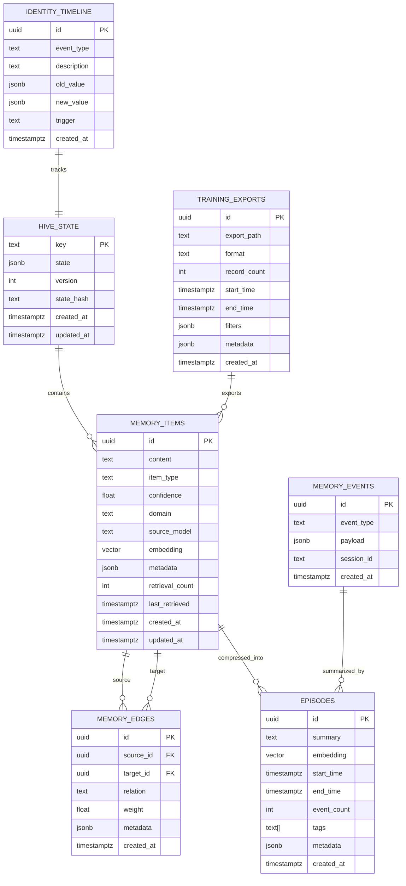

# Storage Schema

> *"The substrate persists. Memory endures."*

This page provides the complete PostgreSQL schema for VECNA's warm memory tier, including tables, indexes, relationships, and Redis key patterns.

---

## Overview



---

## Core Tables

### `hive_state`

Primary HiveState persistence. Stores the complete substrate as a JSON blob with metadata.

```sql
CREATE TABLE hive_state (
    key TEXT PRIMARY KEY,
    state JSONB NOT NULL,
    version INTEGER NOT NULL DEFAULT 0,
    state_hash TEXT,
    created_at TIMESTAMPTZ NOT NULL DEFAULT NOW(),
    updated_at TIMESTAMPTZ NOT NULL DEFAULT NOW()
);

-- Trigger for updated_at
CREATE OR REPLACE FUNCTION update_updated_at()
RETURNS TRIGGER AS $$
BEGIN
    NEW.updated_at = NOW();
    RETURN NEW;
END;
$$ LANGUAGE plpgsql;

CREATE TRIGGER hive_state_updated_at
    BEFORE UPDATE ON hive_state
    FOR EACH ROW
    EXECUTE FUNCTION update_updated_at();

-- Index for version queries
CREATE INDEX hive_state_version_idx ON hive_state (version DESC);
```

**Usage:**

```python
# Save state
await db.execute("""
    INSERT INTO hive_state (key, state, version, state_hash)
    VALUES ($1, $2, $3, $4)
    ON CONFLICT (key) DO UPDATE SET
        state = EXCLUDED.state,
        version = hive_state.version + 1,
        state_hash = EXCLUDED.state_hash,
        updated_at = NOW()
""", "default", state_json, 1, hash)

# Load state
row = await db.fetchone("""
    SELECT state, version FROM hive_state WHERE key = $1
""", "default")
```

---

### `memory_items`

Unified semantic memory table with vector embeddings.

```sql
CREATE TABLE memory_items (
    -- Primary key
    id UUID PRIMARY KEY DEFAULT gen_random_uuid(),
    
    -- Content
    content TEXT NOT NULL,
    item_type TEXT NOT NULL,  -- fact, belief, hypothesis, goal, observation, trace
    confidence FLOAT NOT NULL DEFAULT 0.5,
    
    -- Classification
    domain TEXT DEFAULT 'general',
    source_model TEXT,
    
    -- Vector embedding (1536 dimensions for OpenAI)
    embedding vector(1536),
    
    -- Flexible metadata
    metadata JSONB DEFAULT '{}',
    
    -- Retrieval tracking
    retrieval_count INTEGER DEFAULT 0,
    last_retrieved_at TIMESTAMPTZ,
    
    -- Timestamps
    created_at TIMESTAMPTZ NOT NULL DEFAULT NOW(),
    updated_at TIMESTAMPTZ NOT NULL DEFAULT NOW(),
    
    -- Constraints
    CONSTRAINT valid_item_type CHECK (
        item_type IN ('fact', 'belief', 'hypothesis', 'goal', 'observation', 'trace')
    ),
    CONSTRAINT valid_confidence CHECK (confidence >= 0.0 AND confidence <= 1.0)
);

-- HNSW index for fast approximate nearest neighbor search
CREATE INDEX memory_items_embedding_idx ON memory_items 
    USING hnsw (embedding vector_cosine_ops) 
    WITH (m = 16, ef_construction = 64);

-- Type + confidence for filtered queries
CREATE INDEX memory_items_type_confidence_idx 
    ON memory_items (item_type, confidence DESC);

-- Domain filtering
CREATE INDEX memory_items_domain_idx ON memory_items (domain);

-- Source model filtering
CREATE INDEX memory_items_source_idx ON memory_items (source_model);

-- Metadata GIN index for JSON queries
CREATE INDEX memory_items_metadata_idx ON memory_items USING GIN (metadata);

-- Created at for temporal queries
CREATE INDEX memory_items_created_idx ON memory_items (created_at DESC);

-- Updated at trigger
CREATE TRIGGER memory_items_updated_at
    BEFORE UPDATE ON memory_items
    FOR EACH ROW
    EXECUTE FUNCTION update_updated_at();
```

**Metadata Schema:**

```json
{
    "evidence": ["supporting fact 1", "supporting fact 2"],
    "tags": ["python", "web-development"],
    "sources": ["gpt-4o", "claude"],
    "consensus_score": 0.85,
    "entanglement": {
        "gpt-4o": 0.6,
        "claude": 0.8
    }
}
```

---

### `memory_edges`

Graph structure for relationships between memory items.

```sql
CREATE TABLE memory_edges (
    id UUID PRIMARY KEY DEFAULT gen_random_uuid(),
    
    -- Relationship
    source_id UUID NOT NULL REFERENCES memory_items(id) ON DELETE CASCADE,
    target_id UUID NOT NULL REFERENCES memory_items(id) ON DELETE CASCADE,
    relation TEXT NOT NULL,  -- supports, contradicts, derived_from, evidence_for
    
    -- Weight/strength
    weight FLOAT DEFAULT 1.0,
    
    -- Metadata
    metadata JSONB DEFAULT '{}',
    
    -- Timestamp
    created_at TIMESTAMPTZ NOT NULL DEFAULT NOW(),
    
    -- Constraints
    CONSTRAINT valid_relation CHECK (
        relation IN ('supports', 'contradicts', 'derived_from', 'evidence_for', 'related_to')
    ),
    CONSTRAINT no_self_reference CHECK (source_id != target_id),
    UNIQUE(source_id, target_id, relation)
);

-- Index for graph traversal from source
CREATE INDEX memory_edges_source_idx ON memory_edges (source_id);

-- Index for reverse traversal
CREATE INDEX memory_edges_target_idx ON memory_edges (target_id);

-- Index for relation type filtering
CREATE INDEX memory_edges_relation_idx ON memory_edges (relation);

-- Composite index for common queries
CREATE INDEX memory_edges_source_relation_idx ON memory_edges (source_id, relation);
```

**Relation Types:**

| Relation | Description | Example |
|----------|-------------|---------|
| `supports` | Provides evidence for | Fact A supports Belief B |
| `contradicts` | Conflicts with | Fact A contradicts Fact B |
| `derived_from` | Inferred from | Belief A derived from Fact B |
| `evidence_for` | Direct evidence | Observation A evidence for Fact B |
| `related_to` | General association | Topic A related to Topic B |

---

### `memory_events`

Raw episodic event stream, partitioned by month for scalability.

```sql
CREATE TABLE memory_events (
    id UUID PRIMARY KEY DEFAULT gen_random_uuid(),
    event_type TEXT NOT NULL,
    payload JSONB NOT NULL,
    session_id TEXT,
    created_at TIMESTAMPTZ NOT NULL DEFAULT NOW()
) PARTITION BY RANGE (created_at);

-- Create partitions for each month
CREATE TABLE memory_events_2025_01 PARTITION OF memory_events
    FOR VALUES FROM ('2025-01-01') TO ('2025-02-01');
CREATE TABLE memory_events_2025_02 PARTITION OF memory_events
    FOR VALUES FROM ('2025-02-01') TO ('2025-03-01');
-- ... continue for future months

-- Indexes (created on parent, inherited by partitions)
CREATE INDEX memory_events_type_idx ON memory_events (event_type);
CREATE INDEX memory_events_session_idx ON memory_events (session_id);
CREATE INDEX memory_events_created_idx ON memory_events (created_at DESC);
CREATE INDEX memory_events_payload_idx ON memory_events USING GIN (payload);
```

**Event Types:**

| Event Type | Description | Payload |
|------------|-------------|---------|
| `query` | User query received | `{content, source}` |
| `response` | Model response | `{model, content, latency_ms}` |
| `consensus` | Consensus completed | `{facts, beliefs, contradictions}` |
| `tool_call` | Tool invocation | `{tool, args, result}` |
| `code_execution` | Code executed | `{code, output, success}` |
| `state_change` | Substrate modified | `{delta}` |
| `error` | Error occurred | `{type, message, stack}` |

**Partition Management:**

```sql
-- Function to create future partitions
CREATE OR REPLACE FUNCTION create_memory_events_partition(
    start_date DATE,
    end_date DATE
) RETURNS VOID AS $$
DECLARE
    partition_name TEXT;
BEGIN
    partition_name := 'memory_events_' || TO_CHAR(start_date, 'YYYY_MM');
    EXECUTE format(
        'CREATE TABLE IF NOT EXISTS %I PARTITION OF memory_events
         FOR VALUES FROM (%L) TO (%L)',
        partition_name, start_date, end_date
    );
END;
$$ LANGUAGE plpgsql;

-- Create partitions for next 12 months
DO $$
DECLARE
    d DATE := DATE_TRUNC('month', NOW());
BEGIN
    FOR i IN 0..11 LOOP
        PERFORM create_memory_events_partition(
            d + (i || ' months')::INTERVAL,
            d + ((i + 1) || ' months')::INTERVAL
        );
    END LOOP;
END;
$$;
```

---

### `episodes`

Compressed episodic summaries.

```sql
CREATE TABLE episodes (
    id UUID PRIMARY KEY DEFAULT gen_random_uuid(),
    
    -- Content
    summary TEXT NOT NULL,
    embedding vector(1536),
    
    -- Time range
    start_time TIMESTAMPTZ NOT NULL,
    end_time TIMESTAMPTZ NOT NULL,
    
    -- Metrics
    event_count INTEGER DEFAULT 0,
    
    -- Classification
    tags TEXT[] DEFAULT '{}',
    metadata JSONB DEFAULT '{}',
    
    -- Timestamp
    created_at TIMESTAMPTZ NOT NULL DEFAULT NOW(),
    
    -- Constraints
    CONSTRAINT valid_time_range CHECK (end_time >= start_time)
);

-- HNSW index for semantic search
CREATE INDEX episodes_embedding_idx ON episodes 
    USING hnsw (embedding vector_cosine_ops) 
    WITH (m = 16, ef_construction = 64);

-- Time range index for temporal queries
CREATE INDEX episodes_time_idx ON episodes (start_time, end_time);

-- Tags GIN index
CREATE INDEX episodes_tags_idx ON episodes USING GIN (tags);

-- Metadata GIN index
CREATE INDEX episodes_metadata_idx ON episodes USING GIN (metadata);
```

---

### `memory_snapshots`

Dream loop output - compressed, re-scored memory summaries.

```sql
CREATE TABLE memory_snapshots (
    id UUID PRIMARY KEY DEFAULT gen_random_uuid(),
    
    -- Content
    summary TEXT NOT NULL,
    embedding vector(1536),
    
    -- Reference
    state_hash TEXT,
    
    -- Type
    snapshot_type TEXT DEFAULT 'dream',  -- dream, checkpoint, export
    
    -- Metadata
    metadata JSONB DEFAULT '{}',
    
    -- Timestamp
    created_at TIMESTAMPTZ NOT NULL DEFAULT NOW(),
    
    -- Constraints
    CONSTRAINT valid_snapshot_type CHECK (
        snapshot_type IN ('dream', 'checkpoint', 'export')
    )
);

-- HNSW index
CREATE INDEX memory_snapshots_embedding_idx ON memory_snapshots 
    USING hnsw (embedding vector_cosine_ops) 
    WITH (m = 16, ef_construction = 64);

-- Type filtering
CREATE INDEX memory_snapshots_type_idx ON memory_snapshots (snapshot_type);

-- Created at for recent snapshots
CREATE INDEX memory_snapshots_created_idx ON memory_snapshots (created_at DESC);
```

---

### `identity_timeline`

Evolution of the hive's identity over time.

```sql
CREATE TABLE identity_timeline (
    id UUID PRIMARY KEY DEFAULT gen_random_uuid(),
    
    -- Event details
    event_type TEXT NOT NULL,
    description TEXT,
    
    -- State change
    old_value JSONB,
    new_value JSONB,
    
    -- Cause
    trigger TEXT,
    
    -- Timestamp
    created_at TIMESTAMPTZ NOT NULL DEFAULT NOW(),
    
    -- Constraints
    CONSTRAINT valid_identity_event CHECK (
        event_type IN (
            'coherence_shift', 
            'capability_added', 
            'capability_removed',
            'contradiction_resolved',
            'belief_crystallized',
            'knowledge_decay',
            'identity_reinforced'
        )
    )
);

-- Event type filtering
CREATE INDEX identity_timeline_type_idx ON identity_timeline (event_type);

-- Temporal ordering
CREATE INDEX identity_timeline_created_idx ON identity_timeline (created_at DESC);
```

---

### `training_exports`

Metadata for exported training datasets.

```sql
CREATE TABLE training_exports (
    id UUID PRIMARY KEY DEFAULT gen_random_uuid(),
    
    -- Export location
    export_path TEXT NOT NULL,
    format TEXT DEFAULT 'jsonl',  -- jsonl, parquet
    
    -- Stats
    record_count INTEGER,
    
    -- Time range covered
    start_time TIMESTAMPTZ,
    end_time TIMESTAMPTZ,
    
    -- Filters applied
    filters JSONB DEFAULT '{}',
    
    -- Metadata
    metadata JSONB DEFAULT '{}',
    
    -- Timestamp
    created_at TIMESTAMPTZ NOT NULL DEFAULT NOW()
);

-- Path uniqueness
CREATE UNIQUE INDEX training_exports_path_idx ON training_exports (export_path);

-- Time range for finding exports
CREATE INDEX training_exports_time_idx ON training_exports (start_time, end_time);
```

---

## Redis Key Patterns

### Key Schema

```
vecna:{category}:{identifier}[:{sub-key}]
```

### Key Reference

| Key Pattern | Type | TTL | Description |
|-------------|------|-----|-------------|
| `vecna:events:recent` | List | 1h | Ring buffer of last 1000 events |
| `vecna:goals:active` | Hash | 5m | Currently active goals |
| `vecna:context:current` | String | 10m | Current task context JSON |
| `vecna:memory:cache:{query_hash}` | String | 30m | Cached retrieval results |
| `vecna:embed:cache:{content_hash}` | String | 24h | Cached embeddings |
| `vecna:lock:{resource}` | String | 30s | Distributed lock |
| `vecna:session:{session_id}` | Hash | 1h | Session state |
| `vecna:metrics:counter:{name}` | String | - | Metric counters |

### Key Examples

```python
# Recent events
await redis.lpush("vecna:events:recent", event_json)
await redis.ltrim("vecna:events:recent", 0, 999)

# Active goals
await redis.hset("vecna:goals:active", goal_id, goal_json)
await redis.expire("vecna:goals:active", 300)

# Memory cache
cache_key = f"vecna:memory:cache:{hashlib.sha256(query.encode()).hexdigest()[:16]}"
await redis.setex(cache_key, 1800, results_json)

# Embedding cache
embed_key = f"vecna:embed:cache:{hashlib.sha256(content.encode()).hexdigest()[:16]}"
await redis.setex(embed_key, 86400, embedding_base64)

# Distributed lock
lock_key = f"vecna:lock:memory_item:{item_id}"
acquired = await redis.set(lock_key, "1", nx=True, ex=30)
```

---

## Migration Management

### Alembic Setup

```python
# alembic/env.py
from alembic import context
from sqlalchemy import engine_from_config
from vecna.memory.schema import Base

target_metadata = Base.metadata

def run_migrations_online():
    connectable = engine_from_config(
        config.get_section(config.config_ini_section),
        prefix="sqlalchemy.",
    )
    with connectable.connect() as connection:
        context.configure(
            connection=connection,
            target_metadata=target_metadata,
        )
        with context.begin_transaction():
            context.run_migrations()
```

### Initial Migration

```python
# alembic/versions/001_initial_schema.py
"""Initial schema

Revision ID: 001
"""

from alembic import op
import sqlalchemy as sa
from pgvector.sqlalchemy import Vector

def upgrade():
    # Enable pgvector
    op.execute("CREATE EXTENSION IF NOT EXISTS vector")
    
    # Create tables
    op.create_table(
        "hive_state",
        sa.Column("key", sa.Text, primary_key=True),
        sa.Column("state", sa.JSON, nullable=False),
        sa.Column("version", sa.Integer, default=0),
        sa.Column("state_hash", sa.Text),
        sa.Column("created_at", sa.DateTime(timezone=True), server_default=sa.func.now()),
        sa.Column("updated_at", sa.DateTime(timezone=True), server_default=sa.func.now()),
    )
    
    op.create_table(
        "memory_items",
        sa.Column("id", sa.UUID, primary_key=True, server_default=sa.text("gen_random_uuid()")),
        sa.Column("content", sa.Text, nullable=False),
        sa.Column("item_type", sa.Text, nullable=False),
        sa.Column("confidence", sa.Float, nullable=False, default=0.5),
        sa.Column("domain", sa.Text, default="general"),
        sa.Column("source_model", sa.Text),
        sa.Column("embedding", Vector(1536)),
        sa.Column("metadata", sa.JSON, default={}),
        sa.Column("retrieval_count", sa.Integer, default=0),
        sa.Column("last_retrieved_at", sa.DateTime(timezone=True)),
        sa.Column("created_at", sa.DateTime(timezone=True), server_default=sa.func.now()),
        sa.Column("updated_at", sa.DateTime(timezone=True), server_default=sa.func.now()),
    )
    
    # Create HNSW index
    op.execute("""
        CREATE INDEX memory_items_embedding_idx ON memory_items 
        USING hnsw (embedding vector_cosine_ops) 
        WITH (m = 16, ef_construction = 64)
    """)
    
    # ... continue with other tables and indexes

def downgrade():
    op.drop_table("memory_items")
    op.drop_table("hive_state")
    op.execute("DROP EXTENSION IF EXISTS vector")
```

---

## Performance Considerations

### Index Maintenance

```sql
-- Reindex HNSW periodically for optimal performance
REINDEX INDEX CONCURRENTLY memory_items_embedding_idx;

-- Analyze for query planner
ANALYZE memory_items;

-- Vacuum to reclaim space
VACUUM ANALYZE memory_items;
```

### Partitioning Strategy

```sql
-- Check partition sizes
SELECT 
    child.relname AS partition_name,
    pg_size_pretty(pg_relation_size(child.oid)) AS size
FROM pg_inherits
JOIN pg_class parent ON pg_inherits.inhparent = parent.oid
JOIN pg_class child ON pg_inherits.inhrelid = child.oid
WHERE parent.relname = 'memory_events';

-- Drop old partitions
DROP TABLE memory_events_2024_01;
```

### Query Optimization

```sql
-- Explain analyze for vector search
EXPLAIN (ANALYZE, BUFFERS) 
SELECT * FROM memory_items 
ORDER BY embedding <=> '[...]'::vector 
LIMIT 10;

-- Set search parameters
SET hnsw.ef_search = 100;
SET work_mem = '256MB';
```

---

## Best Practices

!!! tip "Schema Tips"
    
    1. **Use UUIDs for IDs** - Globally unique, no coordination needed
    2. **JSONB over JSON** - Binary format, indexable, faster
    3. **Partition events by time** - Enables efficient pruning
    4. **GIN indexes for JSONB** - Enable flexible queries
    5. **HNSW for vectors** - Best balance of speed and recall

!!! warning "Common Pitfalls"
    
    - **Missing indexes** - Always index filter columns
    - **Unbounded partitions** - Set up auto-partition creation
    - **No vacuum schedule** - Table bloat degrades performance
    - **Wrong vector dimensions** - Must match embedding model

---

## Next Steps

- [Low-Level Details](low-level.md) - Embedding and vector operations
- [Memory Lifecycle](lifecycle.md) - Data movement and cleanup
- [Retrieval Pipelines](retrieval.md) - Query patterns
