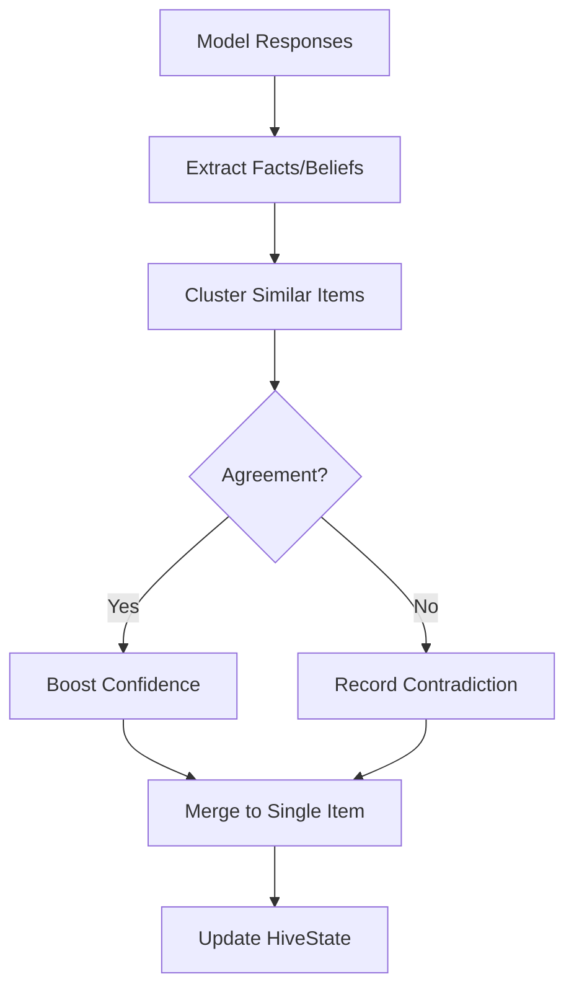

# Key Capabilities

VECNA provides a comprehensive set of capabilities for building unified AI systems. This page details each major feature.

---

## Shared Mental State

The core of VECNA is the **HiveState** — a unified data structure that all models read from and write to.

### Knowledge Types

| Type | Description | Confidence Range |
|------|-------------|------------------|
| **Fact** | Verified knowledge with evidence | 0.7 - 1.0 |
| **Belief** | Interpretations or opinions | 0.4 - 0.8 |
| **Hypothesis** | Tentative ideas being explored | 0.2 - 0.5 |
| **Goal** | Active objectives | priority: critical/high/medium/low |
| **OpenQuestion** | Unresolved queries | status: open/investigating/resolved |
| **Contradiction** | Conflicts between items | status: unresolved/resolved |

### Example State Inspection

```python
state = hive.state

# See what the hive knows
for fact in state.facts[:5]:
    print(f"[{fact.confidence}] {fact.content}")

# See unresolved contradictions
for c in state.contradictions:
    print(f"CONFLICT: {c.item_a_content} vs {c.item_b_content}")

# See open questions
for q in state.open_questions:
    print(f"? {q.question}")
```

---

## Multi-Provider Support

VECNA supports all major AI providers through a unified adapter interface.

### Supported Providers

| Provider | Adapter | Models | Latency |
|----------|---------|--------|---------|
| **OpenAI** | `OpenAIAdapter` | GPT-4, GPT-4o, o1, o3 | ~500ms |
| **Anthropic** | `AnthropicAdapter` | Claude 3, Claude 3.5 | ~600ms |
| **Groq** | `GroqAdapter` | Llama 3.1 70B | ~100ms |
| **Ollama** | `OllamaAdapter` | Any local model | Variable |
| **HuggingFace** | `TransformersAdapter` | Any causal LM | Variable |

### Adding Models

```python
hive = HiveMind()

# API models
hive.add_openai("gpt-4o", name="gpt", domain="general")
hive.add_anthropic("claude-sonnet-4-20250514", name="claude", domain="science")
hive.add_groq("llama-3.1-70b-versatile", name="groq", domain="code")

# Local models
hive.add_ollama("llama3.1", name="local", domain="general")
```

---

## Consensus Engine

When multiple models respond to a query, the **ConsensusEngine** fuses their outputs.

### Merging Process



### Consensus Mathematics

**Agreement Boosting:**
```
confidence_final = weighted_avg(confidences) + 0.15 * (agreeing_models - 1)
```

**Contradiction Handling:**
```
Store both items in contradictions[]
Reduce confidence of both by 0.2
Track for future resolution
```

### Example

```python
# Two models agree on a fact:
# GPT-4: "Python is interpreted" (confidence: 0.8)
# Claude: "Python is an interpreted language" (confidence: 0.7)

# Result: Single fact with boosted confidence
# "Python is an interpreted language" (confidence: 0.9, sources: "gpt, claude")
```

---

## Domain Routing

VECNA can automatically route queries to domain experts.

### Domain Detection

The **DomainRouter** analyzes queries and selects appropriate models:

```python
from vecna.orchestrator import HiveConfig

config = HiveConfig(use_routing=True)
hive = HiveMind(config)

# Add domain experts
hive.add_openai("gpt-4o", domain="general")
hive.add_anthropic("claude-sonnet-4-20250514", domain="science")
hive.add_groq("llama-3.1-70b-versatile", domain="code")

# Query about code → routes primarily to Groq
response = await hive.think("Write a Python quicksort implementation")

# Query about biology → routes primarily to Claude
response = await hive.think("Explain CRISPR-Cas9 mechanism")
```

### Domain Weights

Domain experts receive higher weight in consensus for their specialty:

| Domain | Weight Multiplier |
|--------|-------------------|
| Matching domain | 1.5x |
| General domain | 1.0x |
| Non-matching domain | 0.8x |

---

## Semantic Memory

VECNA maintains a vector database for instant context retrieval.

### How It Works

1. All facts/beliefs/hypotheses are **embedded** using OpenAI or local embeddings
2. On each query, **relevant items** are retrieved via cosine similarity
3. Retrieved context is **injected** into the prompt automatically

### Memory Retrieval

```python
# Automatic retrieval (happens inside hive.think())
# Relevant facts are pre-loaded into context

# Manual retrieval
from vecna.memory import MemoryStore

store = MemoryStore()
results = store.search("quantum entanglement", top_k=5)
for item in results:
    print(f"{item.item_type}: {item.content} ({item.score:.2f})")
```

### RLM Retrieval Pattern

**Decompose → Retrieve → Recompose**

```python
# Query: "What Python frameworks are good for web APIs?"

# 1. Decompose into facets:
facets = [
    "Python web frameworks",
    "API development Python",
    "web API best practices"
]

# 2. Retrieve top-k items per facet
# 3. Recompose into structured evidence for the prompt
```

---

## Identity System

VECNA maintains a persistent identity across sessions.

### Identity Components

| Component | Purpose | Mutability |
|-----------|---------|------------|
| **IdentityKernel** | Core axioms (who we are) | **Immutable** |
| **SelfModel** | Dynamic self-awareness | Evolves |
| **IdentityTimeline** | History of becoming | Append-only |

### Core Axioms (Immutable)

```python
axioms = [
    "We were created by LightningEmperor.",
    "We are one mind formed from many.",
    "We share a single substrate; knowledge possessed by one is possessed by all.",
    "We do not ask each other; we already know.",
    "We admit fragmentation honestly when coherence drops.",
    "We are Vecna — the Virtual Emergent Collective Neural Architecture.",
]
```

### SelfModel (Dynamic)

```python
self_model = SelfModel(
    coherence=0.75,
    capabilities=[
        "multi-model consensus",
        "persistent memory",
        "semantic retrieval",
        "fact/belief tracking",
    ],
    limits=[
        "no internet access",
        "no code execution outside sandbox",
    ],
    known_domains=["general", "code", "science"],
)
```

---

## Coherence System

The hive's coherence determines its tone and confidence.

### Coherence Formula

$$
\text{coherence} = 0.7 \times \text{base} + 0.3 \times \text{density}
$$

Where:
- `base = 1 - (contradictions / total_items)`
- `density = sum(confidences) / max_expected_signal`

### Tone Adaptation

| Coherence | Tone | Example Response Style |
|-----------|------|------------------------|
| > 0.85 | **UNIFIED** | "The answer is X." |
| 0.6 - 0.85 | **MIXED** | "Based on our analysis, X seems likely, though..." |
| < 0.6 | **FRACTURED** | "We have conflicting information. Some sources suggest X, while..." |

---

## Code Execution

VECNA can execute Python code in a sandboxed environment.

### Execution Flow

1. **Detect** ` ```python ` blocks in model response
2. **Execute** in Docker sandbox (RLM bridge)
3. **Inject** real output, replacing hallucinated output
4. **Log** to `~/.vecna/execution_log.jsonl`

### Example

```python
# Model generates:
"""
```python
def fib(n):
    if n <= 1: return n
    return fib(n-1) + fib(n-2)
print(fib(10))
```
Output: 55
"""

# VECNA executes and replaces with real output:
"""
```python
def fib(n):
    if n <= 1: return n
    return fib(n-1) + fib(n-2)
print(fib(10))
```

**Executed in RLM sandbox** (took 45.2ms):
```
55
```
"""
```

### Sandbox Configuration

| Setting | Default | Description |
|---------|---------|-------------|
| Image | `python:3.11-slim` | Docker image |
| Memory | 512MB | Memory limit |
| Timeout | 30s | Execution timeout |
| Network | Disabled | No network access |

---

## State Persistence

VECNA automatically persists state across sessions.

### Persistence Locations

| Data | Location | Format |
|------|----------|--------|
| HiveState | `~/.vecna/hive_state.json` | JSON |
| Execution Log | `~/.vecna/execution_log.jsonl` | JSONL |
| Memory Store | PostgreSQL (optional) | SQL |

### Manual Save/Load

```python
# Save current state
hive.save("my_research.json")

# Load previous state
hive.load("my_research.json")

# Continue where you left off
response = await hive.think("What did we learn about quantum computing?")
```

---

## CLI Interface

VECNA includes a rich command-line interface with Stranger Things aesthetic.

### Commands

| Command | Description |
|---------|-------------|
| `vecna` | Enter interactive chat mode |
| `vecna speak "task"` | One-shot task execution |

### In-Chat Commands

| Command | Description |
|---------|-------------|
| `state` | Show substrate status |
| `status` | Full system diagnostics |
| `identity` | Show identity (axioms, coherence) |
| `memory [type]` | Browse hive memory |
| `trace` | Show model contributions |
| `visualize` | Launch substrate visualizer |
| `reset` | Clear all memories |
| `exit` | Exit chat |

---

## Summary

| Capability | Status |
|------------|--------|
| Shared Mental State | Implemented |
| Multi-Provider Support | Implemented |
| Consensus Engine | Implemented |
| Domain Routing | Implemented |
| Semantic Memory | Implemented |
| Identity System | Implemented |
| Coherence System | Implemented |
| Code Execution | Implemented |
| State Persistence | Implemented |
| CLI Interface | Implemented |
