# Execution & Scheduling

> *"The hive thinks in parallel. All minds converge on the answer."*

This page details how VECNA orchestrates model execution, manages the hive loop, and schedules concurrent operations across multiple AI models.

---

## The Hive Loop

The **HiveLoop** is the central orchestrator that drives all hive mind operations. It manages the cycle of querying models, merging their responses through consensus, and updating the shared substrate.

```mermaid
flowchart TB
    subgraph HiveLoop["Hive Loop Cycle"]
        direction TB
        A[Receive Query] --> B[Prepare Context]
        B --> C[Dispatch to Models]
        C --> D[Await Responses]
        D --> E[Consensus Merge]
        E --> F[Update Substrate]
        F --> G[Execute Code Blocks]
        G --> H[Self-Reflection]
        H --> I[Return Response]
    end
    
    I --> |"Next Query"| A
    
    style A fill:#1a1a2e,stroke:#ff0000
    style E fill:#1a1a2e,stroke:#ff0000
    style H fill:#1a1a2e,stroke:#ff0000
```



### Loop Phases

| Phase | Description | Duration |
|-------|-------------|----------|
| **Context Preparation** | Build prompt with identity, memory, and current state | 10-50ms |
| **Model Dispatch** | Send query to all active models in parallel | ~100ms |
| **Response Collection** | Await all model responses with timeout | 1-30s |
| **Consensus Merge** | Fuse responses into unified knowledge | 50-200ms |
| **Substrate Update** | Persist new facts, beliefs, contradictions | 10-50ms |
| **Code Execution** | Run detected Python blocks in sandbox | 0-30s |
| **Self-Reflection** | Compute coherence, update identity | 20-100ms |

---

## Parallel Model Execution

VECNA executes multiple models **concurrently** using Python's `asyncio`. This is fundamental to the hive mind concept: all models think simultaneously, not sequentially.

### Execution Model

```mermaid
sequenceDiagram
    participant User
    participant Loop as HiveLoop
    participant GPT as GPT-4
    participant Claude as Claude
    participant Groq as Groq
    participant Consensus
    
    User->>Loop: Query
    
    par Parallel Execution
        Loop->>GPT: generate()
        Loop->>Claude: generate()
        Loop->>Groq: generate()
    end
    
    GPT-->>Loop: Response A
    Claude-->>Loop: Response B
    Groq-->>Loop: Response C
    
    Loop->>Consensus: merge([A, B, C])
    Consensus-->>Loop: Unified Response
    Loop->>User: Final Answer
```

### Async Dispatch Pattern

```python
async def dispatch_to_models(self, query: str) -> list[ModelResponse]:
    """Execute query across all models in parallel."""
    tasks = []
    for adapter in self.adapters:
        task = asyncio.create_task(
            self._query_model(adapter, query),
            name=f"query-{adapter.name}"
        )
        tasks.append(task)
    
    # Await all with timeout
    responses = await asyncio.gather(
        *tasks,
        return_exceptions=True
    )
    
    # Filter successful responses
    return [r for r in responses if not isinstance(r, Exception)]
```

---

## Model Routing

The **DomainRouter** intelligently selects which models to query based on the nature of the task. This optimizes for both speed and quality.

### Domain Mapping

```mermaid
flowchart LR
    subgraph Router["Domain Router"]
        Q[Query] --> D{Detect Domain}
        D --> |code| Code[Code Models]
        D --> |science| Science[Science Models]
        D --> |creative| Creative[Creative Models]
        D --> |general| General[All Models]
    end
    
    Code --> GPT[GPT-4]
    Code --> Claude[Claude]
    Science --> GPT
    Science --> Groq[Groq/Llama]
    Creative --> Claude
    General --> All[All Available]
    
    style D fill:#1a1a2e,stroke:#ff0000
```



### Routing Configuration

| Domain | Primary Models | Rationale |
|--------|---------------|-----------|
| `code` | GPT-4, Claude | Strong code generation |
| `science` | GPT-4, Groq/Llama | Technical accuracy |
| `creative` | Claude, GPT-4 | Nuanced writing |
| `math` | GPT-4, Claude | Reasoning capability |
| `general` | All models | Maximum consensus |

### Routing Logic

```python
def route_query(self, query: str, domain: str | None = None) -> list[Adapter]:
    """Select models based on detected or specified domain."""
    if domain is None:
        domain = self.detect_domain(query)
    
    domain_models = self.domain_weights.get(domain, {})
    
    # Sort by weight, return top N
    ranked = sorted(
        self.adapters,
        key=lambda a: domain_models.get(a.name, 0.5),
        reverse=True
    )
    
    return ranked[:self.config.max_parallel_models]
```

---

## Timeout & Retry Strategy

Robust execution requires handling slow or failing models gracefully.

### Timeout Hierarchy

```
┌─────────────────────────────────────────────────────────────┐
│                    TIMEOUT CONFIGURATION                     │
├─────────────────────────────────────────────────────────────┤
│                                                              │
│   Per-Model Timeout:     30 seconds (default)                │
│   ├── GPT-4:             45 seconds (slower, higher quality) │
│   ├── Claude:            30 seconds                          │
│   ├── Groq:              10 seconds (fast inference)         │
│   └── Ollama:            60 seconds (local, variable)        │
│                                                              │
│   Loop Timeout:          60 seconds (entire cycle)           │
│   Code Execution:        30 seconds (sandbox limit)          │
│                                                              │
└─────────────────────────────────────────────────────────────┘
```

### Retry Policy

| Failure Type | Retry Count | Backoff | Action |
|--------------|-------------|---------|--------|
| Timeout | 1 | 2s | Retry once |
| Rate Limit | 3 | Exponential | Wait and retry |
| Auth Error | 0 | N/A | Skip model |
| Network Error | 2 | 1s | Retry with backoff |
| Invalid Response | 1 | 0s | Immediate retry |

### Graceful Degradation

When models fail, the hive continues with available responses:

```python
async def execute_with_fallback(self, query: str) -> str:
    """Execute query with graceful degradation."""
    responses = await self.dispatch_to_models(query)
    
    if not responses:
        # All models failed - use cached response or admit failure
        return self._generate_fallback_response(query)
    
    # Even one response allows the hive to function
    return await self.consensus.merge(responses)
```

---

## Scheduling Modes

VECNA supports multiple scheduling modes for different use cases.

### Interactive Mode (Default)

Optimized for conversational latency:

- Execute all models in parallel
- Return as soon as consensus is reached
- Timeout aggressive (30s max)

```python
config = HiveConfig(
    max_parallel_models=3,
    timeout_seconds=30,
    wait_for_all=False,  # Return on first consensus
)
```

### Thorough Mode

Optimized for quality over speed:

- Wait for all models to respond
- Extended timeout
- More rigorous consensus

```python
config = HiveConfig(
    max_parallel_models=5,
    timeout_seconds=120,
    wait_for_all=True,  # Wait for everyone
    min_consensus_models=3,
)
```

### Streaming Mode

For real-time output:

```mermaid
sequenceDiagram
    participant User
    participant Loop as HiveLoop
    participant Model as Fastest Model
    participant Others as Other Models
    
    User->>Loop: Query (streaming=True)
    Loop->>Model: generate_stream()
    Loop->>Others: generate() [background]
    
    loop Token Stream
        Model-->>Loop: token
        Loop-->>User: token
    end
    
    Others-->>Loop: Full responses
    Loop->>Loop: Background consensus update
```

---

## Resource Management

### Concurrency Limits

```python
class ResourceLimiter:
    """Manage concurrent operations."""
    
    def __init__(self):
        self.model_semaphore = asyncio.Semaphore(5)  # Max concurrent models
        self.embed_semaphore = asyncio.Semaphore(10)  # Max concurrent embeddings
        self.code_semaphore = asyncio.Semaphore(1)   # One code execution at a time
    
    async def with_model_limit(self, coro):
        async with self.model_semaphore:
            return await coro
```

### Memory Pressure Handling

When system resources are constrained:

1. **Reduce parallel models**: Drop to 2 concurrent
2. **Skip embedding generation**: Use keyword fallback
3. **Compress context**: Truncate memory injection
4. **Queue requests**: Add backpressure

---

## Cycle Metrics

Every hive loop cycle collects metrics for observability:

| Metric | Description | Typical Value |
|--------|-------------|---------------|
| `cycle_duration_ms` | Total loop time | 500-5000ms |
| `models_queried` | Number of models | 2-5 |
| `models_responded` | Successful responses | 2-5 |
| `consensus_duration_ms` | Merge time | 50-200ms |
| `facts_extracted` | New facts added | 0-10 |
| `coherence_delta` | Change in coherence | -0.1 to +0.1 |
| `code_blocks_executed` | Python blocks run | 0-3 |

### Metrics Collection

```python
@dataclass
class CycleMetrics:
    cycle_id: str
    start_time: datetime
    end_time: datetime
    models_queried: int
    models_responded: int
    consensus_duration_ms: float
    facts_extracted: int
    beliefs_extracted: int
    contradictions_found: int
    coherence_before: float
    coherence_after: float
    code_executions: int
```

---

## Error Handling

### Error Categories

```mermaid
flowchart TD
    E[Error] --> |recoverable| R[Retry Logic]
    E --> |transient| T[Log & Continue]
    E --> |fatal| F[Graceful Shutdown]
    
    R --> |success| S[Continue Loop]
    R --> |failure| T
    
    T --> S
    F --> X[Exit with State Save]
    
    style E fill:#1a1a2e,stroke:#ff0000
    style F fill:#1a1a2e,stroke:#ff6600
```



### Error Recovery Patterns

```python
class HiveLoop:
    async def run_cycle(self, query: str) -> str:
        try:
            return await self._execute_cycle(query)
        except ConsensusFailure:
            # Not enough agreement - return best individual response
            return self._select_best_response()
        except AllModelsFailedError:
            # Complete failure - use cached knowledge
            return self._generate_from_memory(query)
        except SubstrateCorruptionError:
            # Critical - save state and alert
            await self._emergency_save()
            raise
```

---

## Configuration Reference

### HiveConfig Options

| Option | Type | Default | Description |
|--------|------|---------|-------------|
| `max_parallel_models` | int | 5 | Maximum concurrent model queries |
| `use_routing` | bool | True | Enable domain-based routing |
| `compress_every` | int | 5 | Compress memory every N cycles |
| `max_cycles` | int | 20 | Safety limit per session |
| `timeout_seconds` | float | 30.0 | Per-model timeout |
| `wait_for_all` | bool | False | Wait for all models |
| `auto_execute_code` | bool | True | Execute Python blocks |
| `verbose` | bool | True | Enable detailed logging |

---

## Best Practices

!!! tip "Execution Tips"
    
    1. **Start with 3 models**: Balance between consensus quality and latency
    2. **Enable routing**: Let the router pick optimal models per domain
    3. **Monitor coherence**: Drops indicate model disagreement
    4. **Use streaming for UX**: Real-time output improves perceived latency
    5. **Set appropriate timeouts**: Faster for chat, longer for complex tasks

!!! warning "Common Pitfalls"
    
    - **Too many models**: Increases latency without proportional quality gain
    - **No timeout**: Hanging models block the entire loop
    - **Ignoring failures**: Always handle partial consensus gracefully
    - **Synchronous execution**: Defeats the purpose of multi-model fusion

---

## Next Steps

- [IO Model](io-model.md) - Data streams and transport layers
- [Consensus Engine](../architecture/consistency.md) - How responses are merged
- [Memory Retrieval](../memory/retrieval.md) - Context injection patterns
