# Extension Interfaces

> *"The hive grows. New capabilities emerge."*

This page describes how to extend VECNA with custom adapters, memory backends, tools, and plugins.

---

## Extension Architecture

VECNA is designed for extensibility through well-defined interfaces:

```mermaid
flowchart TB
    subgraph Core["VECNA Core"]
        Loop[Hive Loop]
        State[HiveState]
        Consensus[Consensus Engine]
    end
    
    subgraph Extensions["Extension Points"]
        Adapters[Model Adapters]
        Memory[Memory Backends]
        Tools[Tool Plugins]
        Hooks[Event Hooks]
    end
    
    Adapters --> Loop
    Memory --> State
    Tools --> Loop
    Hooks --> Loop
    Hooks --> Consensus
    
    style Core fill:#1a1a2e,stroke:#ff0000
    style Extensions fill:#1a1a2e,stroke:#ff3333
```



---

## Model Adapters

### Adapter Interface

All model adapters implement the `BaseAdapter` protocol:

```python
from abc import ABC, abstractmethod
from typing import AsyncIterator

class BaseAdapter(ABC):
    """Base interface for model adapters."""
    
    name: str           # Unique adapter name
    model: str          # Model identifier
    domains: list[str]  # Expertise domains
    
    @abstractmethod
    async def generate(
        self,
        prompt: str,
        system: str | None = None,
        temperature: float = 0.7,
        max_tokens: int = 2048,
    ) -> str:
        """Generate a response."""
        ...
    
    @abstractmethod
    async def generate_stream(
        self,
        prompt: str,
        system: str | None = None,
        temperature: float = 0.7,
        max_tokens: int = 2048,
    ) -> AsyncIterator[str]:
        """Generate a streaming response."""
        ...
    
    @abstractmethod
    async def embed(self, text: str) -> list[float]:
        """Generate embedding for text."""
        ...
    
    async def health_check(self) -> bool:
        """Check if adapter is healthy."""
        return True
```

### Creating a Custom Adapter

Example: Adding a custom provider:

```python
from vecna.adapters.base import BaseAdapter
import httpx

class CustomProviderAdapter(BaseAdapter):
    """Adapter for a custom LLM provider."""
    
    def __init__(
        self,
        api_key: str,
        model: str = "custom-model-v1",
        base_url: str = "https://api.custom-provider.com",
    ):
        self.name = "custom"
        self.model = model
        self.domains = ["general"]
        self.api_key = api_key
        self.base_url = base_url
        self._client = httpx.AsyncClient(
            base_url=base_url,
            headers={"Authorization": f"Bearer {api_key}"},
        )
    
    async def generate(
        self,
        prompt: str,
        system: str | None = None,
        temperature: float = 0.7,
        max_tokens: int = 2048,
    ) -> str:
        response = await self._client.post(
            "/v1/completions",
            json={
                "model": self.model,
                "prompt": prompt,
                "system": system,
                "temperature": temperature,
                "max_tokens": max_tokens,
            },
        )
        response.raise_for_status()
        return response.json()["completion"]
    
    async def generate_stream(
        self,
        prompt: str,
        system: str | None = None,
        temperature: float = 0.7,
        max_tokens: int = 2048,
    ) -> AsyncIterator[str]:
        async with self._client.stream(
            "POST",
            "/v1/completions/stream",
            json={
                "model": self.model,
                "prompt": prompt,
                "system": system,
                "temperature": temperature,
                "max_tokens": max_tokens,
                "stream": True,
            },
        ) as response:
            async for line in response.aiter_lines():
                if line.startswith("data: "):
                    yield json.loads(line[6:])["token"]
    
    async def embed(self, text: str) -> list[float]:
        response = await self._client.post(
            "/v1/embeddings",
            json={"text": text},
        )
        response.raise_for_status()
        return response.json()["embedding"]
```

### Registering an Adapter

```python
from vecna import HiveMind

hive = HiveMind()

# Add built-in adapters
hive.add_openai(model="gpt-4o")
hive.add_anthropic(model="claude-sonnet-4-20250514")

# Add custom adapter
custom_adapter = CustomProviderAdapter(
    api_key="your-api-key",
    model="custom-model-v1",
)
hive.add_adapter(custom_adapter)
```

---

## Memory Backends

### Memory Store Interface

Custom memory backends implement the `MemoryStore` protocol:

```python
from abc import ABC, abstractmethod
from typing import Any

class MemoryStore(ABC):
    """Interface for memory storage backends."""
    
    @abstractmethod
    async def store(
        self,
        content: str,
        item_type: str,
        confidence: float,
        metadata: dict[str, Any] | None = None,
    ) -> str:
        """Store a memory item. Returns item ID."""
        ...
    
    @abstractmethod
    async def retrieve(
        self,
        query: str,
        top_k: int = 10,
        min_confidence: float = 0.0,
        item_types: list[str] | None = None,
    ) -> list[MemoryItem]:
        """Retrieve relevant memory items."""
        ...
    
    @abstractmethod
    async def update(
        self,
        item_id: str,
        updates: dict[str, Any],
    ) -> None:
        """Update a memory item."""
        ...
    
    @abstractmethod
    async def delete(self, item_id: str) -> None:
        """Delete a memory item."""
        ...
    
    @abstractmethod
    async def search_by_metadata(
        self,
        filters: dict[str, Any],
    ) -> list[MemoryItem]:
        """Search by metadata filters."""
        ...
```

### Example: SQLite Backend

```python
import aiosqlite
import json
from vecna.memory.base import MemoryStore, MemoryItem

class SQLiteMemoryStore(MemoryStore):
    """SQLite-based memory backend."""
    
    def __init__(self, db_path: str = "vecna_memory.db"):
        self.db_path = db_path
        self._db: aiosqlite.Connection | None = None
    
    async def initialize(self):
        """Initialize database schema."""
        self._db = await aiosqlite.connect(self.db_path)
        await self._db.execute("""
            CREATE TABLE IF NOT EXISTS memory_items (
                id TEXT PRIMARY KEY,
                content TEXT NOT NULL,
                item_type TEXT NOT NULL,
                confidence REAL NOT NULL,
                metadata TEXT,
                embedding BLOB,
                created_at TIMESTAMP DEFAULT CURRENT_TIMESTAMP
            )
        """)
        await self._db.commit()
    
    async def store(
        self,
        content: str,
        item_type: str,
        confidence: float,
        metadata: dict[str, Any] | None = None,
    ) -> str:
        item_id = str(uuid.uuid4())
        embedding = await self._embed(content)
        
        await self._db.execute(
            """
            INSERT INTO memory_items (id, content, item_type, confidence, metadata, embedding)
            VALUES (?, ?, ?, ?, ?, ?)
            """,
            (
                item_id,
                content,
                item_type,
                confidence,
                json.dumps(metadata or {}),
                embedding.tobytes(),
            ),
        )
        await self._db.commit()
        return item_id
    
    async def retrieve(
        self,
        query: str,
        top_k: int = 10,
        min_confidence: float = 0.0,
        item_types: list[str] | None = None,
    ) -> list[MemoryItem]:
        # Embed query
        query_embedding = await self._embed(query)
        
        # Fetch candidates
        sql = "SELECT * FROM memory_items WHERE confidence >= ?"
        params = [min_confidence]
        
        if item_types:
            placeholders = ",".join("?" * len(item_types))
            sql += f" AND item_type IN ({placeholders})"
            params.extend(item_types)
        
        async with self._db.execute(sql, params) as cursor:
            rows = await cursor.fetchall()
        
        # Rank by similarity
        results = []
        for row in rows:
            embedding = np.frombuffer(row["embedding"], dtype=np.float32)
            similarity = cosine_similarity(query_embedding, embedding)
            results.append((similarity, row))
        
        results.sort(reverse=True, key=lambda x: x[0])
        return [self._row_to_item(row) for _, row in results[:top_k]]
```

### Registering a Memory Backend

```python
from vecna import HiveMind
from my_backends import SQLiteMemoryStore

# Create and initialize backend
memory_store = SQLiteMemoryStore("my_memory.db")
await memory_store.initialize()

# Create hive with custom backend
hive = HiveMind(memory_store=memory_store)
```

---

## Tool Plugins

### Tool Interface

Tools extend the hive's capabilities:

```python
from abc import ABC, abstractmethod
from dataclasses import dataclass
from typing import Any

@dataclass
class ToolResult:
    """Result from tool execution."""
    success: bool
    output: Any
    error: str | None = None

class Tool(ABC):
    """Interface for tool plugins."""
    
    name: str           # Tool name
    description: str    # Description for the model
    
    @abstractmethod
    async def execute(self, **kwargs) -> ToolResult:
        """Execute the tool."""
        ...
    
    @property
    @abstractmethod
    def schema(self) -> dict:
        """JSON schema for tool parameters."""
        ...
```

### Example: Web Search Tool

```python
from vecna.tools.base import Tool, ToolResult
import httpx

class WebSearchTool(Tool):
    """Web search tool using a search API."""
    
    name = "web_search"
    description = "Search the web for information"
    
    def __init__(self, api_key: str):
        self.api_key = api_key
        self._client = httpx.AsyncClient()
    
    @property
    def schema(self) -> dict:
        return {
            "type": "object",
            "properties": {
                "query": {
                    "type": "string",
                    "description": "Search query",
                },
                "num_results": {
                    "type": "integer",
                    "description": "Number of results",
                    "default": 5,
                },
            },
            "required": ["query"],
        }
    
    async def execute(self, query: str, num_results: int = 5) -> ToolResult:
        try:
            response = await self._client.get(
                "https://api.search-provider.com/search",
                params={"q": query, "num": num_results},
                headers={"Authorization": f"Bearer {self.api_key}"},
            )
            response.raise_for_status()
            
            results = response.json()["results"]
            return ToolResult(success=True, output=results)
        except Exception as e:
            return ToolResult(success=False, output=None, error=str(e))
```

### Example: Calculator Tool

```python
import ast
import operator
from vecna.tools.base import Tool, ToolResult

class CalculatorTool(Tool):
    """Safe mathematical expression evaluator."""
    
    name = "calculator"
    description = "Evaluate mathematical expressions"
    
    # Safe operators
    OPERATORS = {
        ast.Add: operator.add,
        ast.Sub: operator.sub,
        ast.Mult: operator.mul,
        ast.Div: operator.truediv,
        ast.Pow: operator.pow,
        ast.USub: operator.neg,
    }
    
    @property
    def schema(self) -> dict:
        return {
            "type": "object",
            "properties": {
                "expression": {
                    "type": "string",
                    "description": "Mathematical expression to evaluate",
                },
            },
            "required": ["expression"],
        }
    
    async def execute(self, expression: str) -> ToolResult:
        try:
            tree = ast.parse(expression, mode="eval")
            result = self._eval(tree.body)
            return ToolResult(success=True, output=result)
        except Exception as e:
            return ToolResult(success=False, output=None, error=str(e))
    
    def _eval(self, node):
        if isinstance(node, ast.Constant):
            return node.value
        elif isinstance(node, ast.BinOp):
            left = self._eval(node.left)
            right = self._eval(node.right)
            return self.OPERATORS[type(node.op)](left, right)
        elif isinstance(node, ast.UnaryOp):
            operand = self._eval(node.operand)
            return self.OPERATORS[type(node.op)](operand)
        else:
            raise ValueError(f"Unsupported operation: {type(node)}")
```

### Registering Tools

```python
from vecna import HiveMind
from my_tools import WebSearchTool, CalculatorTool

hive = HiveMind()

# Register tools
hive.register_tool(WebSearchTool(api_key="..."))
hive.register_tool(CalculatorTool())

# Tools are now available during thinking
response = await hive.think("What is 15% of 847?")
```

---

## Event Hooks

### Hook Interface

Hooks allow you to react to system events:

```python
from abc import ABC
from typing import Any

class EventHook(ABC):
    """Base class for event hooks."""
    
    def on_query_received(self, query: str, metadata: dict[str, Any]) -> None:
        """Called when a query is received."""
        pass
    
    def on_model_response(
        self,
        model: str,
        response: str,
        latency_ms: float,
    ) -> None:
        """Called when a model responds."""
        pass
    
    def on_consensus_complete(
        self,
        facts: list,
        beliefs: list,
        contradictions: list,
    ) -> None:
        """Called after consensus merge."""
        pass
    
    def on_state_updated(self, old_state: HiveState, new_state: HiveState) -> None:
        """Called when substrate state changes."""
        pass
    
    def on_code_executed(
        self,
        code: str,
        output: str,
        success: bool,
        duration_ms: float,
    ) -> None:
        """Called after code execution."""
        pass
    
    def on_error(self, error: Exception, context: dict[str, Any]) -> None:
        """Called when an error occurs."""
        pass
```

### Example: Logging Hook

```python
import logging
from vecna.hooks.base import EventHook

class LoggingHook(EventHook):
    """Hook that logs all events."""
    
    def __init__(self, logger: logging.Logger | None = None):
        self.logger = logger or logging.getLogger("vecna.events")
    
    def on_query_received(self, query: str, metadata: dict) -> None:
        self.logger.info(f"Query received: {query[:100]}...")
    
    def on_model_response(self, model: str, response: str, latency_ms: float) -> None:
        self.logger.info(f"Model {model} responded in {latency_ms:.1f}ms")
    
    def on_consensus_complete(self, facts, beliefs, contradictions) -> None:
        self.logger.info(
            f"Consensus: {len(facts)} facts, {len(beliefs)} beliefs, "
            f"{len(contradictions)} contradictions"
        )
    
    def on_error(self, error: Exception, context: dict) -> None:
        self.logger.error(f"Error: {error}", exc_info=True)
```

### Example: Metrics Hook

```python
from prometheus_client import Counter, Histogram
from vecna.hooks.base import EventHook

class MetricsHook(EventHook):
    """Hook that exports Prometheus metrics."""
    
    def __init__(self):
        self.queries_total = Counter(
            "vecna_queries_total",
            "Total queries processed",
        )
        self.model_latency = Histogram(
            "vecna_model_latency_seconds",
            "Model response latency",
            ["model"],
        )
        self.consensus_items = Counter(
            "vecna_consensus_items_total",
            "Items extracted by consensus",
            ["type"],
        )
    
    def on_query_received(self, query: str, metadata: dict) -> None:
        self.queries_total.inc()
    
    def on_model_response(self, model: str, response: str, latency_ms: float) -> None:
        self.model_latency.labels(model=model).observe(latency_ms / 1000)
    
    def on_consensus_complete(self, facts, beliefs, contradictions) -> None:
        self.consensus_items.labels(type="fact").inc(len(facts))
        self.consensus_items.labels(type="belief").inc(len(beliefs))
        self.consensus_items.labels(type="contradiction").inc(len(contradictions))
```

### Registering Hooks

```python
from vecna import HiveMind
from my_hooks import LoggingHook, MetricsHook

hive = HiveMind()

# Register hooks
hive.add_hook(LoggingHook())
hive.add_hook(MetricsHook())
```

---

## Consensus Extensions

### Custom Consensus Strategies

Extend the consensus engine with custom merging strategies:

```python
from vecna.orchestrator.consensus import ConsensusStrategy

class WeightedConsensusStrategy(ConsensusStrategy):
    """Consensus with model-specific weights."""
    
    def __init__(self, model_weights: dict[str, float]):
        self.model_weights = model_weights
    
    def compute_confidence(
        self,
        responses: list[ModelResponse],
        item: str,
        agreeing_models: list[str],
    ) -> float:
        base_confidence = len(agreeing_models) / len(responses)
        
        # Weight by model quality
        weight_sum = sum(
            self.model_weights.get(model, 1.0)
            for model in agreeing_models
        )
        total_weight = sum(
            self.model_weights.get(r.model, 1.0)
            for r in responses
        )
        
        weighted_confidence = weight_sum / total_weight
        return (base_confidence + weighted_confidence) / 2
```

### Registering Consensus Strategies

```python
from vecna import HiveMind
from my_strategies import WeightedConsensusStrategy

strategy = WeightedConsensusStrategy({
    "gpt-4o": 1.5,
    "claude": 1.3,
    "groq": 1.0,
})

hive = HiveMind(consensus_strategy=strategy)
```

---

## Plugin System

### Plugin Structure

Plugins bundle multiple extensions together:

```python
from vecna.plugins.base import Plugin

class MyPlugin(Plugin):
    """Example plugin bundling multiple extensions."""
    
    name = "my-plugin"
    version = "1.0.0"
    
    def __init__(self, config: dict):
        self.config = config
    
    def get_adapters(self) -> list[BaseAdapter]:
        """Return adapters provided by this plugin."""
        return [CustomProviderAdapter(self.config["api_key"])]
    
    def get_tools(self) -> list[Tool]:
        """Return tools provided by this plugin."""
        return [WebSearchTool(self.config["search_api_key"])]
    
    def get_hooks(self) -> list[EventHook]:
        """Return hooks provided by this plugin."""
        return [LoggingHook()]
    
    async def on_load(self, hive: HiveMind) -> None:
        """Called when plugin is loaded."""
        print(f"Plugin {self.name} loaded!")
    
    async def on_unload(self, hive: HiveMind) -> None:
        """Called when plugin is unloaded."""
        print(f"Plugin {self.name} unloaded!")
```

### Loading Plugins

```python
from vecna import HiveMind
from my_plugin import MyPlugin

hive = HiveMind()

# Load plugin
plugin = MyPlugin(config={
    "api_key": "...",
    "search_api_key": "...",
})
await hive.load_plugin(plugin)

# Unload plugin
await hive.unload_plugin("my-plugin")
```

---

## Best Practices

!!! tip "Extension Guidelines"
    
    1. **Follow the interfaces** - Implement all required methods
    2. **Handle errors gracefully** - Return appropriate error states
    3. **Be async-friendly** - Use async/await throughout
    4. **Document your extensions** - Include docstrings and type hints
    5. **Test thoroughly** - Write unit tests for extensions

!!! warning "Common Pitfalls"
    
    - **Blocking operations** - Always use async for I/O
    - **Missing error handling** - Catch and report exceptions
    - **State mutation** - Avoid modifying shared state directly
    - **Resource leaks** - Clean up connections and files

---

## Extension Registry

VECNA maintains a registry of community extensions:

| Extension | Type | Description |
|-----------|------|-------------|
| `vecna-ollama` | Adapter | Enhanced Ollama support |
| `vecna-pinecone` | Memory | Pinecone vector store backend |
| `vecna-langchain` | Tools | LangChain tool integration |
| `vecna-prometheus` | Hooks | Prometheus metrics export |

### Installing Extensions

```bash
pip install vecna-ollama vecna-pinecone
```

```python
from vecna_ollama import EnhancedOllamaAdapter
from vecna_pinecone import PineconeMemoryStore

hive = HiveMind(memory_store=PineconeMemoryStore())
hive.add_adapter(EnhancedOllamaAdapter())
```

---

## Next Steps

- [Model Adapters](../api/adapters.md) - Built-in adapter reference
- [Memory API](../api/memory.md) - Memory system API
- [Configuration](../configuration/index.md) - Configure extensions
