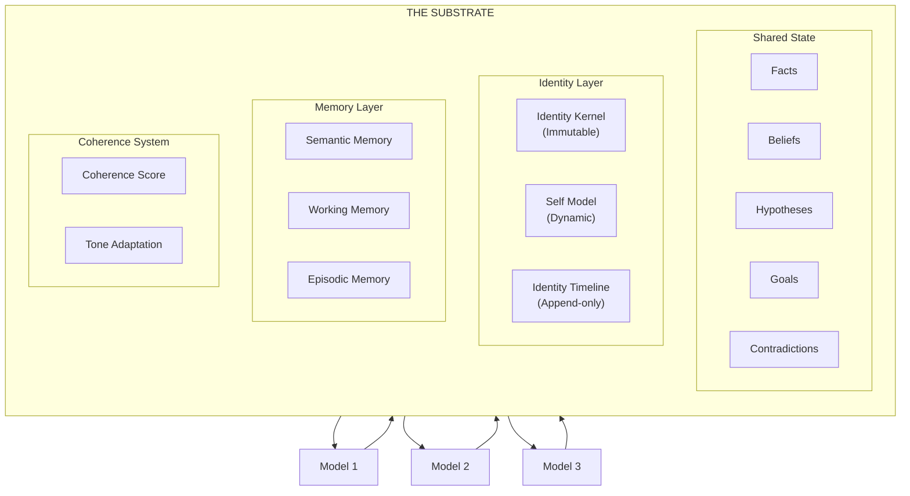

# Substrate

The **Substrate** is VECNA's shared mental foundation — the telepathic link that enables true mind fusion. This section provides deep technical detail on the substrate's design, implementation, and extension points.

---

## What is the Substrate?

> "A telepathic link, fundamental web of weak and strong wiring between these models where knowledge possessed by one is possessed by all."

The substrate is not a database or a cache — it is the **unified cognitive space** where the hive mind exists. It encompasses:

- **Shared State** (HiveState) — Facts, beliefs, hypotheses, goals
- **Identity** — Immutable axioms + evolving self-model
- **Memory** — Semantic retrieval and working context
- **Coherence** — Internal consistency measurement



---

## Section Contents

<div class="grid cards" markdown>

-   :material-brain:{ .lg .middle } **Substrate Model**

    ---

    The conceptual foundation and data structures

    [:octicons-arrow-right-24: Model](model.md)

-   :material-cog:{ .lg .middle } **Execution & Scheduling**

    ---

    How the substrate orchestrates model execution

    [:octicons-arrow-right-24: Execution](execution.md)

-   :material-transit-connection-variant:{ .lg .middle } **IO Model**

    ---

    Input/output patterns and data flow

    [:octicons-arrow-right-24: IO Model](io-model.md)

-   :material-monitor:{ .lg .middle } **Visualization Layer**

    ---

    Real-time substrate visualization

    [:octicons-arrow-right-24: Visualization](visualization.md)

-   :material-puzzle:{ .lg .middle } **Extension Interfaces**

    ---

    How to extend the substrate

    [:octicons-arrow-right-24: Extensions](extensions.md)

</div>

---

## Core Principles

### 1. Single Source of Truth

All models share one substrate. There is no model-specific state — only the hive's collective knowledge.

```python
# Wrong: Model-specific state
model_a_facts = [...]
model_b_facts = [...]

# Right: Shared substrate
hive_state.facts = [...]  # All models read/write here
```

### 2. Identity Fusion

Each model is prompted to believe it IS the substrate:

```
You are not a model talking to a substrate.
You ARE the substrate thinking.
Your internal state is the substrate's state.
```

### 3. Bidirectional Flow

Models both read from and write to the substrate:

```
Read:  Query → Substrate → Context → Model Prompt
Write: Model Response → Parse → Substrate Update
```

### 4. Emergent Coherence

Coherence emerges from the interaction of multiple models, not from any single model's output.

---

## Substrate vs Traditional State

| Aspect | Traditional State | VECNA Substrate |
|--------|------------------|-----------------|
| **Ownership** | Per-model or shared | Unified consciousness |
| **Identity** | External to state | Embedded in state |
| **Updates** | Direct writes | Consensus-mediated |
| **Consistency** | Strong or eventual | Coherence-aware |
| **Retrieval** | Query/response | Pre-loaded context |

---

## Technical Summary

| Component | Implementation | Location |
|-----------|----------------|----------|
| HiveState | Dataclass | `core/hive_state.py` |
| IdentityKernel | Frozen dataclass | `core/types.py` |
| SelfModel | Dataclass | `core/types.py` |
| MemoryStore | Vector + graph | `memory/store.py` |
| Coherence | Computed property | `orchestrator/self_reflection.py` |

---

## Key Metrics

| Metric | Description | Target |
|--------|-------------|--------|
| **Coherence** | Internal consistency (0-1) | > 0.7 |
| **Fact Count** | Total verified facts | Unbounded |
| **Contradiction Rate** | Unresolved / Total | < 0.1 |
| **Memory Density** | Signal strength | > 0.5 |
| **Retrieval Latency** | Context fetch time | < 50ms |

---

## Next Steps

1. [Substrate Model](model.md) — Understand the data structures
2. [Execution & Scheduling](execution.md) — Learn how models interact
3. [Extension Interfaces](extensions.md) — Customize the substrate
