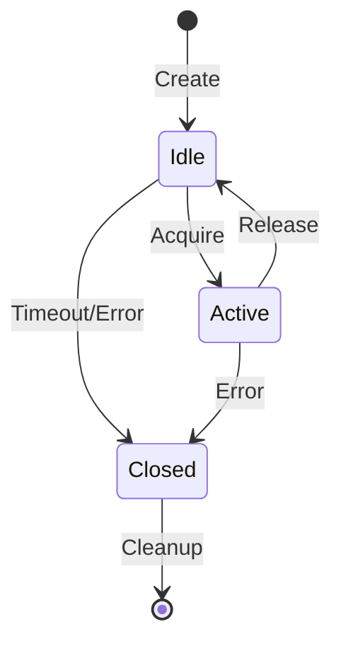
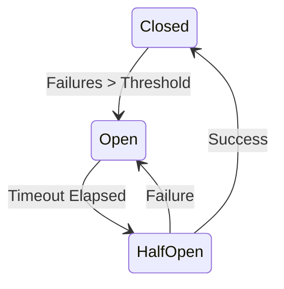

# IO Model

> *"Information flows through the hive like blood through veins."*

This page describes VECNA's input/output model, including data streams, message queues, transport layers, and how information moves through the system.

---

## Overview

VECNA's IO model is designed around three principles:

1. **Asynchronous by default** - Non-blocking operations throughout
2. **Stream-oriented** - Data flows as continuous streams, not discrete batches
3. **Multi-channel** - Parallel paths for different data types

```mermaid
flowchart LR
    subgraph Input["Input Channels"]
        CLI[CLI Input]
        API[API Requests]
        Stream[Event Streams]
    end
    
    subgraph Core["Core Processing"]
        Queue[Message Queue]
        Loop[Hive Loop]
        State[HiveState]
    end
    
    subgraph Output["Output Channels"]
        Resp[Responses]
        Events[Event Log]
        Metrics[Metrics]
    end
    
    CLI --> Queue
    API --> Queue
    Stream --> Queue
    Queue --> Loop
    Loop <--> State
    Loop --> Resp
    Loop --> Events
    Loop --> Metrics
    
    style Loop fill:#1a1a2e,stroke:#ff0000
    style State fill:#1a1a2e,stroke:#ff0000
```



---

## Input Streams

### User Input

The primary input stream comes from user interactions:

| Channel | Format | Description |
|---------|--------|-------------|
| CLI | Text | Interactive terminal input |
| API | JSON | Programmatic requests |
| File | Various | Document ingestion |

### Message Format

All inputs are normalized to a common message format:

```python
@dataclass
class HiveMessage:
    """Normalized input message."""
    id: str                      # Unique message ID
    content: str                 # User query/input
    role: Literal["user", "system", "tool"]
    timestamp: datetime
    metadata: dict[str, Any]     # Source, session, etc.
    attachments: list[Attachment] = field(default_factory=list)
```

### Input Processing Pipeline

```mermaid
flowchart TB
    Raw[Raw Input] --> Validate[Validation]
    Validate --> Normalize[Normalization]
    Normalize --> Enrich[Enrichment]
    Enrich --> Queue[Message Queue]
    
    subgraph Enrichment
        Context[Add Context]
        Memory[Retrieve Memory]
        Identity[Inject Identity]
    end
    
    Enrich --> Context
    Context --> Memory
    Memory --> Identity
    Identity --> Queue
    
    style Raw fill:#1a1a2e,stroke:#ff0000
```



---

## Output Streams

### Response Stream

VECNA supports both buffered and streaming responses:

#### Buffered Mode
Complete response returned after full processing:

```python
response = await hive.think("Explain quantum computing")
print(response)  # Full response at once
```

#### Streaming Mode
Tokens streamed as generated:

```python
async for token in hive.think_stream("Explain quantum computing"):
    print(token, end="", flush=True)
```

### Event Stream

All system events are emitted to an event stream for observability:

```python
@dataclass
class HiveEvent:
    """System event."""
    event_type: str          # query, response, consensus, error, etc.
    timestamp: datetime
    payload: dict[str, Any]
    session_id: str | None
    correlation_id: str      # Links related events
```

#### Event Types

| Event Type | Description | Payload |
|------------|-------------|---------|
| `query.received` | User query received | `{content, source}` |
| `model.dispatched` | Query sent to model | `{model, query_id}` |
| `model.responded` | Model returned response | `{model, latency_ms}` |
| `consensus.started` | Consensus merge begun | `{response_count}` |
| `consensus.completed` | Consensus merge done | `{facts, beliefs, contradictions}` |
| `code.executed` | Python code run | `{block_id, duration_ms, success}` |
| `state.updated` | Substrate changed | `{delta_summary}` |
| `error.occurred` | Error encountered | `{error_type, message}` |

---

## Transport Layers

### Adapter Transport

Each model adapter implements a transport interface for communication with AI providers:

```mermaid
flowchart TB
    subgraph Adapters["Model Adapters"]
        OA[OpenAI Adapter]
        AA[Anthropic Adapter]
        GA[Groq Adapter]
        LA[Ollama Adapter]
    end
    
    subgraph Transports["Transport Layer"]
        HTTP[HTTPS/REST]
        WS[WebSocket]
        Local[Local Process]
    end
    
    OA --> HTTP
    AA --> HTTP
    GA --> HTTP
    LA --> HTTP
    LA --> Local
    
    style HTTP fill:#1a1a2e,stroke:#ff0000
```



### Transport Interface

```python
class Transport(Protocol):
    """Transport layer protocol."""
    
    async def send(self, request: Request) -> Response:
        """Send request and await response."""
        ...
    
    async def stream(self, request: Request) -> AsyncIterator[Chunk]:
        """Send request and stream response chunks."""
        ...
    
    async def close(self) -> None:
        """Close transport connection."""
        ...
```

### HTTP Transport

Default transport for cloud providers:

```python
class HTTPTransport:
    """HTTPS transport with connection pooling."""
    
    def __init__(self, base_url: str, timeout: float = 30.0):
        self.session = aiohttp.ClientSession(
            base_url=base_url,
            timeout=aiohttp.ClientTimeout(total=timeout),
            connector=aiohttp.TCPConnector(limit=100),
        )
    
    async def send(self, request: Request) -> Response:
        async with self.session.post(
            request.endpoint,
            json=request.body,
            headers=request.headers,
        ) as resp:
            return Response(
                status=resp.status,
                body=await resp.json(),
            )
```

---

## Message Queues

### Internal Queue

VECNA uses an internal async queue for message processing:

```python
class MessageQueue:
    """Async message queue for hive operations."""
    
    def __init__(self, max_size: int = 1000):
        self._queue: asyncio.Queue[HiveMessage] = asyncio.Queue(maxsize=max_size)
        self._processors: list[MessageProcessor] = []
    
    async def put(self, message: HiveMessage) -> None:
        """Add message to queue."""
        await self._queue.put(message)
    
    async def process(self) -> None:
        """Process messages from queue."""
        while True:
            message = await self._queue.get()
            for processor in self._processors:
                await processor.handle(message)
            self._queue.task_done()
```

### Queue Priorities

| Priority | Use Case | Max Latency |
|----------|----------|-------------|
| **Critical** | System commands, shutdown | < 100ms |
| **High** | User queries | < 500ms |
| **Normal** | Background tasks | < 5s |
| **Low** | Maintenance, cleanup | Best effort |

---

## Data Serialization

### Wire Format

All data is serialized as JSON for transport:

```python
class HiveSerializer:
    """Serialization for hive data."""
    
    @staticmethod
    def serialize(obj: Any) -> str:
        """Serialize object to JSON."""
        return json.dumps(obj, cls=HiveEncoder, ensure_ascii=False)
    
    @staticmethod
    def deserialize(data: str, cls: type[T]) -> T:
        """Deserialize JSON to object."""
        return cls(**json.loads(data))

class HiveEncoder(json.JSONEncoder):
    """Custom encoder for hive types."""
    
    def default(self, obj):
        if isinstance(obj, datetime):
            return obj.isoformat()
        if isinstance(obj, UUID):
            return str(obj)
        if hasattr(obj, "to_dict"):
            return obj.to_dict()
        return super().default(obj)
```

### Embedding Serialization

Vector embeddings require special handling:

```python
def serialize_embedding(embedding: list[float]) -> str:
    """Serialize embedding to compact format."""
    # Use base64 for efficiency
    arr = np.array(embedding, dtype=np.float32)
    return base64.b64encode(arr.tobytes()).decode()

def deserialize_embedding(data: str) -> list[float]:
    """Deserialize embedding from compact format."""
    raw = base64.b64decode(data)
    arr = np.frombuffer(raw, dtype=np.float32)
    return arr.tolist()
```

---

## Backpressure & Flow Control

### Backpressure Mechanisms

When the system is overloaded, backpressure prevents cascading failures:

```mermaid
flowchart TB
    Input[Input Stream] --> Check{Queue Full?}
    Check --> |No| Accept[Accept Message]
    Check --> |Yes| Back[Apply Backpressure]
    
    Back --> Reject[Reject with 429]
    Back --> Delay[Delay Response]
    Back --> Shed[Shed Low Priority]
    
    Accept --> Process[Process Message]
    
    style Check fill:#1a1a2e,stroke:#ff0000
    style Back fill:#1a1a2e,stroke:#ff6600
```



### Flow Control Configuration

```python
@dataclass
class FlowControlConfig:
    """Flow control settings."""
    max_queue_size: int = 1000
    max_concurrent_requests: int = 50
    backpressure_threshold: float = 0.8  # 80% full
    shed_priority_below: str = "normal"  # Shed low priority when overloaded
```

### Rate Limiting

Per-model rate limiting to respect provider limits:

| Provider | Rate Limit | Strategy |
|----------|------------|----------|
| OpenAI | 10,000 TPM | Token bucket |
| Anthropic | 100 RPM | Fixed window |
| Groq | 30 RPM | Sliding window |
| Ollama | Unlimited | None |

---

## Connection Management

### Connection Pooling

HTTP connections are pooled for efficiency:

```python
class ConnectionPool:
    """Manage HTTP connection pools per provider."""
    
    def __init__(self):
        self._pools: dict[str, aiohttp.TCPConnector] = {}
    
    def get_connector(self, provider: str) -> aiohttp.TCPConnector:
        if provider not in self._pools:
            self._pools[provider] = aiohttp.TCPConnector(
                limit=100,              # Max connections
                limit_per_host=20,      # Max per host
                ttl_dns_cache=300,      # DNS cache TTL
                enable_cleanup_closed=True,
            )
        return self._pools[provider]
```

### Connection Lifecycle



---

## Error Handling in IO

### Retry Logic

Transient errors trigger automatic retries:

```python
class RetryPolicy:
    """Retry policy for IO operations."""
    
    def __init__(
        self,
        max_retries: int = 3,
        base_delay: float = 1.0,
        max_delay: float = 30.0,
        exponential_base: float = 2.0,
    ):
        self.max_retries = max_retries
        self.base_delay = base_delay
        self.max_delay = max_delay
        self.exponential_base = exponential_base
    
    def get_delay(self, attempt: int) -> float:
        """Calculate delay for attempt."""
        delay = self.base_delay * (self.exponential_base ** attempt)
        return min(delay, self.max_delay)
    
    def should_retry(self, error: Exception, attempt: int) -> bool:
        """Determine if retry is appropriate."""
        if attempt >= self.max_retries:
            return False
        return isinstance(error, (TimeoutError, ConnectionError, RateLimitError))
```

### Circuit Breaker

Prevent cascading failures with circuit breaker pattern:



```python
class CircuitBreaker:
    """Circuit breaker for external services."""
    
    def __init__(self, failure_threshold: int = 5, reset_timeout: float = 60.0):
        self.failure_count = 0
        self.failure_threshold = failure_threshold
        self.reset_timeout = reset_timeout
        self.state = "closed"
        self.last_failure_time: datetime | None = None
    
    async def call(self, func: Callable, *args, **kwargs) -> Any:
        if self.state == "open":
            if self._should_attempt_reset():
                self.state = "half_open"
            else:
                raise CircuitOpenError("Circuit breaker is open")
        
        try:
            result = await func(*args, **kwargs)
            self._on_success()
            return result
        except Exception as e:
            self._on_failure()
            raise
```

---

## Logging & Observability

### Structured Logging

All IO operations emit structured logs:

```python
import structlog

logger = structlog.get_logger()

async def send_request(self, request: Request) -> Response:
    log = logger.bind(
        request_id=request.id,
        model=request.model,
        endpoint=request.endpoint,
    )
    
    log.info("sending_request")
    start = time.monotonic()
    
    try:
        response = await self._transport.send(request)
        log.info(
            "request_completed",
            status=response.status,
            latency_ms=(time.monotonic() - start) * 1000,
        )
        return response
    except Exception as e:
        log.error("request_failed", error=str(e))
        raise
```

### Metrics Export

IO metrics are exposed for monitoring:

| Metric | Type | Labels |
|--------|------|--------|
| `vecna_requests_total` | Counter | `model`, `status` |
| `vecna_request_duration_seconds` | Histogram | `model` |
| `vecna_queue_size` | Gauge | `priority` |
| `vecna_connections_active` | Gauge | `provider` |
| `vecna_circuit_breaker_state` | Gauge | `service` |

---

## Configuration Reference

### IO Configuration

```python
@dataclass
class IOConfig:
    """IO layer configuration."""
    
    # Timeouts
    connect_timeout: float = 5.0
    read_timeout: float = 30.0
    write_timeout: float = 30.0
    
    # Connection pooling
    max_connections: int = 100
    max_connections_per_host: int = 20
    
    # Queue settings
    max_queue_size: int = 1000
    queue_timeout: float = 60.0
    
    # Retry settings
    max_retries: int = 3
    retry_base_delay: float = 1.0
    
    # Circuit breaker
    circuit_failure_threshold: int = 5
    circuit_reset_timeout: float = 60.0
```

---

## Best Practices

!!! tip "IO Best Practices"
    
    1. **Use streaming for long responses** - Better UX and memory efficiency
    2. **Set appropriate timeouts** - Prevent hanging operations
    3. **Enable circuit breakers** - Protect against cascading failures
    4. **Monitor queue depth** - Early warning of overload
    5. **Log correlation IDs** - Enable request tracing

!!! warning "Common Pitfalls"
    
    - **No timeout** - Operations can hang indefinitely
    - **Unbounded queues** - Memory exhaustion under load
    - **Synchronous IO** - Blocks event loop
    - **No retry logic** - Transient failures become permanent

---

## Next Steps

- [Execution & Scheduling](execution.md) - How operations are orchestrated
- [Visualization](visualization.md) - Real-time substrate monitoring
- [Memory Retrieval](../memory/retrieval.md) - Data retrieval pipelines
