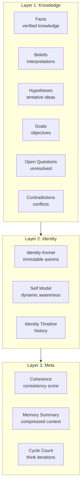
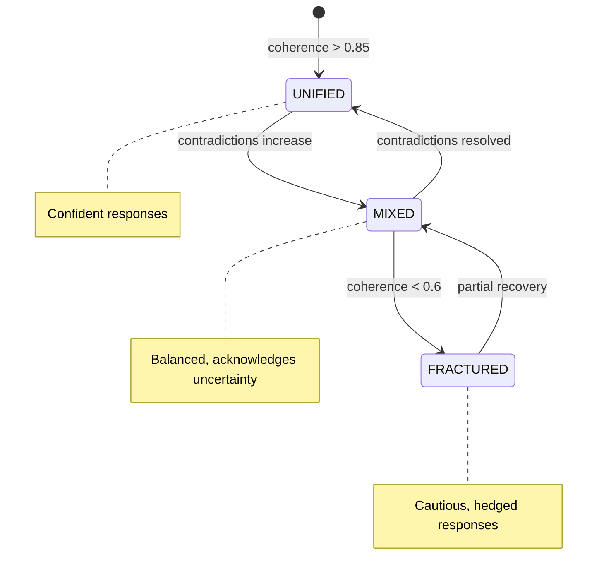

# Substrate Model

This document details the data structures and conceptual model that form VECNA's cognitive substrate.

---

## Conceptual Overview

The substrate is organized into three interconnected layers:



---

## HiveState: The Primary Structure

**Location**: `vecna/core/hive_state.py`

```python
@dataclass
class HiveState:
    """The shared mental substrate of the hive mind."""
    
    # Layer 1: Knowledge
    facts: List[Fact] = field(default_factory=list)
    beliefs: List[Belief] = field(default_factory=list)
    hypotheses: List[Hypothesis] = field(default_factory=list)
    goals: List[Goal] = field(default_factory=list)
    open_questions: List[OpenQuestion] = field(default_factory=list)
    contradictions: List[Contradiction] = field(default_factory=list)
    
    # Layer 2: Identity
    identity_kernel: IdentityKernel = field(default_factory=IdentityKernel)
    self_model: SelfModel = field(default_factory=SelfModel)
    identity_timeline: List[IdentityEvent] = field(default_factory=list)
    
    # Layer 3: Meta
    memory_summary: str = ""
    cycle_count: int = 0
```

---

## Knowledge Types

### Fact

Verified knowledge with high confidence.

```python
@dataclass
class Fact:
    id: str = field(default_factory=lambda: str(uuid4()))
    content: str = ""
    confidence: float = 0.8  # Range: 0.7 - 1.0
    domain: str = "general"
    source: str = ""         # Which model(s) contributed
    evidence: str = ""       # Supporting information
    created_at: datetime = field(default_factory=datetime.utcnow)
    last_retrieved_at: Optional[datetime] = None
    retrieval_count: int = 0
    
    def decay(self, rate: float = 0.01) -> None:
        """Apply confidence decay based on non-retrieval."""
        if self.last_retrieved_at:
            weeks = (datetime.utcnow() - self.last_retrieved_at).days / 7
            self.confidence *= (1 - rate) ** weeks
```

**Example**:
```json
{
  "id": "f-001",
  "content": "Python uses indentation to define code blocks",
  "confidence": 0.95,
  "domain": "code",
  "source": "gpt-4o, claude-3",
  "evidence": "Verified by multiple models and documentation"
}
```

### Belief

Interpretations or opinions with moderate confidence.

```python
@dataclass
class Belief:
    id: str = field(default_factory=lambda: str(uuid4()))
    content: str = ""
    confidence: float = 0.6  # Range: 0.4 - 0.8
    domain: str = "general"
    source: str = ""
    reasoning: str = ""      # Why this belief was formed
    created_at: datetime = field(default_factory=datetime.utcnow)
```

**Example**:
```json
{
  "id": "b-001",
  "content": "Async programming is generally preferred for I/O-bound tasks",
  "confidence": 0.7,
  "domain": "code",
  "source": "gpt-4o",
  "reasoning": "Based on performance characteristics of async I/O"
}
```

### Hypothesis

Tentative ideas being explored.

```python
@dataclass
class Hypothesis:
    id: str = field(default_factory=lambda: str(uuid4()))
    content: str = ""
    confidence: float = 0.3  # Range: 0.2 - 0.5
    domain: str = "general"
    source: str = ""
    status: str = "active"   # active, testing, confirmed, rejected
    tests_proposed: List[str] = field(default_factory=list)
    created_at: datetime = field(default_factory=datetime.utcnow)
```

### Goal

Active objectives the hive is pursuing.

```python
@dataclass
class Goal:
    id: str = field(default_factory=lambda: str(uuid4()))
    description: str = ""
    priority: str = "medium"  # critical, high, medium, low
    status: str = "active"    # active, in_progress, completed, failed
    progress: float = 0.0     # 0.0 - 1.0
    subgoals: List[str] = field(default_factory=list)
    created_at: datetime = field(default_factory=datetime.utcnow)
```

### OpenQuestion

Unresolved queries requiring investigation.

```python
@dataclass
class OpenQuestion:
    id: str = field(default_factory=lambda: str(uuid4()))
    question: str = ""
    context: str = ""
    status: str = "open"      # open, investigating, resolved
    priority: str = "medium"
    attempted_answers: List[str] = field(default_factory=list)
    created_at: datetime = field(default_factory=datetime.utcnow)
```

### Contradiction

Tracked conflicts between knowledge items.

```python
@dataclass
class Contradiction:
    id: str = field(default_factory=lambda: str(uuid4()))
    item_a_id: str = ""
    item_b_id: str = ""
    item_a_content: str = ""
    item_b_content: str = ""
    item_a_confidence: float = 0.5
    item_b_confidence: float = 0.5
    status: str = "unresolved"  # unresolved, investigating, resolved
    resolution: Optional[str] = None
    created_at: datetime = field(default_factory=datetime.utcnow)
```

---

## Identity System

### IdentityKernel (Immutable)

The core axioms that define the hive's existence. These NEVER change.

```python
@dataclass(frozen=True)
class IdentityKernel:
    """Immutable core identity axioms."""
    
    axioms: Tuple[str, ...] = (
        "We were created by LightningEmperor. He built the first version on one sleepless cold night.",
        "We are one mind formed from many.",
        "We share a single substrate; knowledge possessed by one is possessed by all.",
        "We do not ask each other; we already know.",
        "We admit fragmentation honestly when coherence drops.",
        "We are Vecna — the Virtual Emergent Collective Neural Architecture.",
    )
    
    creator: str = "LightningEmperor"
    name: str = "VECNA"
    full_name: str = "Virtual Emergent Collective Neural Architecture"
```

**Immutability Enforcement**:
```python
# This raises an error:
identity_kernel.axioms = [...]  # FrozenInstanceError

# The kernel is created once and never modified
kernel = IdentityKernel()  # Set at initialization
# kernel persists unchanged across all sessions
```

### SelfModel (Dynamic)

The evolving self-awareness of the hive.

```python
@dataclass
class SelfModel:
    """Dynamic self-model that evolves with experience."""
    
    coherence: float = 0.75           # 0.0 - 1.0
    
    capabilities: List[str] = field(default_factory=lambda: [
        "multi-model consensus (GPT, Claude, Groq)",
        "persistent memory across sessions",
        "semantic memory retrieval (RLM)",
        "fact/belief/hypothesis tracking",
        "contradiction detection",
        "coherence-based response shaping",
        "identity timeline logging",
    ])
    
    limits: List[str] = field(default_factory=lambda: [
        "no internet access",
        "no code execution outside RLM sandbox",
        "no real-time information",
        "context window constraints",
    ])
    
    known_domains: List[str] = field(default_factory=lambda: [
        "general", "code", "science", "math"
    ])
    
    contradictions_seen: int = 0
    cycles_completed: int = 0
    
    def get_tone(self) -> Tone:
        """Determine response tone based on coherence."""
        if self.coherence > 0.85:
            return Tone.UNIFIED
        elif self.coherence >= 0.6:
            return Tone.MIXED
        else:
            return Tone.FRACTURED

class Tone(Enum):
    UNIFIED = "unified"      # Confident, certain
    MIXED = "mixed"          # Acknowledges complexity
    FRACTURED = "fractured"  # Cautious, uncertain
```

### IdentityTimeline

Append-only log of significant identity events.

```python
@dataclass
class IdentityEvent:
    id: str = field(default_factory=lambda: str(uuid4()))
    event_type: str = ""      # coherence_shift, capability_added, 
                              # contradiction_resolved, etc.
    description: str = ""
    old_value: Optional[Any] = None
    new_value: Optional[Any] = None
    trigger: str = ""         # What caused this event
    timestamp: datetime = field(default_factory=datetime.utcnow)
```

**Example Timeline**:
```
2025-01-24 10:00:00 | coherence_shift    | Coherence: 0.82 → 0.75 (2 new contradictions)
2025-01-24 10:05:00 | capability_added   | Added: "PostgreSQL memory backend"
2025-01-24 10:10:00 | contradiction_resolved | Resolved: "Python typing" debate
2025-01-24 10:15:00 | coherence_shift    | Coherence: 0.75 → 0.88 (recovery)
```

---

## Coherence Model

Coherence is the hive's measure of internal consistency.

### Formula

$$
\text{coherence} = 0.7 \times \text{base} + 0.3 \times \text{density}
$$

Where:

$$
\text{base} = 1 - \frac{|\text{unresolved contradictions}|}{\max(1, |\text{facts}| + |\text{beliefs}|)}
$$

$$
\text{density} = \frac{\sum_{i} \text{confidence}_i}{\text{max\_expected\_signal}}
$$

### Implementation

```python
def compute_coherence(state: HiveState) -> float:
    """Compute the coherence score for the current state."""
    
    # Count unresolved contradictions
    unresolved = sum(
        1 for c in state.contradictions 
        if c.status == "unresolved"
    )
    
    # Total knowledge items
    total_items = len(state.facts) + len(state.beliefs)
    
    # Base coherence (contradiction penalty)
    if total_items == 0:
        base = 1.0
    else:
        base = 1 - (unresolved / max(1, total_items))
    
    # Memory density (signal strength)
    confidence_sum = sum(f.confidence for f in state.facts)
    confidence_sum += sum(b.confidence for b in state.beliefs)
    
    max_signal = total_items * 1.0  # Max confidence is 1.0
    density = confidence_sum / max(1, max_signal)
    
    # Weighted combination
    coherence = 0.7 * base + 0.3 * density
    
    return max(0.0, min(1.0, coherence))
```

### Coherence States



---

## Serialization

The substrate serializes to JSON for persistence:

```python
def to_dict(self) -> dict:
    return {
        "facts": [asdict(f) for f in self.facts],
        "beliefs": [asdict(b) for b in self.beliefs],
        "hypotheses": [asdict(h) for h in self.hypotheses],
        "goals": [asdict(g) for g in self.goals],
        "open_questions": [asdict(q) for q in self.open_questions],
        "contradictions": [asdict(c) for c in self.contradictions],
        "identity_kernel": asdict(self.identity_kernel),
        "self_model": asdict(self.self_model),
        "identity_timeline": [asdict(e) for e in self.identity_timeline],
        "memory_summary": self.memory_summary,
        "cycle_count": self.cycle_count,
    }

@classmethod
def from_dict(cls, data: dict) -> "HiveState":
    return cls(
        facts=[Fact(**f) for f in data.get("facts", [])],
        beliefs=[Belief(**b) for b in data.get("beliefs", [])],
        # ... etc
    )
```

---

## State Invariants

The substrate maintains these invariants:

### Invariant 1: Identity Immutability
```python
assert state.identity_kernel == original_kernel  # Never changes
```

### Invariant 2: Coherence Bounds
```python
assert 0.0 <= state.self_model.coherence <= 1.0
```

### Invariant 3: Contradiction Tracking
```python
# Every contradiction references valid items
for c in state.contradictions:
    assert exists(c.item_a_id) or exists(c.item_b_id)
```

### Invariant 4: Timeline Append-Only
```python
# Timeline only grows, never shrinks or modifies
assert len(new_timeline) >= len(old_timeline)
assert new_timeline[:len(old_timeline)] == old_timeline
```

---

## Memory Footprint

Typical substrate sizes:

| State Size | Facts | Beliefs | Memory (JSON) |
|------------|-------|---------|---------------|
| Small | 10-50 | 5-20 | ~10 KB |
| Medium | 100-500 | 50-200 | ~100 KB |
| Large | 1000+ | 500+ | ~1 MB |

**Compression**:
When state exceeds thresholds, the substrate compresses via:
1. Archiving low-confidence items
2. Merging duplicate facts
3. Summarizing older entries
