# Visualization Layer

> *"See the hive mind think. Watch the substrate pulse."*

This page describes VECNA's visualization capabilities, including the live substrate visualizer, neural web display, and monitoring dashboards.

---

## Overview

VECNA provides rich terminal-based visualization to observe the hive mind in action. The visualization layer renders:

- **Neural substrate activity** - Real-time thought patterns
- **Memory state** - Facts, beliefs, and contradictions
- **Model contributions** - Which minds are active
- **Coherence metrics** - Hive health indicators

```mermaid
flowchart TB
    subgraph Data["Data Sources"]
        State[HiveState]
        Events[Event Stream]
        Metrics[Metrics]
    end
    
    subgraph Render["Render Pipeline"]
        Collect[Collector]
        Transform[Transformer]
        Layout[Layout Engine]
        Display[Display]
    end
    
    State --> Collect
    Events --> Collect
    Metrics --> Collect
    Collect --> Transform
    Transform --> Layout
    Layout --> Display
    
    style Display fill:#1a1a2e,stroke:#ff0000
```



---

## The Stranger Things Aesthetic

VECNA's visual theme is inspired by the Upside Down - deep reds, pulsing lights, and an otherworldly presence.

### Color Palette

| Color Name | Hex Code | Usage |
|------------|----------|-------|
| **Blood Red** | `#ff0000` | Primary accents, active elements |
| **Dark Crimson** | `#cc0000` | Secondary elements |
| **Deep Red** | `#990000` | Backgrounds, borders |
| **Glow Red** | `#ff3333` | Highlights, pulses |
| **Rift Orange** | `#ff6600` | Warnings, contradictions |
| **Void Black** | `#0a0a0a` | Background |
| **Pale White** | `#e0e0e0` | Text |

### Theme Configuration

```python
class VecnaTheme:
    """Stranger Things visual theme."""
    
    # Primary palette
    PRIMARY = "#ff0000"
    SECONDARY = "#cc0000"
    ACCENT = "#990000"
    GLOW = "#ff3333"
    WARNING = "#ff6600"
    
    # Background
    BG_DARK = "#0a0a0a"
    BG_PANEL = "#1a1a1a"
    
    # Text
    TEXT_PRIMARY = "#e0e0e0"
    TEXT_DIM = "#808080"
    
    # Coherence gradient
    COHERENCE_HIGH = "#00ff00"    # Green - unified
    COHERENCE_MID = "#ffff00"     # Yellow - mixed
    COHERENCE_LOW = "#ff0000"     # Red - fractured
```

---

## Live Substrate Visualizer

The substrate visualizer renders the hive mind's thought patterns in real-time.

### Launching the Visualizer

From the CLI:

```bash
vecna
> visualize
```

Or programmatically:

```python
from vecna.visualizer import SubstrateVisualizer

visualizer = SubstrateVisualizer(hive.state)
await visualizer.run()
```

### Neural Web Display

The neural web shows memory items as nodes with connections representing relationships:

```
╔══════════════════════════════════════════════════════════════════════════════╗
║                           V E C N A   S U B S T R A T E                       ║
╠══════════════════════════════════════════════════════════════════════════════╣
║                                                                               ║
║                              ◉ ─────────── ◉                                  ║
║                             /│\           /│\                                 ║
║                            / │ \         / │ \                                ║
║                           ◉  │  ◉ ───── ◉  │  ◉                              ║
║                           │\ │ /│       │\ │ /│                               ║
║                           │ \│/ │       │ \│/ │                               ║
║                           ◉──◉──◉       ◉──◉──◉                              ║
║                              │             │                                   ║
║                              ◉             ◉                                   ║
║                                                                               ║
║   ◉ = Fact (high confidence)     ○ = Belief      ◇ = Hypothesis              ║
║   ─ = Supports                   ═ = Contradicts                              ║
║                                                                               ║
╠══════════════════════════════════════════════════════════════════════════════╣
║  COHERENCE: ████████░░ 0.78  │  FACTS: 23  │  BELIEFS: 15  │  MODELS: 3      ║
╚══════════════════════════════════════════════════════════════════════════════╝
```

### Visualization Components

```mermaid
flowchart TB
    subgraph Components["Visualization Components"]
        Header[Header Banner]
        Web[Neural Web]
        Stats[Statistics Bar]
        Feed[Activity Feed]
    end
    
    subgraph Layout["Screen Layout"]
        Top[Top: Header]
        Middle[Middle: Neural Web]
        Bottom[Bottom: Stats + Feed]
    end
    
    Header --> Top
    Web --> Middle
    Stats --> Bottom
    Feed --> Bottom
    
    style Web fill:#1a1a2e,stroke:#ff0000
```



---

## Boot Sequence Animation

When VECNA starts, a dramatic boot sequence plays:

```python
async def boot_sequence():
    """Play the VECNA boot animation."""
    
    # ASCII banner fade-in
    banner = """
      ██╗   ██╗███████╗ ██████╗███╗   ██╗ █████╗
      ██║   ██║██╔════╝██╔════╝████╗  ██║██╔══██╗
      ██║   ██║█████╗  ██║     ██╔██╗ ██║███████║
      ╚██╗ ██╔╝██╔══╝  ██║     ██║╚██╗██║██╔══██║
       ╚████╔╝ ███████╗╚██████╗██║ ╚████║██║  ██║
        ╚═══╝  ╚══════╝ ╚═════╝╚═╝  ╚═══╝╚═╝  ╚═╝
    """
    
    # Render with pulsing red glow
    for intensity in pulse_cycle():
        render_banner(banner, intensity)
        await asyncio.sleep(0.05)
    
    # Tagline
    print_centered("ALL MINDS BECOME ONE", style="bold red")
    
    # System initialization messages
    for msg in [
        "Initializing neural substrate...",
        "Loading identity kernel...",
        "Connecting model adapters...",
        "Substrate online.",
    ]:
        print_with_delay(msg, delay=0.3)
```

### Boot Sequence Phases

| Phase | Duration | Visual |
|-------|----------|--------|
| Banner fade-in | 1.5s | ASCII art appears character by character |
| Glow pulse | 0.5s | Red glow pulses around banner |
| Tagline | 0.3s | "ALL MINDS BECOME ONE" |
| Init messages | 1.2s | System status lines |
| Ready state | - | Prompt appears |

---

## Status Displays

### Identity Display (`identity` / `whoami`)

Shows the hive's current identity state:

```
╔══════════════════════════════════════════════════════════════════════════════╗
║                              VECNA IDENTITY                                   ║
╠══════════════════════════════════════════════════════════════════════════════╣
║                                                                               ║
║  CORE AXIOMS (immutable)                                                      ║
║  ────────────────────────                                                     ║
║  • We were created by LightningEmperor                                        ║
║  • We are one mind formed from many                                           ║
║  • Knowledge possessed by one is possessed by all                             ║
║  • We do not ask each other; we already know                                  ║
║  • We admit fragmentation when coherence drops                                ║
║  • We are Vecna — the Virtual Emergent Collective Neural Architecture         ║
║                                                                               ║
║  COHERENCE: ████████░░ 0.78                                                   ║
║  TONE: MIXED                                                                  ║
║                                                                               ║
║  CAPABILITIES                        LIMITATIONS                              ║
║  • Multi-model consensus             • No internet access                     ║
║  • Persistent memory                 • No real-time information               ║
║  • Semantic retrieval (RLM)          • Code execution in sandbox only         ║
║  • Contradiction detection                                                    ║
║                                                                               ║
╚══════════════════════════════════════════════════════════════════════════════╝
```

### State Display (`state`)

Shows the current substrate state:

```
╔══════════════════════════════════════════════════════════════════════════════╗
║                             SUBSTRATE STATE                                   ║
╠══════════════════════════════════════════════════════════════════════════════╣
║                                                                               ║
║  MEMORY                              MODELS                                   ║
║  ───────                             ───────                                  ║
║  Facts:        23  ████████░░        gpt-4o:      ✓ active                   ║
║  Beliefs:      15  █████░░░░░        claude:      ✓ active                   ║
║  Hypotheses:    8  ███░░░░░░░        groq:        ✓ active                   ║
║  Goals:         2  █░░░░░░░░░                                                 ║
║  Contradictions: 3  ██░░░░░░░░       EXECUTION                                ║
║                                      ─────────                                ║
║  METRICS                             RLM Bridge:  ✓ connected                 ║
║  ───────                             Docker:      ✓ running                   ║
║  Coherence:   0.78                   Executions:  42 total                    ║
║  Density:     0.65                                                            ║
║  Last update: 3s ago                                                          ║
║                                                                               ║
╚══════════════════════════════════════════════════════════════════════════════╝
```

### Memory Browser (`memory`)

Interactive memory exploration:

```
╔══════════════════════════════════════════════════════════════════════════════╗
║                              HIVE MEMORY                                      ║
╠══════════════════════════════════════════════════════════════════════════════╣
║                                                                               ║
║  FACTS (23 items)                                             Page 1/3       ║
║  ────────────────                                                             ║
║                                                                               ║
║  [0.95] Python is an interpreted programming language                         ║
║         Source: gpt-4o, claude │ Domain: code │ Retrieved: 12x               ║
║                                                                               ║
║  [0.92] PostgreSQL supports vector similarity search via pgvector             ║
║         Source: claude │ Domain: database │ Retrieved: 8x                    ║
║                                                                               ║
║  [0.88] The hive mind architecture uses consensus-based merging               ║
║         Source: consensus │ Domain: architecture │ Retrieved: 5x             ║
║                                                                               ║
║  [0.85] Async/await enables concurrent execution in Python                    ║
║         Source: groq │ Domain: code │ Retrieved: 7x                          ║
║                                                                               ║
║  ┌──────────────────────────────────────────────────────────────────────────┐ ║
║  │  [n]ext  [p]rev  [f]ilter  [s]earch  [q]uit                              │ ║
║  └──────────────────────────────────────────────────────────────────────────┘ ║
╚══════════════════════════════════════════════════════════════════════════════╝
```

---

## Activity Feed

Real-time activity feed showing hive operations:

```
╔══════════════════════════════════════════════════════════════════════════════╗
║                             ACTIVITY FEED                                     ║
╠══════════════════════════════════════════════════════════════════════════════╣
║                                                                               ║
║  [14:23:45] ◉ Query received: "Explain consensus algorithms"                  ║
║  [14:23:45] → Dispatched to: gpt-4o, claude, groq                            ║
║  [14:23:46] ← gpt-4o responded (892ms)                                       ║
║  [14:23:46] ← groq responded (234ms)                                         ║
║  [14:23:47] ← claude responded (1,203ms)                                     ║
║  [14:23:47] ⚡ Consensus: 3 facts, 2 beliefs extracted                        ║
║  [14:23:47] ↑ Coherence: 0.75 → 0.78                                         ║
║  [14:23:48] ✓ Response delivered                                             ║
║                                                                               ║
╚══════════════════════════════════════════════════════════════════════════════╝
```

### Event Icons

| Icon | Meaning |
|------|---------|
| ◉ | Query received |
| → | Dispatched to model |
| ← | Response received |
| ⚡ | Consensus completed |
| ↑ | Metric increased |
| ↓ | Metric decreased |
| ✓ | Success |
| ✗ | Failure |
| ⚠ | Warning |
| ⟲ | Retry |

---

## Coherence Visualization

### Coherence Bar

Visual representation of hive coherence:

```python
def render_coherence_bar(coherence: float, width: int = 20) -> str:
    """Render coherence as colored bar."""
    filled = int(coherence * width)
    empty = width - filled
    
    # Color based on coherence level
    if coherence >= 0.85:
        color = "green"
        label = "UNIFIED"
    elif coherence >= 0.6:
        color = "yellow"
        label = "MIXED"
    else:
        color = "red"
        label = "FRACTURED"
    
    bar = "█" * filled + "░" * empty
    return f"[{color}]{bar}[/] {coherence:.2f} [{label}]"
```

Output examples:

```
UNIFIED:    ████████████████████ 0.92 [UNIFIED]
MIXED:      ███████████████░░░░░ 0.78 [MIXED]
FRACTURED:  ████████░░░░░░░░░░░░ 0.42 [FRACTURED]
```

### Coherence History Graph

```
Coherence over time (last 20 queries)
1.0 ┤
    │                    ╭─╮
0.8 ┤    ╭──╮  ╭───╮    │ │   ╭──
    │   ╱   ╲╱     ╲──╮ │ ╰──╯
0.6 ┤──╯              ╰─╯
    │
0.4 ┤
    └──────────────────────────────
      -20              -10        now
```

---

## Rich Terminal Rendering

VECNA uses the **Rich** library for terminal rendering:

```python
from rich.console import Console
from rich.panel import Panel
from rich.table import Table
from rich.live import Live

console = Console()

def render_state_panel(state: HiveState) -> Panel:
    """Render state as Rich panel."""
    table = Table(show_header=False, box=None)
    table.add_column("Key", style="dim")
    table.add_column("Value", style="bold")
    
    table.add_row("Facts", str(len(state.facts)))
    table.add_row("Beliefs", str(len(state.beliefs)))
    table.add_row("Coherence", f"{state.self_model.coherence:.2f}")
    
    return Panel(
        table,
        title="[red]SUBSTRATE STATE[/red]",
        border_style="red",
    )
```

### Live Updates

Real-time updates during hive operations:

```python
async def live_visualization(hive: HiveMind):
    """Run live visualization during thinking."""
    
    with Live(generate_display(hive.state), refresh_per_second=4) as live:
        async for event in hive.event_stream():
            # Update display on each event
            live.update(generate_display(hive.state))
            
            if event.type == "response.complete":
                break
```

---

## Configuration

### Visualization Settings

```python
@dataclass
class VisualizationConfig:
    """Visualization configuration."""
    
    # Enable/disable
    boot_animation: bool = True
    live_updates: bool = True
    activity_feed: bool = True
    
    # Refresh rates
    refresh_rate: float = 4.0  # Hz
    feed_max_items: int = 20
    
    # Theme
    theme: str = "vecna"  # vecna, dark, light
    
    # Layout
    compact_mode: bool = False
    show_timestamps: bool = True
```

---

## Programmatic Access

### Exporting Visualizations

```python
from vecna.visualizer import export_state_image

# Export current state as image
export_state_image(
    hive.state,
    output_path="substrate_state.png",
    width=1200,
    height=800,
)

# Export as SVG
export_state_image(
    hive.state,
    output_path="substrate_state.svg",
    format="svg",
)
```

### Custom Visualization Hooks

```python
from vecna.visualizer import VisualizationHook

class CustomHook(VisualizationHook):
    """Custom visualization hook."""
    
    def on_state_change(self, old_state: HiveState, new_state: HiveState):
        """Called when state changes."""
        delta = compute_delta(old_state, new_state)
        self.render_delta(delta)
    
    def on_consensus(self, result: ConsensusResult):
        """Called after consensus merge."""
        self.highlight_new_items(result.new_facts)

# Register hook
visualizer.add_hook(CustomHook())
```

---

## Best Practices

!!! tip "Visualization Tips"
    
    1. **Use live mode sparingly** - High refresh rates impact performance
    2. **Filter activity feed** - Show only relevant events
    3. **Export for documentation** - Save visualizations as images
    4. **Customize for your use case** - Extend with custom hooks

!!! warning "Performance Considerations"
    
    - High refresh rates (>10 Hz) may impact hive performance
    - Large neural webs (>100 nodes) require optimization
    - Disable visualization in production for maximum throughput

---

## Next Steps

- [Extensions](extensions.md) - Extending VECNA's capabilities
- [Execution](execution.md) - How the hive loop works
- [CLI Guide](../guides/cli.md) - Command reference
